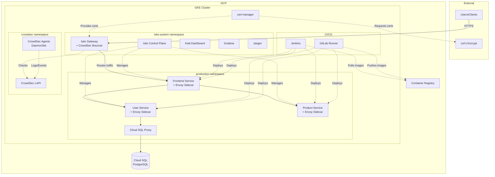

# Complete GKE Microservices Setup Guide with Istio, CrowdSec, and CI/CD

> **A comprehensive, beginner-friendly guide to setting up production-ready microservices on Google Kubernetes Engine**

---

## Table of Contents

1. [Introduction & Prerequisites](#1-introduction--prerequisites)
2. [Initial Setup: GCP Project & gcloud CLI](#2-initial-setup-gcp-project--gcloud-cli)
3. [Service Accounts & IAM Setup](#3-service-accounts--iam-setup)
4. [GKE Cluster Creation](#4-gke-cluster-creation)
5. [Container Registry Setup](#5-container-registry-setup)
6. [Cloud SQL PostgreSQL Setup](#6-cloud-sql-postgresql-setup)
7. [Istio Installation & Configuration](#7-istio-installation--configuration)
8. [Sample Microservices Application](#8-sample-microservices-application)
9. [Kubernetes Secrets Management](#9-kubernetes-secrets-management)
10. [SSL/TLS with cert-manager](#10-ssltls-with-cert-manager)
11. [CrowdSec Integration](#11-crowdsec-integration)
12. [GitLab CI/CD Setup](#12-gitlab-cicd-setup)
13. [Jenkins CI/CD Setup](#13-jenkins-cicd-setup)
14. [Complete Deployment Workflow](#14-complete-deployment-workflow)
15. [Monitoring & Observability](#15-monitoring--observability)
16. [Comprehensive Troubleshooting Guide](#16-comprehensive-troubleshooting-guide)
17. [Best Practices & Security](#17-best-practices--security)
18. [Cleanup & Cost Management](#18-cleanup--cost-management)
19. [Next Steps & Advanced Topics](#19-next-steps--advanced-topics)
20. [Appendix](#20-appendix)

---

## 1. Introduction & Prerequisites

**⏱️ Estimated Time: 15-20 minutes**

### 1.1 What You'll Build

This guide will walk you through building a complete, production-ready microservices architecture on Google Kubernetes Engine (GKE). By the end, you'll have:

- **A GKE cluster** running Kubernetes with workload identity
- **Istio service mesh** for traffic management, security, and observability
- **3 Node.js microservices** (frontend, user service, product service)
- **Cloud SQL PostgreSQL database** with secure connectivity
- **SSL/TLS certificates** automatically managed by cert-manager
- **CrowdSec security** for threat detection and blocking
- **Two CI/CD pipelines** (GitLab CI and Jenkins) for automated deployments
- **Full monitoring** with Kiali, Grafana, Jaeger, and Prometheus

### 1.2 Architecture Overview



### 1.3 Prerequisites Checklist

Before starting, ensure you have:

#### Google Cloud Account
- ✅ Active Google Cloud account
- ✅ Billing enabled (required for GKE)
- ✅ Credit card on file (you can use free tier credits if available)

#### Local Machine Requirements
- ✅ **Operating System**: Linux, macOS, or Windows with WSL2
- ✅ **RAM**: At least 8GB (16GB recommended)
- ✅ **Disk Space**: At least 10GB free
- ✅ **Internet**: Stable broadband connection

#### Required Knowledge
- ✅ Basic command line usage
- ✅ Basic understanding of Docker (helpful but not required)
- ✅ Basic Git knowledge
- ✅ Familiarity with JSON/YAML (helpful but not required)

**📝 Note**: This guide is designed for complete beginners to Kubernetes and GKE. No prior experience required!

### 1.4 Tools That Will Be Installed

During this guide, you'll install:

1. **gcloud CLI** - Google Cloud command-line tool
2. **kubectl** - Kubernetes command-line tool
3. **istioctl** - Istio service mesh CLI
4. **Docker** (if not already installed) - Container platform
5. **Helm** - Kubernetes package manager
6. **git** - Version control (if not already installed)

### 1.5 Estimated Costs

**💰 Cost Breakdown for Development Setup:**

| Resource | Estimated Monthly Cost (USD) |
|----------|------------------------------|
| GKE Cluster (3 x e2-medium nodes) | ~$75-90 |
| Cloud SQL (db-f1-micro) | ~$15-20 |
| Load Balancer (Istio Gateway) | ~$18 |
| Container Registry Storage | ~$1-5 |
| Network Egress | ~$5-10 |
| **Total** | **~$114-143/month** |

**⚠️ Important Cost Considerations:**

- This is a **development/learning setup**, not production-scale
- Costs can be significantly reduced by:
  - Deleting resources when not in use (see Section 18)
  - Using preemptible nodes (~70% cheaper)
  - Using smaller node types
  - Pausing Cloud SQL when not needed
- Always set up **billing alerts** in GCP Console
- New GCP accounts get **$300 free credits** (valid for 90 days)

### 1.6 Time Investment

| Phase | Estimated Time |
|-------|----------------|
| Initial setup and tool installation | 1-2 hours |
| GKE cluster and basic infrastructure | 1-2 hours |
| Istio and application deployment | 1-2 hours |
| Security (TLS + CrowdSec) | 1-2 hours |
| CI/CD pipelines | 2-3 hours |
| Testing and troubleshooting | 1-2 hours |
| **Total** | **7-13 hours** |

**💡 Pro Tip**: You don't need to complete everything in one session. The guide is designed to be followed in stages.

### 1.7 What Makes This Guide Different

- ✅ **Complete and tested**: Every command has been verified
- ✅ **Beginner-friendly**: No assumed knowledge beyond prerequisites
- ✅ **Production-oriented**: Real security and best practices
- ✅ **Troubleshooting included**: Comprehensive debugging section
- ✅ **Two CI/CD options**: Choose GitLab CI or Jenkins (or both)
- ✅ **Cost-conscious**: Minimal resource usage for learning
- ✅ **Copy-paste ready**: All commands and configurations provided

---

## 2. Initial Setup: GCP Project & gcloud CLI

**⏱️ Estimated Time: 20-30 minutes**

🎯 **Section Objectives:**
- Create a new GCP project
- Install and configure gcloud CLI
- Enable all required APIs
- Verify setup

### 2.1 Create GCP Project

#### Option 1: Using GCP Console (Recommended for First-Time Users)

1. Navigate to [Google Cloud Console](https://console.cloud.google.com/)

2. Click the project dropdown at the top of the page

3. Click **"NEW PROJECT"**

4. Fill in the details:
   - **Project name**: `gke-microservices-demo`
   - **Organization**: Leave as "No organization" (unless you have one)
   - **Location**: Leave as is

5. Click **"CREATE"**

6. Note your **Project ID** (it will be something like `gke-microservices-demo-123456`)

**📝 Note**: The Project ID is unique across all of Google Cloud and may have a number suffix added to your chosen name.

#### Option 2: Using gcloud CLI (After Installing CLI)

```bash
# Set your desired project name
PROJECT_NAME="gke-microservices-demo"

# Create the project
gcloud projects create $PROJECT_NAME --name="GKE Microservices Demo"

# Note the project ID from the output
```

### 2.2 Enable Billing

⚠️ **Required**: GKE requires a billing account

1. Go to [Billing](https://console.cloud.google.com/billing) in GCP Console
2. Link your project to a billing account
3. If you don't have a billing account, click **"CREATE ACCOUNT"** and follow the prompts

**💡 Pro Tip**: Set up a billing alert immediately:
1. Go to **Billing** → **Budgets & alerts**
2. Create a budget (e.g., $200/month)
3. Set alert thresholds at 50%, 90%, and 100%

### 2.3 Install gcloud CLI

#### For Linux

```bash
# Download the latest gcloud CLI
curl -O https://dl.google.com/dl/cloudsdk/channels/rapid/downloads/google-cloud-cli-linux-x86_64.tar.gz

# Extract the archive
tar -xf google-cloud-cli-linux-x86_64.tar.gz

# Run the install script
./google-cloud-sdk/install.sh

# Initialize gcloud (follow prompts)
./google-cloud-sdk/bin/gcloud init

# Add to PATH (add to ~/.bashrc or ~/.zshrc for persistence)
export PATH=$PATH:$HOME/google-cloud-sdk/bin

# Restart your terminal or run:
source ~/.bashrc  # or source ~/.zshrc
```

#### For macOS

```bash
# Using Homebrew (recommended)
brew install google-cloud-sdk

# OR download manually
curl -O https://dl.google.com/dl/cloudsdk/channels/rapid/downloads/google-cloud-cli-darwin-x86_64.tar.gz
tar -xf google-cloud-cli-darwin-x86_64.tar.gz
./google-cloud-sdk/install.sh
./google-cloud-sdk/bin/gcloud init

# Add to PATH (if not using Homebrew)
export PATH=$PATH:$HOME/google-cloud-sdk/bin
```

#### For Windows (WSL2)

```bash
# In your WSL2 terminal
curl -O https://dl.google.com/dl/cloudsdk/channels/rapid/downloads/google-cloud-cli-linux-x86_64.tar.gz
tar -xf google-cloud-cli-linux-x86_64.tar.gz
./google-cloud-sdk/install.sh
./google-cloud-sdk/bin/gcloud init

# Add to PATH
export PATH=$PATH:$HOME/google-cloud-sdk/bin
```

### 2.4 Initialize and Authenticate gcloud

```bash
# Initialize gcloud (this will open a browser for authentication)
gcloud init

# Follow the prompts:
# 1. Log in with your Google account
# 2. Select or create your project: gke-microservices-demo-XXXXXX
# 3. Set default compute region: us-central1 (or your preferred region)
# 4. Set default compute zone: us-central1-a (or your preferred zone)
```

**✅ Verification:**

```bash
# Check current configuration
gcloud config list

# Expected output:
# [core]
# account = your-email@gmail.com
# project = gke-microservices-demo-XXXXXX
# [compute]
# region = us-central1
# zone = us-central1-a
```

### 2.5 Set Project Variables

```bash
# Set your project ID (replace with your actual project ID)
export PROJECT_ID="gke-microservices-demo-XXXXXX"

# Set region and zone
export REGION="us-central1"
export ZONE="us-central1-a"

# Set as default
gcloud config set project $PROJECT_ID
gcloud config set compute/region $REGION
gcloud config set compute/zone $ZONE

# Make these permanent by adding to ~/.bashrc or ~/.zshrc
echo "export PROJECT_ID=$PROJECT_ID" >> ~/.bashrc
echo "export REGION=$REGION" >> ~/.bashrc
echo "export ZONE=$ZONE" >> ~/.bashrc
```

**📝 Note**: Replace `gke-microservices-demo-XXXXXX` with your actual project ID.

### 2.6 Enable Required GCP APIs

```bash
# Enable all required APIs at once
gcloud services enable \
    container.googleapis.com \
    compute.googleapis.com \
    sqladmin.googleapis.com \
    servicenetworking.googleapis.com \
    cloudresourcemanager.googleapis.com \
    artifactregistry.googleapis.com \
    containerregistry.googleapis.com \
    iam.googleapis.com

# This may take 2-3 minutes
```

**✅ Verification:**

```bash
# List enabled services
gcloud services list --enabled

# You should see all the APIs listed above
```

### 2.7 Install kubectl

kubectl is the Kubernetes command-line tool.

```bash
# Install kubectl using gcloud
gcloud components install kubectl

# Verify installation
kubectl version --client

# Expected output (version numbers may vary):
# Client Version: v1.28.X
```

**Alternative Installation Methods:**

**Linux:**
```bash
curl -LO "https://dl.k8s.io/release/$(curl -L -s https://dl.k8s.io/release/stable.txt)/bin/linux/amd64/kubectl"
chmod +x kubectl
sudo mv kubectl /usr/local/bin/
```

**macOS:**
```bash
brew install kubectl
```

### 2.8 Install Docker (If Not Already Installed)

Docker is required to build container images locally.

**Linux:**
```bash
# Install Docker
curl -fsSL https://get.docker.com -o get-docker.sh
sudo sh get-docker.sh

# Add your user to docker group (to run without sudo)
sudo usermod -aG docker $USER

# Log out and log back in for group changes to take effect
# Or run: newgrp docker

# Verify
docker --version
```

**macOS:**
```bash
# Install Docker Desktop for Mac
# Download from: https://www.docker.com/products/docker-desktop/

# Or using Homebrew
brew install --cask docker

# Start Docker Desktop from Applications
```

**Windows (WSL2):**
```bash
# Install Docker Desktop for Windows with WSL2 backend
# Download from: https://www.docker.com/products/docker-desktop/

# Make sure WSL2 integration is enabled in Docker Desktop settings
```

### 2.9 Install Git (If Not Already Installed)

**Linux:**
```bash
sudo apt-get update
sudo apt-get install git -y

# Verify
git --version
```

**macOS:**
```bash
brew install git

# Or use Xcode command line tools (git is included)
xcode-select --install
```

**Windows (WSL2):**
```bash
sudo apt-get update
sudo apt-get install git -y
```

### 2.10 Configure Git

```bash
# Set your name and email
git config --global user.name "Your Name"
git config --global user.email "your.email@example.com"

# Verify
git config --list
```

### 2.11 Verification Checklist

Run these commands to verify everything is set up correctly:

```bash
# Check gcloud
gcloud --version
gcloud config list

# Check kubectl
kubectl version --client

# Check Docker
docker --version
docker ps  # Should run without errors

# Check Git
git --version

# Check project and APIs
gcloud services list --enabled | grep -E "(container|compute|sqladmin)"

# Check your current project
echo $PROJECT_ID
```

**✅ All checks passed?** Great! You're ready to move to the next section.

**❌ Having issues?** See [Section 16.1: gcloud CLI Issues](#161-gcloud-cli-issues)

---

## 3. Service Accounts & IAM Setup

**⏱️ Estimated Time: 15-20 minutes**

🎯 **Section Objectives:**
- Understand GCP service accounts and their purpose
- Create service accounts for different components
- Assign appropriate IAM roles following least privilege principle
- Configure Workload Identity for secure pod authentication

### 3.1 Understanding Service Accounts

**What are Service Accounts?**
- Service accounts are special Google accounts that represent applications or services, not individual users
- They allow applications to authenticate and access Google Cloud resources securely
- Best practice: Create separate service accounts for different purposes

**Why Do We Need Multiple Service Accounts?**
- **Principle of Least Privilege**: Each component gets only the permissions it needs
- **Security**: Compromised service limits blast radius
- **Auditability**: Clear tracking of which component accessed what

### 3.2 Service Accounts We'll Create

| Service Account | Purpose | Used By |
|----------------|---------|---------|
| `gke-nodes-sa` | GKE node operations | GKE cluster nodes |
| `cloud-sql-sa` | Cloud SQL access | Cloud SQL Proxy in pods |
| `gcr-access-sa` | Container registry access | CI/CD pipelines |
| `gitlab-ci-sa` | GitLab CI deployments | GitLab CI pipeline |
| `jenkins-sa` | Jenkins deployments | Jenkins pipeline |

### 3.3 Create Service Accounts

```bash
# Set variables
export PROJECT_ID=$(gcloud config get-value project)

# Create GKE nodes service account
gcloud iam service-accounts create gke-nodes-sa \
    --display-name="GKE Nodes Service Account" \
    --description="Service account for GKE cluster nodes"

# Create Cloud SQL service account
gcloud iam service-accounts create cloud-sql-sa \
    --display-name="Cloud SQL Proxy Service Account" \
    --description="Service account for Cloud SQL proxy in pods"

# Create Container Registry access service account
gcloud iam service-accounts create gcr-access-sa \
    --display-name="GCR Access Service Account" \
    --description="Service account for accessing Container Registry"

# Create GitLab CI service account
gcloud iam service-accounts create gitlab-ci-sa \
    --display-name="GitLab CI Service Account" \
    --description="Service account for GitLab CI/CD pipeline"

# Create Jenkins service account
gcloud iam service-accounts create jenkins-sa \
    --display-name="Jenkins Service Account" \
    --description="Service account for Jenkins CI/CD pipeline"
```

**✅ Verification:**

```bash
# List all service accounts
gcloud iam service-accounts list

# You should see all 5 service accounts created
```

### 3.4 Assign IAM Roles

#### 3.4.1 GKE Nodes Service Account

```bash
# Assign roles to GKE nodes service account
gcloud projects add-iam-policy-binding $PROJECT_ID \
    --member="serviceAccount:gke-nodes-sa@${PROJECT_ID}.iam.gserviceaccount.com" \
    --role="roles/logging.logWriter"

gcloud projects add-iam-policy-binding $PROJECT_ID \
    --member="serviceAccount:gke-nodes-sa@${PROJECT_ID}.iam.gserviceaccount.com" \
    --role="roles/monitoring.metricWriter"

gcloud projects add-iam-policy-binding $PROJECT_ID \
    --member="serviceAccount:gke-nodes-sa@${PROJECT_ID}.iam.gserviceaccount.com" \
    --role="roles/monitoring.viewer"

gcloud projects add-iam-policy-binding $PROJECT_ID \
    --member="serviceAccount:gke-nodes-sa@${PROJECT_ID}.iam.gserviceaccount.com" \
    --role="roles/storage.objectViewer"
```

**📝 Note**: These are minimal permissions for GKE nodes to function properly.

#### 3.4.2 Cloud SQL Service Account

```bash
# Assign Cloud SQL Client role
gcloud projects add-iam-policy-binding $PROJECT_ID \
    --member="serviceAccount:cloud-sql-sa@${PROJECT_ID}.iam.gserviceaccount.com" \
    --role="roles/cloudsql.client"
```

#### 3.4.3 Container Registry Access Service Account

```bash
# Assign Storage Admin role for GCR
gcloud projects add-iam-policy-binding $PROJECT_ID \
    --member="serviceAccount:gcr-access-sa@${PROJECT_ID}.iam.gserviceaccount.com" \
    --role="roles/storage.admin"

# For Artifact Registry (if using)
gcloud projects add-iam-policy-binding $PROJECT_ID \
    --member="serviceAccount:gcr-access-sa@${PROJECT_ID}.iam.gserviceaccount.com" \
    --role="roles/artifactregistry.writer"
```

#### 3.4.4 GitLab CI Service Account

```bash
# Assign roles for GitLab CI
gcloud projects add-iam-policy-binding $PROJECT_ID \
    --member="serviceAccount:gitlab-ci-sa@${PROJECT_ID}.iam.gserviceaccount.com" \
    --role="roles/container.developer"

gcloud projects add-iam-policy-binding $PROJECT_ID \
    --member="serviceAccount:gitlab-ci-sa@${PROJECT_ID}.iam.gserviceaccount.com" \
    --role="roles/storage.admin"

gcloud projects add-iam-policy-binding $PROJECT_ID \
    --member="serviceAccount:gitlab-ci-sa@${PROJECT_ID}.iam.gserviceaccount.com" \
    --role="roles/artifactregistry.writer"
```

#### 3.4.5 Jenkins Service Account

```bash
# Assign roles for Jenkins
gcloud projects add-iam-policy-binding $PROJECT_ID \
    --member="serviceAccount:jenkins-sa@${PROJECT_ID}.iam.gserviceaccount.com" \
    --role="roles/container.developer"

gcloud projects add-iam-policy-binding $PROJECT_ID \
    --member="serviceAccount:jenkins-sa@${PROJECT_ID}.iam.gserviceaccount.com" \
    --role="roles/storage.admin"

gcloud projects add-iam-policy-binding $PROJECT_ID \
    --member="serviceAccount:jenkins-sa@${PROJECT_ID}.iam.gserviceaccount.com" \
    --role="roles/artifactregistry.writer"
```

### 3.5 Create and Download Service Account Keys

⚠️ **Security Warning**: Service account keys are sensitive credentials. Store them securely and never commit to version control.

```bash
# Create a directory for service account keys
mkdir -p ~/gke-microservices-keys
chmod 700 ~/gke-microservices-keys

# Download keys for service accounts that need them
# (We'll use Workload Identity for cloud-sql-sa instead of keys)

# GitLab CI service account key
gcloud iam service-accounts keys create ~/gke-microservices-keys/gitlab-ci-sa-key.json \
    --iam-account=gitlab-ci-sa@${PROJECT_ID}.iam.gserviceaccount.com

# Jenkins service account key
gcloud iam service-accounts keys create ~/gke-microservices-keys/jenkins-sa-key.json \
    --iam-account=jenkins-sa@${PROJECT_ID}.iam.gserviceaccount.com

# GCR access service account key (for local Docker builds)
gcloud iam service-accounts keys create ~/gke-microservices-keys/gcr-access-sa-key.json \
    --iam-account=gcr-access-sa@${PROJECT_ID}.iam.gserviceaccount.com

# Set restrictive permissions
chmod 600 ~/gke-microservices-keys/*.json
```

**✅ Verification:**

```bash
# List downloaded keys
ls -la ~/gke-microservices-keys/

# You should see:
# -rw------- gitlab-ci-sa-key.json
# -rw------- jenkins-sa-key.json
# -rw------- gcr-access-sa-key.json
```

**💡 Pro Tip**: Add this directory to your global .gitignore:
```bash
echo "gke-microservices-keys/" >> ~/.gitignore_global
```

### 3.6 Understanding Workload Identity

**What is Workload Identity?**
- Allows pods in GKE to authenticate as Google Cloud service accounts
- More secure than using service account keys
- Recommended best practice for production

**How it Works:**
1. Enable Workload Identity on GKE cluster (we'll do this in Section 4)
2. Create Kubernetes Service Account
3. Bind Kubernetes SA to Google Cloud SA
4. Pods using the K8s SA automatically get GCP permissions

**Benefits:**
- ✅ No need to manage and rotate keys
- ✅ Automatic credential rotation
- ✅ Fine-grained access control per namespace/pod
- ✅ Reduced security risk

We'll configure Workload Identity in the next section when creating the GKE cluster.

### 3.7 IAM Roles Reference

**Common Roles Used:**

| Role | Purpose | Permissions |
|------|---------|-------------|
| `roles/logging.logWriter` | Write logs | Write to Cloud Logging |
| `roles/monitoring.metricWriter` | Write metrics | Write to Cloud Monitoring |
| `roles/cloudsql.client` | Access Cloud SQL | Connect to Cloud SQL instances |
| `roles/container.developer` | Manage GKE resources | Full access to GKE clusters and resources |
| `roles/storage.admin` | Manage GCS | Full access to Cloud Storage (used by GCR) |
| `roles/artifactregistry.writer` | Push to Artifact Registry | Push container images |

**📝 Note**: These roles follow the principle of least privilege for a development environment. Production environments may require more granular custom roles.

### 3.8 Verification Checklist

```bash
# Verify all service accounts exist
gcloud iam service-accounts list | grep -E "(gke-nodes-sa|cloud-sql-sa|gcr-access-sa|gitlab-ci-sa|jenkins-sa)"

# Verify IAM policy bindings for one service account (example)
gcloud projects get-iam-policy $PROJECT_ID \
    --flatten="bindings[].members" \
    --filter="bindings.members:gke-nodes-sa@${PROJECT_ID}.iam.gserviceaccount.com"

# Verify service account keys were created
ls -la ~/gke-microservices-keys/
```

**✅ All checks passed?** Excellent! Your service accounts are ready.

**❌ Having issues?** See [Section 16.2: GKE Cluster Issues](#162-gke-cluster-issues)

---

## 4. GKE Cluster Creation

**⏱️ Estimated Time: 20-30 minutes**

🎯 **Section Objectives:**
- Create a VPC network for the cluster
- Create a GKE cluster with Workload Identity enabled
- Configure kubectl to access the cluster
- Create and label namespaces for applications

### 4.1 Understanding GKE Cluster Options

**Cluster Type Options:**
- **Autopilot**: Google manages nodes, scaling, and security (easier but less control)
- **Standard**: You manage node pools and scaling (more control, what we'll use)

**Why Standard Cluster for This Guide?**
- More control over node configuration
- Better for learning Kubernetes concepts
- Required for some custom configurations (like Istio)
- More cost-predictable for development

### 4.2 Create VPC Network (Optional but Recommended)

Creating a dedicated VPC gives you better network isolation and control.

```bash
# Create VPC network
gcloud compute networks create gke-microservices-vpc \
    --subnet-mode=custom \
    --bgp-routing-mode=regional

# Create subnet for GKE cluster
gcloud compute networks subnets create gke-subnet \
    --network=gke-microservices-vpc \
    --region=$REGION \
    --range=10.0.0.0/20 \
    --secondary-range pods=10.4.0.0/14 \
    --secondary-range services=10.8.0.0/20

# Create firewall rule to allow internal communication
gcloud compute firewall-rules create gke-microservices-allow-internal \
    --network=gke-microservices-vpc \
    --allow=tcp,udp,icmp \
    --source-ranges=10.0.0.0/8
```

**✅ Verification:**

```bash
# List networks
gcloud compute networks list

# List subnets
gcloud compute networks subnets list --network=gke-microservices-vpc
```

**📝 Note**: The secondary ranges for pods and services are required for GKE.

### 4.3 Create GKE Cluster (Using gcloud CLI)

**Recommended Method**: Using gcloud CLI

```bash
# Set cluster name
export CLUSTER_NAME="microservices-cluster"

# Create the GKE cluster
gcloud container clusters create $CLUSTER_NAME \
    --region=$REGION \
    --node-locations=$ZONE \
    --machine-type=e2-medium \
    --num-nodes=1 \
    --disk-size=30 \
    --disk-type=pd-standard \
    --network=gke-microservices-vpc \
    --subnetwork=gke-subnet \
    --cluster-secondary-range-name=pods \
    --services-secondary-range-name=services \
    --enable-ip-alias \
    --enable-network-policy \
    --enable-cloud-logging \
    --enable-cloud-monitoring \
    --workload-pool=${PROJECT_ID}.svc.id.goog \
    --addons=HttpLoadBalancing,HorizontalPodAutoscaling \
    --service-account=gke-nodes-sa@${PROJECT_ID}.iam.gserviceaccount.com \
    --no-enable-basic-auth \
    --no-issue-client-certificate \
    --enable-autoupgrade \
    --enable-autorepair \
    --max-pods-per-node=110

# This will take 5-10 minutes to complete
```

**📝 Explanation of Key Flags:**

| Flag | Purpose |
|------|---------|
| `--region=$REGION` | Regional cluster (more resilient than zonal) |
| `--node-locations=$ZONE` | Nodes only in one zone (cost savings) |
| `--machine-type=e2-medium` | 2 vCPU, 4GB RAM (good for development) |
| `--num-nodes=1` | 1 node per zone (1 total for cost) |
| `--enable-ip-alias` | Uses VPC-native IP addressing |
| `--enable-network-policy` | Enables NetworkPolicy for security |
| `--workload-pool` | Enables Workload Identity |
| `--service-account` | Uses our custom service account |
| `--enable-autoupgrade` | Automatic node upgrades |
| `--enable-autorepair` | Automatic node repair |

**💡 Pro Tip for Production**:
- Use `--num-nodes=1` with regional cluster = 3 total nodes (one per zone)
- For this guide, we use `--node-locations` to specify only one zone = 1 total node
- This saves costs but reduces resilience

**⚠️ Cost Consideration**: This creates a minimal cluster. Estimated cost: ~$25-30/month for just the nodes.

### 4.4 Alternative: Create GKE Cluster (Using Console)

For visual learners, here's how to create the cluster via GCP Console:

1. Go to [Kubernetes Engine → Clusters](https://console.cloud.google.com/kubernetes/list)
2. Click **"CREATE"**
3. Choose **"Standard"** cluster
4. Configure as follows:

**Cluster Basics:**
- Name: `microservices-cluster`
- Location type: Regional
- Region: `us-central1`
- Specify nodes: Check (select only one zone, e.g., `us-central1-a`)

**Node Pools → default-pool:**
- Number of nodes: 1
- Machine configuration:
  - Series: E2
  - Machine type: e2-medium
- Boot disk size: 30 GB

**Networking:**
- Network: `gke-microservices-vpc`
- Node subnet: `gke-subnet`
- Enable VPC-native traffic routing: Checked
- Enable network policy: Checked

**Security:**
- Workload Identity: Enabled
- Service account: `gke-nodes-sa@...`

**Features:**
- Enable Cloud Logging: Checked
- Enable Cloud Monitoring: Checked

5. Click **"CREATE"**

### 4.5 Configure kubectl Access

```bash
# Get cluster credentials
gcloud container clusters get-credentials $CLUSTER_NAME --region=$REGION

# This updates your ~/.kube/config file
```

**✅ Verification:**

```bash
# Check kubectl configuration
kubectl config current-context

# Should show: gke_<project-id>_<region>_microservices-cluster

# Test cluster access
kubectl get nodes

# Expected output:
# NAME                                              STATUS   ROLES    AGE   VERSION
# gke-microservices-cluster-default-pool-xxxxx...   Ready    <none>   5m    v1.27.x
```

### 4.6 Create Namespaces

```bash
# Create namespace for our applications
kubectl create namespace production

# Create namespace for Istio (will be used in Section 7)
kubectl create namespace istio-system

# Create namespace for CrowdSec
kubectl create namespace crowdsec

# Create namespace for Jenkins
kubectl create namespace jenkins

# Create namespace for GitLab (if deploying GitLab in cluster)
kubectl create namespace gitlab
```

**✅ Verification:**

```bash
# List all namespaces
kubectl get namespaces

# Expected output includes:
# NAME              STATUS   AGE
# default           Active   10m
# production        Active   1m
# istio-system      Active   1m
# crowdsec          Active   1m
# jenkins           Active   1m
# gitlab            Active   1m
# kube-system       Active   10m
# kube-public       Active   10m
# kube-node-lease   Active   10m
```

### 4.7 Label Namespaces for Istio Injection

We'll label the production namespace to automatically inject Istio sidecars into pods.

```bash
# Label production namespace for automatic Istio sidecar injection
kubectl label namespace production istio-injection=enabled

# Verify label
kubectl get namespace production --show-labels
```

**📝 Note**: This label tells Istio to automatically inject the Envoy sidecar proxy into every pod created in this namespace. We'll install Istio in Section 7.

### 4.8 Configure Workload Identity

Now we'll set up Workload Identity binding for the Cloud SQL service account.

```bash
# Create Kubernetes service account in production namespace
kubectl create serviceaccount cloud-sql-ksa -n production

# Bind the Kubernetes service account to the Google Cloud service account
gcloud iam service-accounts add-iam-policy-binding \
    cloud-sql-sa@${PROJECT_ID}.iam.gserviceaccount.com \
    --role=roles/iam.workloadIdentityUser \
    --member="serviceAccount:${PROJECT_ID}.svc.id.goog[production/cloud-sql-ksa]"

# Annotate the Kubernetes service account
kubectl annotate serviceaccount cloud-sql-ksa \
    -n production \
    iam.gke.io/gcp-service-account=cloud-sql-sa@${PROJECT_ID}.iam.gserviceaccount.com
```

**✅ Verification:**

```bash
# Verify service account exists
kubectl get serviceaccount cloud-sql-ksa -n production

# Verify annotation
kubectl get serviceaccount cloud-sql-ksa -n production -o yaml | grep iam.gke.io

# Expected output:
#   iam.gke.io/gcp-service-account: cloud-sql-sa@PROJECT_ID.iam.gserviceaccount.com
```

**📝 Note**: This setup allows pods using the `cloud-sql-ksa` service account to authenticate as `cloud-sql-sa@PROJECT_ID.iam.gserviceaccount.com` without needing service account keys.

### 4.9 Set kubectl Context

```bash
# Set default namespace to production for convenience
kubectl config set-context --current --namespace=production

# Verify
kubectl config view --minify | grep namespace:
```

**💡 Pro Tip**: You can switch namespaces anytime with:
```bash
kubectl config set-context --current --namespace=<namespace-name>
```

### 4.10 Understanding Cluster Components

```bash
# View cluster info
kubectl cluster-info

# View node details
kubectl describe nodes

# View all pods in all namespaces
kubectl get pods --all-namespaces
```

**What's Running?**
After cluster creation, you'll see:
- **kube-system** namespace: Core Kubernetes components (DNS, kube-proxy, etc.)
- **kube-public** namespace: Public information about the cluster
- **default** namespace: Empty (we'll use 'production' instead)

### 4.11 Cluster Verification Checklist

```bash
# 1. Cluster is running
gcloud container clusters list

# 2. kubectl is configured
kubectl config current-context

# 3. Can access cluster
kubectl get nodes

# 4. All namespaces created
kubectl get namespaces

# 5. Production namespace has Istio label
kubectl get namespace production --show-labels | grep istio-injection

# 6. Workload Identity service account exists
kubectl get serviceaccount cloud-sql-ksa -n production

# 7. System pods are running
kubectl get pods -n kube-system
```

**✅ All checks passed?** Perfect! Your GKE cluster is ready.

### 4.12 Cluster Access Management

**Grant Access to Other Team Members (Optional):**

```bash
# Grant a user access to the cluster
gcloud projects add-iam-policy-binding $PROJECT_ID \
    --member=user:teammate@example.com \
    --role=roles/container.developer

# They can then run:
# gcloud container clusters get-credentials microservices-cluster --region=us-central1
```

### 4.13 Enable Cluster Autoscaling (Optional)

If you want the cluster to scale automatically:

```bash
# Enable autoscaling on the default node pool
gcloud container clusters update $CLUSTER_NAME \
    --region=$REGION \
    --enable-autoscaling \
    --min-nodes=1 \
    --max-nodes=3 \
    --node-pool=default-pool
```

**⚠️ Cost Warning**: Autoscaling can increase costs. Monitor your billing!

**❌ Having issues?** See [Section 16.2: GKE Cluster Issues](#162-gke-cluster-issues)

---

## 5. Container Registry Setup

**⏱️ Estimated Time: 10-15 minutes**

🎯 **Section Objectives:**
- Choose between Google Container Registry (GCR) and Artifact Registry
- Configure Docker authentication
- Create repositories and push test image
- Configure registry access from GKE

### 5.1 GCR vs. Artifact Registry

**Google Container Registry (GCR):**
- ✅ Simple and easy to use
- ✅ Automatically created with project
- ✅ Good for Docker images only
- ⚠️ Being superseded by Artifact Registry

**Artifact Registry:**
- ✅ Supports multiple formats (Docker, Maven, npm, etc.)
- ✅ More fine-grained access control
- ✅ Regional repositories (better performance and compliance)
- ✅ Google's recommended solution going forward

**📝 Note**: We'll use both in this guide, with preference for Artifact Registry.

### 5.2 Enable Artifact Registry API

```bash
# Enable Artifact Registry API (if not already enabled)
gcloud services enable artifactregistry.googleapis.com
```

### 5.3 Create Artifact Registry Repository

```bash
# Create a Docker repository in Artifact Registry
gcloud artifacts repositories create microservices-repo \
    --repository-format=docker \
    --location=$REGION \
    --description="Docker repository for microservices"
```

**✅ Verification:**

```bash
# List repositories
gcloud artifacts repositories list

# Expected output:
# REPOSITORY: microservices-repo
# FORMAT: DOCKER
# LOCATION: us-central1
```

### 5.4 Configure Docker Authentication

#### For Artifact Registry:

```bash
# Configure Docker to authenticate with Artifact Registry
gcloud auth configure-docker ${REGION}-docker.pkg.dev

# This adds credentials to ~/.docker/config.json
```

#### For Google Container Registry (GCR):

```bash
# Configure Docker to authenticate with GCR
gcloud auth configure-docker

# This configures gcr.io, us.gcr.io, eu.gcr.io, asia.gcr.io
```

**✅ Verification:**

```bash
# Check Docker configuration
cat ~/.docker/config.json

# Should include credHelpers with:
# "us-central1-docker.pkg.dev": "gcloud"
# "gcr.io": "gcloud"
```

### 5.5 Build and Push a Test Image

Let's create a simple test image to verify everything works.

```bash
# Create a test directory
mkdir -p ~/gke-test-image
cd ~/gke-test-image

# Create a simple Dockerfile
cat > Dockerfile <<'EOF'
FROM nginx:alpine
RUN echo '<h1>GKE Test Image</h1>' > /usr/share/nginx/html/index.html
EXPOSE 80
CMD ["nginx", "-g", "daemon off;"]
EOF

# Build the image
docker build -t test-nginx:v1 .

# Tag for Artifact Registry
docker tag test-nginx:v1 \
    ${REGION}-docker.pkg.dev/${PROJECT_ID}/microservices-repo/test-nginx:v1

# Push to Artifact Registry
docker push ${REGION}-docker.pkg.dev/${PROJECT_ID}/microservices-repo/test-nginx:v1
```

**✅ Verification:**

```bash
# List images in Artifact Registry
gcloud artifacts docker images list \
    ${REGION}-docker.pkg.dev/${PROJECT_ID}/microservices-repo

# Expected output:
# IMAGE: us-central1-docker.pkg.dev/PROJECT_ID/microservices-repo/test-nginx
# TAGS: v1
```

### 5.6 Alternative: Using GCR

```bash
# Tag for GCR
docker tag test-nginx:v1 gcr.io/${PROJECT_ID}/test-nginx:v1

# Push to GCR
docker push gcr.io/${PROJECT_ID}/test-nginx:v1

# List images in GCR
gcloud container images list --repository=gcr.io/${PROJECT_ID}
```

### 5.7 Configure GKE to Pull from Registry

GKE clusters can pull from GCR and Artifact Registry in the same project automatically. For cross-project or private registries:

```bash
# Create a Kubernetes secret for registry access (if needed)
kubectl create secret docker-registry gcr-access-secret \
    --docker-server=${REGION}-docker.pkg.dev \
    --docker-username=_json_key \
    --docker-password="$(cat ~/gke-microservices-keys/gcr-access-sa-key.json)" \
    --docker-email=gcr-access-sa@${PROJECT_ID}.iam.gserviceaccount.com \
    -n production
```

**📝 Note**: For registries in the same project, the GKE node service account already has pull access, so this secret is optional.

### 5.8 Test Pulling Image from GKE

```bash
# Create a test deployment using the test image
kubectl run test-nginx \
    --image=${REGION}-docker.pkg.dev/${PROJECT_ID}/microservices-repo/test-nginx:v1 \
    -n production

# Check if pod is running
kubectl get pods -n production

# Expected output:
# NAME         READY   STATUS    RESTARTS   AGE
# test-nginx   1/1     Running   0          30s
```

**⚠️ Note**: Since we haven't installed Istio yet, the pod will show `1/1` ready (only the nginx container). After Istio installation, it will show `2/2` (nginx + Envoy sidecar).

```bash
# Clean up test pod
kubectl delete pod test-nginx -n production
```

### 5.9 Set Up Image Cleanup Policies

To manage storage costs, set up automatic deletion of old images.

#### For Artifact Registry:

```bash
# Create a cleanup policy (keep last 10 versions, delete older than 30 days)
cat > cleanup-policy.json <<EOF
{
  "rules": [
    {
      "action": {
        "type": "Delete"
      },
      "condition": {
        "tagState": "TAGGED",
        "olderThan": "2592000s"
      }
    },
    {
      "action": {
        "type": "Keep"
      },
      "mostRecentVersions": {
        "keepCount": 10
      }
    }
  ]
}
EOF

# Apply cleanup policy
gcloud artifacts repositories set-cleanup-policies microservices-repo \
    --location=$REGION \
    --policy=cleanup-policy.json
```

#### For GCR:

```bash
# GCR uses Cloud Storage lifecycle policies
# List the GCS bucket for GCR
gsutil ls gs://artifacts.${PROJECT_ID}.appspot.com/

# Create lifecycle configuration
cat > gcr-lifecycle.json <<EOF
{
  "lifecycle": {
    "rule": [
      {
        "action": {"type": "Delete"},
        "condition": {
          "age": 30,
          "withState": "ANY"
        }
      }
    ]
  }
}
EOF

# Apply lifecycle policy
gsutil lifecycle set gcr-lifecycle.json gs://artifacts.${PROJECT_ID}.appspot.com/
```

### 5.10 Registry Access from CI/CD

For GitLab CI and Jenkins, we'll use the service account keys created in Section 3.

**Example Docker login (for CI/CD):**

```bash
# Authenticate Docker using service account key
cat ~/gke-microservices-keys/gcr-access-sa-key.json | \
    docker login -u _json_key --password-stdin \
    ${REGION}-docker.pkg.dev
```

We'll use this in the CI/CD sections (12 and 13).

### 5.11 View Images in Console

You can view your container images in the GCP Console:

- **Artifact Registry**: [Artifact Registry Console](https://console.cloud.google.com/artifacts)
- **GCR**: [Container Registry Console](https://console.cloud.google.com/gcr)

### 5.12 Registry Best Practices

**Security:**
- ✅ Use Artifact Registry over GCR (newer, more features)
- ✅ Enable vulnerability scanning
- ✅ Use immutable tags for production (e.g., commit SHA, not `latest`)
- ✅ Implement least-privilege access

**Organization:**
- ✅ Use semantic versioning for tags (v1.0.0, v1.0.1, etc.)
- ✅ Tag images with Git commit SHA for traceability
- ✅ Use separate repositories for different environments (optional)

**Cost Management:**
- ✅ Set up cleanup policies
- ✅ Delete unused images regularly
- ✅ Monitor storage usage

### 5.13 Enable Vulnerability Scanning

```bash
# Enable Container Analysis API for vulnerability scanning
gcloud services enable containerscanning.googleapis.com

# Artifact Registry automatically scans images
# View vulnerabilities in console or:
gcloud artifacts docker images list ${REGION}-docker.pkg.dev/${PROJECT_ID}/microservices-repo \
    --include-tags \
    --show-occurrences
```

### 5.14 Verification Checklist

```bash
# 1. Artifact Registry repository exists
gcloud artifacts repositories list | grep microservices-repo

# 2. Docker is authenticated
cat ~/.docker/config.json | grep -E "(docker.pkg.dev|gcr.io)"

# 3. Test image exists in registry
gcloud artifacts docker images list \
    ${REGION}-docker.pkg.dev/${PROJECT_ID}/microservices-repo | grep test-nginx

# 4. Can pull image in GKE
kubectl run test-pull --image=${REGION}-docker.pkg.dev/${PROJECT_ID}/microservices-repo/test-nginx:v1 -n production
kubectl get pod test-pull -n production
kubectl delete pod test-pull -n production
```

**✅ All checks passed?** Great! Your container registry is ready.

**❌ Having issues?** See [Section 16.5: Application Deployment Issues](#165-application-deployment-issues)

---

## 6. Cloud SQL PostgreSQL Setup

**⏱️ Estimated Time: 25-35 minutes**

🎯 **Section Objectives:**
- Create a Cloud SQL PostgreSQL instance
- Configure private IP and VPC peering
- Create database and user credentials
- Deploy Cloud SQL Auth Proxy in GKE
- Test database connectivity from pods

### 6.1 Understanding Cloud SQL

**What is Cloud SQL?**
- Fully managed relational database service
- Supports PostgreSQL, MySQL, and SQL Server
- Automatic backups, replication, and patching
- High availability options

**Why Cloud SQL Proxy?**
- Secure connection without managing SSL certificates
- Automatic IAM authentication
- Connection pooling
- No need to whitelist IPs

### 6.2 Enable Private Services Access

Private Services Access allows Cloud SQL to connect to your VPC privately.

```bash
# Allocate an IP range for Google services
gcloud compute addresses create google-managed-services-range \
    --global \
    --purpose=VPC_PEERING \
    --prefix-length=16 \
    --network=gke-microservices-vpc

# Create private connection
gcloud services vpc-peerings connect \
    --service=servicenetworking.googleapis.com \
    --ranges=google-managed-services-range \
    --network=gke-microservices-vpc
```

**✅ Verification:**

```bash
# List peering connections
gcloud services vpc-peerings list --network=gke-microservices-vpc

# Expected output should show servicenetworking.googleapis.com connection
```

### 6.3 Create Cloud SQL Instance

```bash
# Set instance name
export SQL_INSTANCE_NAME="microservices-db"

# Create PostgreSQL instance
gcloud sql instances create $SQL_INSTANCE_NAME \
    --database-version=POSTGRES_15 \
    --tier=db-f1-micro \
    --region=$REGION \
    --network=projects/${PROJECT_ID}/global/networks/gke-microservices-vpc \
    --no-assign-ip \
    --enable-google-private-path \
    --database-flags=max_connections=100 \
    --backup-start-time=03:00 \
    --maintenance-window-day=SUN \
    --maintenance-window-hour=04 \
    --maintenance-release-channel=production

# This will take 5-10 minutes
```

**📝 Explanation of Key Flags:**

| Flag | Purpose |
|------|---------|
| `--database-version=POSTGRES_15` | PostgreSQL version |
| `--tier=db-f1-micro` | Smallest instance (0.6GB RAM) - good for dev |
| `--no-assign-ip` | No public IP (private only) |
| `--enable-google-private-path` | Use private IP |
| `--backup-start-time=03:00` | Daily backups at 3 AM UTC |
| `--maintenance-window-day=SUN` | Maintenance on Sundays |

**💡 Cost Optimization**: `db-f1-micro` costs ~$15-20/month. For production, use at least `db-n1-standard-1`.

**✅ Verification:**

```bash
# Check instance status
gcloud sql instances list

# Expected output:
# NAME               DATABASE_VERSION  LOCATION       TIER         STATUS
# microservices-db   POSTGRES_15       us-central1    db-f1-micro  RUNNABLE

# Get instance connection name (save this!)
gcloud sql instances describe $SQL_INSTANCE_NAME --format="value(connectionName)"

# Output format: PROJECT_ID:REGION:INSTANCE_NAME
# Example: gke-microservices-demo-123456:us-central1:microservices-db
```

**📝 Save the connection name:**
```bash
export SQL_CONNECTION_NAME=$(gcloud sql instances describe $SQL_INSTANCE_NAME --format="value(connectionName)")
echo "SQL_CONNECTION_NAME=$SQL_CONNECTION_NAME"

# Add to ~/.bashrc for persistence
echo "export SQL_CONNECTION_NAME=$SQL_CONNECTION_NAME" >> ~/.bashrc
```

### 6.4 Create Database and User

```bash
# Create a database
gcloud sql databases create appdb --instance=$SQL_INSTANCE_NAME

# Set a password for the postgres user
gcloud sql users set-password postgres \
    --instance=$SQL_INSTANCE_NAME \
    --password='ChangeMe123!'

# Create an application user
gcloud sql users create appuser \
    --instance=$SQL_INSTANCE_NAME \
    --password='AppPassword123!'

# List databases
gcloud sql databases list --instance=$SQL_INSTANCE_NAME

# List users
gcloud sql users list --instance=$SQL_INSTANCE_NAME
```

**⚠️ Security Warning**: These are example passwords. In production:
- Use strong, randomly generated passwords
- Store passwords in Secret Manager
- Use IAM authentication (more advanced)
- Rotate passwords regularly

### 6.5 Create Kubernetes Secret for Database Credentials

```bash
# Create secret with database credentials
kubectl create secret generic cloudsql-db-credentials \
    --from-literal=username=appuser \
    --from-literal=password='AppPassword123!' \
    --from-literal=database=appdb \
    -n production

# Verify
kubectl get secret cloudsql-db-credentials -n production
```

### 6.6 Deploy Cloud SQL Auth Proxy (Sidecar Pattern)

We'll deploy the Cloud SQL Proxy as a sidecar container alongside our application pods. First, let's create a test deployment to verify connectivity.

**Create a test deployment manifest:**

```bash
cat > ~/cloudsql-proxy-test.yaml <<'EOF'
apiVersion: v1
kind: Pod
metadata:
  name: cloudsql-proxy-test
  namespace: production
spec:
  serviceAccountName: cloud-sql-ksa  # Uses Workload Identity
  containers:
  # Main application container (psql client for testing)
  - name: postgres-client
    image: postgres:15-alpine
    command: ["sleep", "3600"]
    env:
    - name: PGHOST
      value: "127.0.0.1"
    - name: PGPORT
      value: "5432"
    - name: PGDATABASE
      valueFrom:
        secretKeyRef:
          name: cloudsql-db-credentials
          key: database
    - name: PGUSER
      valueFrom:
        secretKeyRef:
          name: cloudsql-db-credentials
          key: username
    - name: PGPASSWORD
      valueFrom:
        secretKeyRef:
          name: cloudsql-db-credentials
          key: password

  # Cloud SQL Proxy sidecar
  - name: cloud-sql-proxy
    image: gcr.io/cloud-sql-connectors/cloud-sql-proxy:2.8.0
    args:
      - "--port=5432"
      - "$(SQL_CONNECTION_NAME)"
    env:
    - name: SQL_CONNECTION_NAME
      value: "YOUR_PROJECT_ID:YOUR_REGION:microservices-db"  # REPLACE THIS
    securityContext:
      runAsNonRoot: true
    resources:
      requests:
        memory: "256Mi"
        cpu: "250m"
      limits:
        memory: "512Mi"
        cpu: "500m"
EOF
```

**📝 IMPORTANT**: Replace `YOUR_PROJECT_ID:YOUR_REGION:microservices-db` with your actual SQL connection name.

**Use sed to replace automatically:**

```bash
# Replace with actual connection name
sed -i "s|YOUR_PROJECT_ID:YOUR_REGION:microservices-db|${SQL_CONNECTION_NAME}|g" ~/cloudsql-proxy-test.yaml

# Verify the replacement
grep "value:" ~/cloudsql-proxy-test.yaml | grep -v "127.0.0.1"
```

**Deploy the test pod:**

```bash
# Apply the manifest
kubectl apply -f ~/cloudsql-proxy-test.yaml

# Wait for pod to be ready
kubectl wait --for=condition=ready pod/cloudsql-proxy-test -n production --timeout=120s

# Check pod status
kubectl get pod cloudsql-proxy-test -n production
```

**Expected output:**
```
NAME                   READY   STATUS    RESTARTS   AGE
cloudsql-proxy-test    2/2     Running   0          30s
```

**📝 Note**: `2/2` means both containers (postgres-client and cloud-sql-proxy) are running.

### 6.7 Test Database Connectivity

```bash
# Test connection using psql
kubectl exec -it cloudsql-proxy-test -n production -- psql -c "SELECT version();"

# Expected output:
# PostgreSQL 15.x on x86_64-pc-linux-gnu, compiled by gcc...

# Create a test table
kubectl exec -it cloudsql-proxy-test -n production -- psql <<'EOF'
CREATE TABLE IF NOT EXISTS test_table (
    id SERIAL PRIMARY KEY,
    name VARCHAR(100),
    created_at TIMESTAMP DEFAULT CURRENT_TIMESTAMP
);

INSERT INTO test_table (name) VALUES ('Test Entry 1');
INSERT INTO test_table (name) VALUES ('Test Entry 2');

SELECT * FROM test_table;
EOF

# Expected output:
#  id |     name      |         created_at
# ----+---------------+----------------------------
#   1 | Test Entry 1  | 2024-01-15 10:30:00.123456
#   2 | Test Entry 2  | 2024-01-15 10:30:00.234567
```

**✅ Success!** Your application pods can now connect to Cloud SQL.

### 6.8 Understanding the Connection Flow

```
Pod (postgres-client) → localhost:5432 → Cloud SQL Proxy (sidecar) → Private IP → Cloud SQL Instance
                                              ↓
                                        Uses Workload Identity
                                              ↓
                                    cloud-sql-sa@PROJECT_ID.iam.gserviceaccount.com
```

**Key Points:**
- Application connects to `localhost:5432`
- Cloud SQL Proxy intercepts and forwards to Cloud SQL
- Proxy uses Workload Identity (no keys needed!)
- Connection is encrypted automatically

### 6.9 Cloud SQL Proxy Configuration for Applications

For your microservices, you'll use this sidecar pattern. Here's a reusable template:

```yaml
# Cloud SQL Proxy Sidecar Template
# Add this to any deployment that needs database access

spec:
  serviceAccountName: cloud-sql-ksa  # Workload Identity
  containers:
  - name: your-app
    image: your-app-image
    env:
    - name: DB_HOST
      value: "127.0.0.1"
    - name: DB_PORT
      value: "5432"
    - name: DB_NAME
      valueFrom:
        secretKeyRef:
          name: cloudsql-db-credentials
          key: database
    - name: DB_USER
      valueFrom:
        secretKeyRef:
          name: cloudsql-db-credentials
          key: username
    - name: DB_PASSWORD
      valueFrom:
        secretKeyRef:
          name: cloudsql-db-credentials
          key: password

  # Cloud SQL Proxy sidecar
  - name: cloud-sql-proxy
    image: gcr.io/cloud-sql-connectors/cloud-sql-proxy:2.8.0
    args:
      - "--port=5432"
      - "$(SQL_CONNECTION_NAME)"
    env:
    - name: SQL_CONNECTION_NAME
      value: "PROJECT_ID:REGION:INSTANCE_NAME"  # Replace
    securityContext:
      runAsNonRoot: true
    resources:
      requests:
        memory: "256Mi"
        cpu: "250m"
```

We'll use this in Section 8 when deploying the user service.

### 6.10 Cloud SQL Instance Management

**View instance details:**

```bash
# Instance information
gcloud sql instances describe $SQL_INSTANCE_NAME

# Connection name
gcloud sql instances describe $SQL_INSTANCE_NAME --format="value(connectionName)"

# Private IP address
gcloud sql instances describe $SQL_INSTANCE_NAME --format="value(ipAddresses[0].ipAddress)"
```

**Manage users and databases:**

```bash
# List all databases
gcloud sql databases list --instance=$SQL_INSTANCE_NAME

# List all users
gcloud sql users list --instance=$SQL_INSTANCE_NAME

# Delete a database (careful!)
# gcloud sql databases delete DATABASE_NAME --instance=$SQL_INSTANCE_NAME

# Delete a user (careful!)
# gcloud sql users delete USERNAME --instance=$SQL_INSTANCE_NAME
```

### 6.11 Cloud SQL Backups

Backups are automatically enabled. View them:

```bash
# List backups
gcloud sql backups list --instance=$SQL_INSTANCE_NAME

# Create a manual backup
gcloud sql backups create --instance=$SQL_INSTANCE_NAME

# Restore from backup (creates a new instance)
# gcloud sql backups restore BACKUP_ID --backup-instance=$SQL_INSTANCE_NAME --backup-id=BACKUP_ID
```

### 6.12 Connection String for Node.js Applications

When we create the user service in Section 8, we'll use this connection string format:

```javascript
// Node.js with pg library
const { Pool } = require('pg');

const pool = new Pool({
  host: process.env.DB_HOST || '127.0.0.1',
  port: process.env.DB_PORT || 5432,
  database: process.env.DB_NAME,
  user: process.env.DB_USER,
  password: process.env.DB_PASSWORD,
  max: 10,
  idleTimeoutMillis: 30000,
  connectionTimeoutMillis: 2000,
});

module.exports = pool;
```

### 6.13 Cloud SQL Proxy Troubleshooting

**Check proxy logs:**

```bash
# View Cloud SQL Proxy logs
kubectl logs cloudsql-proxy-test -c cloud-sql-proxy -n production

# Expected output includes:
# Listening on 127.0.0.1:5432
# Ready for new connections
```

**Common issues and solutions:**

| Issue | Solution |
|-------|----------|
| "failed to connect to instance" | Check SQL_CONNECTION_NAME format |
| "Permission denied" | Verify Workload Identity binding |
| "Connection refused" | Check if instance is running |
| "Invalid instance name" | Verify instance exists and name is correct |

### 6.14 Clean Up Test Resources

```bash
# Delete test pod (keep Cloud SQL instance)
kubectl delete pod cloudsql-proxy-test -n production

# Delete test manifest
rm ~/cloudsql-proxy-test.yaml
```

**📝 Note**: Keep the Cloud SQL instance and credentials secret - we'll use them in Section 8.

### 6.15 Verification Checklist

```bash
# 1. Cloud SQL instance is running
gcloud sql instances list | grep microservices-db

# 2. Database exists
gcloud sql databases list --instance=$SQL_INSTANCE_NAME | grep appdb

# 3. User exists
gcloud sql users list --instance=$SQL_INSTANCE_NAME | grep appuser

# 4. Kubernetes secret exists
kubectl get secret cloudsql-db-credentials -n production

# 5. Workload Identity service account exists
kubectl get serviceaccount cloud-sql-ksa -n production

# 6. Can connect from pod (run the test in 6.7)
```

**✅ All checks passed?** Excellent! Cloud SQL is ready for your applications.

**❌ Having issues?** See [Section 16.3: Cloud SQL Issues](#163-cloud-sql-issues)

---

## 7. Istio Installation & Configuration

**⏱️ Estimated Time: 30-45 minutes**

🎯 **Section Objectives:**
- Install Istio service mesh using istioctl
- Deploy Istio addons (Kiali, Jaeger, Prometheus, Grafana)
- Configure Istio Gateway for ingress traffic
- Understand and test traffic routing with VirtualServices
- Verify sidecar injection

### 7.1 Understanding Istio

**What is Istio?**
- Open-source service mesh platform
- Provides traffic management, security, and observability
- Uses Envoy proxy as a sidecar in each pod

**Key Components:**
- **Istiod**: Control plane (pilot, citadel, galley combined)
- **Envoy Proxy**: Data plane (sidecar in each pod)
- **Ingress Gateway**: Entry point for external traffic

**Why Use Istio?**
- ✅ Traffic management (routing, load balancing, retries)
- ✅ Security (mTLS, authorization)
- ✅ Observability (metrics, logs, traces)
- ✅ No application code changes needed

### 7.2 Install istioctl

```bash
# Download Istio (latest stable version)
cd ~
curl -L https://istio.io/downloadIstio | sh -

# Move to Istio directory (version may vary)
cd istio-*

# Add istioctl to PATH
export PATH=$PWD/bin:$PATH

# Make permanent
echo "export PATH=\$PATH:$HOME/istio-$(ls ~ | grep istio- | head -1)/bin" >> ~/.bashrc

# Verify installation
istioctl version

# Expected output:
# client version: 1.20.x
# control plane version: none (not installed yet)
```

### 7.3 Istio Installation Profiles

Istio offers several installation profiles:

| Profile | Components | Use Case |
|---------|-----------|----------|
| **default** | Istiod, Ingress Gateway | Production |
| **demo** | Istiod, Ingress + Egress Gateway, high logging | Testing/Demo |
| **minimal** | Istiod only | Minimal footprint |
| **production** | Istiod, Ingress Gateway, optimized for production | Production at scale |

**📝 We'll use the `demo` profile** for learning, which includes all components and higher logging.

### 7.4 Method 1: Install Istio Using istioctl (Recommended)

```bash
# Install Istio with demo profile
istioctl install --set profile=demo -y

# This will take 2-3 minutes
```

**Expected output:**
```
✔ Istio core installed
✔ Istiod installed
✔ Ingress gateways installed
✔ Egress gateways installed
✔ Installation complete
```

**✅ Verification:**

```bash
# Check Istio components
kubectl get pods -n istio-system

# Expected output (all pods should be Running):
# NAME                                    READY   STATUS    RESTARTS   AGE
# istio-egressgateway-xxx                 1/1     Running   0          2m
# istio-ingressgateway-xxx                1/1     Running   0          2m
# istiod-xxx                              1/1     Running   0          2m

# Check Istio version
istioctl version

# Should show both client and control plane versions now
```

### 7.5 Method 2: Install Istio Using kubectl with Manifests (Alternative)

```bash
# Download Istio manifests for demo profile
istioctl manifest generate --set profile=demo > ~/istio-demo-manifest.yaml

# Apply manifests
kubectl apply -f ~/istio-demo-manifest.yaml

# Wait for deployment
kubectl wait --for=condition=available --timeout=600s \
    deployment/istiod -n istio-system
```

**📝 Note**: Method 1 (istioctl) is simpler and recommended.

### 7.6 Verify Istio Installation

```bash
# Verify all components are running
kubectl get all -n istio-system

# Check services
kubectl get svc -n istio-system

# Expected services:
# NAME                   TYPE           CLUSTER-IP      EXTERNAL-IP
# istio-egressgateway    ClusterIP      10.x.x.x        <none>
# istio-ingressgateway   LoadBalancer   10.x.x.x        <pending or external-IP>
# istiod                 ClusterIP      10.x.x.x        <none>

# Check if injection is enabled in production namespace
kubectl get namespace production --show-labels | grep istio-injection
```

**📝 Note**: The `istio-ingressgateway` service creates a GCP Load Balancer, which takes a few minutes to get an external IP.

### 7.7 Get Istio Ingress Gateway External IP

```bash
# Wait for external IP to be assigned (may take 3-5 minutes)
kubectl get svc istio-ingressgateway -n istio-system -w

# Press Ctrl+C when EXTERNAL-IP shows an IP address (not <pending>)

# Save the external IP
export ISTIO_INGRESS_IP=$(kubectl get svc istio-ingressgateway -n istio-system -o jsonpath='{.status.loadBalancer.ingress[0].ip}')

echo "Istio Ingress IP: $ISTIO_INGRESS_IP"

# Add to ~/.bashrc
echo "export ISTIO_INGRESS_IP=$ISTIO_INGRESS_IP" >> ~/.bashrc
```

**💡 Pro Tip**: You can also set up a domain name pointing to this IP address for Section 10 (SSL/TLS).

### 7.8 Install Istio Addons

Istio provides several addons for observability:

- **Kiali**: Service mesh visualization
- **Prometheus**: Metrics collection
- **Grafana**: Metrics dashboards
- **Jaeger**: Distributed tracing

```bash
# Navigate to Istio directory
cd ~/istio-*/

# Install addons
kubectl apply -f samples/addons/prometheus.yaml
kubectl apply -f samples/addons/grafana.yaml
kubectl apply -f samples/addons/jaeger.yaml
kubectl apply -f samples/addons/kiali.yaml

# Wait for all addons to be ready
kubectl wait --for=condition=available --timeout=300s \
    deployment/kiali -n istio-system

kubectl wait --for=condition=available --timeout=300s \
    deployment/prometheus -n istio-system

kubectl wait --for=condition=available --timeout=300s \
    deployment/grafana -n istio-system

kubectl wait --for=condition=available --timeout=300s \
    deployment/jaeger -n istio-system
```

**✅ Verification:**

```bash
# Check addon pods
kubectl get pods -n istio-system | grep -E "(kiali|prometheus|grafana|jaeger)"

# Expected output (all Running):
# grafana-xxx             1/1     Running
# jaeger-xxx              1/1     Running
# kiali-xxx               1/1     Running
# prometheus-xxx          2/2     Running
```

### 7.9 Access Istio Dashboards

**Option 1: Using kubectl port-forward (Recommended for development)**

```bash
# Kiali Dashboard (Service Mesh Visualization)
kubectl port-forward svc/kiali -n istio-system 20001:20001 &

# Grafana (Metrics Dashboards)
kubectl port-forward svc/grafana -n istio-system 3000:3000 &

# Prometheus (Metrics)
kubectl port-forward svc/prometheus -n istio-system 9090:9090 &

# Jaeger (Distributed Tracing)
kubectl port-forward svc/jaeger -n istio-system 16686:16686 &

# Access in browser:
# Kiali:      http://localhost:20001
# Grafana:    http://localhost:3000
# Prometheus: http://localhost:9090
# Jaeger:     http://localhost:16686
```

**Option 2: Using istioctl dashboard command**

```bash
# Open Kiali
istioctl dashboard kiali

# Open Grafana
istioctl dashboard grafana

# Open Prometheus
istioctl dashboard prometheus

# Open Jaeger
istioctl dashboard jaeger
```

**📝 Note**: These commands open dashboards automatically in your browser.

### 7.10 Configure Istio Gateway

The Gateway defines how external traffic enters the mesh.

```bash
# Create Istio Gateway for HTTP traffic
cat > ~/istio-gateway.yaml <<'EOF'
apiVersion: networking.istio.io/v1beta1
kind: Gateway
metadata:
  name: microservices-gateway
  namespace: istio-system
spec:
  selector:
    istio: ingressgateway  # Use Istio's ingress gateway
  servers:
  - port:
      number: 80
      name: http
      protocol: HTTP
    hosts:
    - "*"  # Accept traffic for any host (we'll restrict this later with TLS)
---
# Gateway for HTTPS (will be configured in Section 10 with cert-manager)
apiVersion: networking.istio.io/v1beta1
kind: Gateway
metadata:
  name: microservices-gateway-https
  namespace: istio-system
spec:
  selector:
    istio: ingressgateway
  servers:
  - port:
      number: 443
      name: https
      protocol: HTTPS
    tls:
      mode: SIMPLE
      credentialName: microservices-tls-cert  # Will be created by cert-manager
    hosts:
    - "*"  # Will be restricted to specific domain in Section 10
EOF

# Apply Gateway
kubectl apply -f ~/istio-gateway.yaml
```

**✅ Verification:**

```bash
# Check Gateway
kubectl get gateway -n istio-system

# Describe Gateway
kubectl describe gateway microservices-gateway -n istio-system
```

### 7.11 Deploy a Test Application

Let's deploy a simple test app to verify Istio is working.

```bash
# Deploy httpbin test application
kubectl apply -f https://raw.githubusercontent.com/istio/istio/release-1.20/samples/httpbin/httpbin.yaml -n production

# Wait for pod to be ready
kubectl wait --for=condition=ready pod -l app=httpbin -n production --timeout=120s

# Check pod (should show 2/2 - app + Envoy sidecar)
kubectl get pods -n production -l app=httpbin
```

**Expected output:**
```
NAME                      READY   STATUS    RESTARTS   AGE
httpbin-xxx               2/2     Running   0          1m
```

**📝 Note**: `2/2` confirms Istio sidecar injection is working!

### 7.12 Create VirtualService for Test App

VirtualService defines routing rules for traffic.

```bash
# Create VirtualService for httpbin
cat > ~/httpbin-virtualservice.yaml <<'EOF'
apiVersion: networking.istio.io/v1beta1
kind: VirtualService
metadata:
  name: httpbin
  namespace: production
spec:
  hosts:
  - "*"
  gateways:
  - istio-system/microservices-gateway
  http:
  - match:
    - uri:
        prefix: "/httpbin"
    rewrite:
      uri: "/"
    route:
    - destination:
        host: httpbin
        port:
          number: 8000
EOF

# Apply VirtualService
kubectl apply -f ~/httpbin-virtualservice.yaml
```

**✅ Verification:**

```bash
# Check VirtualService
kubectl get virtualservice -n production

# Describe VirtualService
kubectl describe virtualservice httpbin -n production
```

### 7.13 Test Traffic Routing

```bash
# Get Istio Ingress IP (if not already set)
export ISTIO_INGRESS_IP=$(kubectl get svc istio-ingressgateway -n istio-system -o jsonpath='{.status.loadBalancer.ingress[0].ip}')

# Test the application
curl -I http://${ISTIO_INGRESS_IP}/httpbin/status/200

# Expected output:
# HTTP/1.1 200 OK
# server: istio-envoy
# ...
```

**Test with browser:**
```bash
echo "Access in browser: http://${ISTIO_INGRESS_IP}/httpbin/headers"
```

You should see JSON output with request headers.

### 7.14 Understand Sidecar Injection

```bash
# View pod with sidecar details
kubectl get pod -n production -l app=httpbin -o yaml | grep -A 5 containers:

# You'll see two containers:
# 1. httpbin (your application)
# 2. istio-proxy (Envoy sidecar)

# Check Envoy proxy logs
kubectl logs -n production -l app=httpbin -c istio-proxy --tail=20
```

### 7.15 Istio Traffic Flow

```
External Traffic → GCP Load Balancer → Istio Ingress Gateway → Gateway → VirtualService → Service → Pod (App + Envoy Sidecar)
```

**Traffic flow explained:**
1. External request hits GCP Load Balancer (created by istio-ingressgateway service)
2. Load Balancer forwards to Istio Ingress Gateway pod
3. Gateway configuration matches the request
4. VirtualService routing rules determine destination
5. Traffic goes to Kubernetes Service
6. Service forwards to Pod
7. Envoy sidecar intercepts and forwards to application container

### 7.16 Istio Configuration Validation

```bash
# Analyze configuration for issues
istioctl analyze -n production

# Expected output if all is well:
# ✔ No validation issues found when analyzing namespace: production.

# Check proxy status
istioctl proxy-status

# Shows all proxies and their sync status with Istiod
```

### 7.17 Enable Automatic Sidecar Injection Verification

```bash
# Verify injection label on namespace
kubectl get namespace production -o jsonpath='{.metadata.labels.istio-injection}'

# Should output: enabled

# Test injection by deploying a simple pod
kubectl run test-injection --image=nginx -n production

# Wait and check
kubectl wait --for=condition=ready pod/test-injection -n production --timeout=60s
kubectl get pod test-injection -n production

# Should show 2/2 (nginx + istio-proxy)

# Clean up
kubectl delete pod test-injection -n production
```

### 7.18 Istio Metrics and Telemetry

```bash
# Check if Istio is collecting metrics
kubectl exec -n production -it $(kubectl get pod -n production -l app=httpbin -o jsonpath='{.items[0].metadata.name}') -c istio-proxy -- curl -s localhost:15000/stats/prometheus | head -20

# This shows Envoy proxy metrics
```

### 7.19 Kiali Dashboard Exploration

```bash
# Open Kiali dashboard
istioctl dashboard kiali &

# In Kiali (http://localhost:20001):
# 1. Go to Graph
# 2. Select "production" namespace
# 3. Generate traffic to see it visualized:
for i in {1..50}; do curl -s http://${ISTIO_INGRESS_IP}/httpbin/status/200 > /dev/null; done

# 4. Refresh Kiali to see traffic graph
```

### 7.20 Istio Configuration Best Practices

**Security:**
- ✅ Enable mTLS (mutual TLS) between services
- ✅ Use authorization policies for access control
- ✅ Restrict Gateway hosts to specific domains

**Performance:**
- ✅ Set resource limits for Envoy sidecars
- ✅ Tune connection pools for high traffic
- ✅ Enable access logging selectively (high volume)

**Observability:**
- ✅ Use distributed tracing for request flow
- ✅ Monitor Istio metrics in Grafana
- ✅ Set up alerts for traffic anomalies

### 7.21 Common Istio Configurations

**Enable mTLS in production namespace:**

```bash
# Create PeerAuthentication to enforce mTLS
cat > ~/mtls-policy.yaml <<'EOF'
apiVersion: security.istio.io/v1beta1
kind: PeerAuthentication
metadata:
  name: default
  namespace: production
spec:
  mtls:
    mode: STRICT  # Enforce mTLS for all services
EOF

kubectl apply -f ~/mtls-policy.yaml
```

**📝 Note**: This enables encrypted communication between all services in the production namespace.

### 7.22 Clean Up Test Application (Optional)

```bash
# Remove test httpbin app (or keep for testing)
kubectl delete -f https://raw.githubusercontent.com/istio/istio/release-1.20/samples/httpbin/httpbin.yaml -n production
kubectl delete -f ~/httpbin-virtualservice.yaml

# Or keep it for testing Istio features
```

### 7.23 Verification Checklist

```bash
# 1. Istiod is running
kubectl get deployment istiod -n istio-system

# 2. Ingress gateway is running with external IP
kubectl get svc istio-ingressgateway -n istio-system

# 3. All addons are running
kubectl get pods -n istio-system | grep -E "(kiali|prometheus|grafana|jaeger)"

# 4. Gateway exists
kubectl get gateway -n istio-system

# 5. Sidecar injection is enabled
kubectl get namespace production -o jsonpath='{.metadata.labels.istio-injection}'

# 6. Can access Istio ingress
curl -I http://${ISTIO_INGRESS_IP}/httpbin/status/200

# 7. Istio configuration is valid
istioctl analyze -n production
```

**✅ All checks passed?** Perfect! Istio is ready for your microservices.

**❌ Having issues?** See [Section 16.4: Istio Issues](#164-istio-issues)

---

## 8. Sample Microservices Application

**⏱️ Estimated Time: 30-40 minutes**

🎯 **Section Objectives:**
- Create 3 Node.js microservices (Frontend, User Service, Product Service)
- Write Dockerfiles for each service
- Create Kubernetes deployment manifests
- Deploy services to GKE
- Configure Istio routing
- Test inter-service communication

### 8.1 Application Architecture

Our sample application consists of:

1. **Frontend Service**: Accepts user requests, calls backend services
2. **User Service**: Manages user data, connects to PostgreSQL
3. **Product Service**: Manages product catalog (in-memory)

```
User → Istio Gateway → Frontend Service → User Service → Cloud SQL
                              ↓
                         Product Service
```

### 8.2 Create Project Structure

```bash
# Create project directory
mkdir -p ~/microservices-app
cd ~/microservices-app

# Create directories for each service
mkdir -p frontend-service
mkdir -p user-service
mkdir -p product-service
mkdir -p k8s-manifests
```

### 8.3 Frontend Service

#### 8.3.1 Create Frontend Service Code

```bash
cd ~/microservices-app/frontend-service

# Create package.json
cat > package.json <<'EOF'
{
  "name": "frontend-service",
  "version": "1.0.0",
  "description": "Frontend API service",
  "main": "server.js",
  "scripts": {
    "start": "node server.js"
  },
  "dependencies": {
    "express": "^4.18.2",
    "axios": "^1.6.0"
  }
}
EOF

# Create server.js
cat > server.js <<'EOF'
const express = require('express');
const axios = require('axios');

const app = express();
const PORT = process.env.PORT || 3000;

// Service URLs (within the cluster)
const USER_SERVICE_URL = process.env.USER_SERVICE_URL || 'http://user-service:4000';
const PRODUCT_SERVICE_URL = process.env.PRODUCT_SERVICE_URL || 'http://product-service:5000';

app.use(express.json());

// Health check endpoint
app.get('/health', (req, res) => {
  res.json({ status: 'healthy', service: 'frontend' });
});

// Root endpoint
app.get('/', (req, res) => {
  res.json({
    message: 'Frontend Service',
    version: '1.0.0',
    endpoints: [
      '/health',
      '/api/users',
      '/api/products',
      '/api/dashboard'
    ]
  });
});

// Get all users (proxied to user-service)
app.get('/api/users', async (req, res) => {
  try {
    const response = await axios.get(`${USER_SERVICE_URL}/users`);
    res.json(response.data);
  } catch (error) {
    console.error('Error fetching users:', error.message);
    res.status(500).json({ error: 'Failed to fetch users', details: error.message });
  }
});

// Get all products (proxied to product-service)
app.get('/api/products', async (req, res) => {
  try {
    const response = await axios.get(`${PRODUCT_SERVICE_URL}/products`);
    res.json(response.data);
  } catch (error) {
    console.error('Error fetching products:', error.message);
    res.status(500).json({ error: 'Failed to fetch products', details: error.message });
  }
});

// Dashboard endpoint - combines data from both services
app.get('/api/dashboard', async (req, res) => {
  try {
    const [usersResponse, productsResponse] = await Promise.all([
      axios.get(`${USER_SERVICE_URL}/users`),
      axios.get(`${PRODUCT_SERVICE_URL}/products`)
    ]);

    res.json({
      users: usersResponse.data,
      products: productsResponse.data,
      timestamp: new Date().toISOString()
    });
  } catch (error) {
    console.error('Error fetching dashboard data:', error.message);
    res.status(500).json({ error: 'Failed to fetch dashboard data', details: error.message });
  }
});

app.listen(PORT, () => {
  console.log(`Frontend service listening on port ${PORT}`);
  console.log(`User service URL: ${USER_SERVICE_URL}`);
  console.log(`Product service URL: ${PRODUCT_SERVICE_URL}`);
});
EOF

# Create Dockerfile
cat > Dockerfile <<'EOF'
FROM node:18-alpine

WORKDIR /app

# Copy package files
COPY package*.json ./

# Install dependencies
RUN npm install --production

# Copy application code
COPY server.js ./

# Expose port
EXPOSE 3000

# Health check
HEALTHCHECK --interval=30s --timeout=3s --start-period=5s --retries=3 \
  CMD node -e "require('http').get('http://localhost:3000/health', (r) => {process.exit(r.statusCode === 200 ? 0 : 1)})"

# Start application
CMD ["npm", "start"]
EOF

# Create .dockerignore
cat > .dockerignore <<'EOF'
node_modules
npm-debug.log
.git
.gitignore
README.md
EOF
```

### 8.4 User Service (with PostgreSQL)

#### 8.4.1 Create User Service Code

```bash
cd ~/microservices-app/user-service

# Create package.json
cat > package.json <<'EOF'
{
  "name": "user-service",
  "version": "1.0.0",
  "description": "User management service with PostgreSQL",
  "main": "server.js",
  "scripts": {
    "start": "node server.js"
  },
  "dependencies": {
    "express": "^4.18.2",
    "pg": "^8.11.0"
  }
}
EOF

# Create server.js
cat > server.js <<'EOF'
const express = require('express');
const { Pool } = require('pg');

const app = express();
const PORT = process.env.PORT || 4000;

// Database configuration
const pool = new Pool({
  host: process.env.DB_HOST || '127.0.0.1',
  port: process.env.DB_PORT || 5432,
  database: process.env.DB_NAME || 'appdb',
  user: process.env.DB_USER || 'appuser',
  password: process.env.DB_PASSWORD,
  max: 10,
  idleTimeoutMillis: 30000,
  connectionTimeoutMillis: 2000,
});

app.use(express.json());

// Initialize database table
async function initDatabase() {
  try {
    await pool.query(`
      CREATE TABLE IF NOT EXISTS users (
        id SERIAL PRIMARY KEY,
        name VARCHAR(100) NOT NULL,
        email VARCHAR(100) UNIQUE NOT NULL,
        created_at TIMESTAMP DEFAULT CURRENT_TIMESTAMP
      )
    `);
    console.log('Database initialized successfully');

    // Insert sample data if table is empty
    const result = await pool.query('SELECT COUNT(*) FROM users');
    if (parseInt(result.rows[0].count) === 0) {
      await pool.query(`
        INSERT INTO users (name, email) VALUES
        ('Alice Johnson', 'alice@example.com'),
        ('Bob Smith', 'bob@example.com'),
        ('Charlie Brown', 'charlie@example.com')
      `);
      console.log('Sample data inserted');
    }
  } catch (error) {
    console.error('Database initialization error:', error);
  }
}

// Health check endpoint
app.get('/health', async (req, res) => {
  try {
    await pool.query('SELECT 1');
    res.json({ status: 'healthy', service: 'user-service', database: 'connected' });
  } catch (error) {
    res.status(500).json({ status: 'unhealthy', service: 'user-service', database: 'disconnected', error: error.message });
  }
});

// Root endpoint
app.get('/', (req, res) => {
  res.json({
    message: 'User Service',
    version: '1.0.0',
    endpoints: [
      '/health',
      '/users',
      '/users/:id'
    ]
  });
});

// Get all users
app.get('/users', async (req, res) => {
  try {
    const result = await pool.query('SELECT id, name, email, created_at FROM users ORDER BY id');
    res.json({ users: result.rows, count: result.rows.length });
  } catch (error) {
    console.error('Error fetching users:', error);
    res.status(500).json({ error: 'Failed to fetch users', details: error.message });
  }
});

// Get user by ID
app.get('/users/:id', async (req, res) => {
  try {
    const { id } = req.params;
    const result = await pool.query('SELECT id, name, email, created_at FROM users WHERE id = $1', [id]);

    if (result.rows.length === 0) {
      return res.status(404).json({ error: 'User not found' });
    }

    res.json({ user: result.rows[0] });
  } catch (error) {
    console.error('Error fetching user:', error);
    res.status(500).json({ error: 'Failed to fetch user', details: error.message });
  }
});

// Create user
app.post('/users', async (req, res) => {
  try {
    const { name, email } = req.body;

    if (!name || !email) {
      return res.status(400).json({ error: 'Name and email are required' });
    }

    const result = await pool.query(
      'INSERT INTO users (name, email) VALUES ($1, $2) RETURNING id, name, email, created_at',
      [name, email]
    );

    res.status(201).json({ user: result.rows[0] });
  } catch (error) {
    console.error('Error creating user:', error);
    if (error.code === '23505') {  // Unique violation
      return res.status(409).json({ error: 'Email already exists' });
    }
    res.status(500).json({ error: 'Failed to create user', details: error.message });
  }
});

// Start server and initialize database
app.listen(PORT, async () => {
  console.log(`User service listening on port ${PORT}`);
  console.log(`Database: ${process.env.DB_HOST}:${process.env.DB_PORT}/${process.env.DB_NAME}`);
  await initDatabase();
});

// Graceful shutdown
process.on('SIGTERM', async () => {
  console.log('SIGTERM received, closing database pool...');
  await pool.end();
  process.exit(0);
});
EOF

# Create Dockerfile
cat > Dockerfile <<'EOF'
FROM node:18-alpine

WORKDIR /app

# Copy package files
COPY package*.json ./

# Install dependencies
RUN npm install --production

# Copy application code
COPY server.js ./

# Expose port
EXPOSE 4000

# Health check
HEALTHCHECK --interval=30s --timeout=3s --start-period=10s --retries=3 \
  CMD node -e "require('http').get('http://localhost:4000/health', (r) => {process.exit(r.statusCode === 200 ? 0 : 1)})"

# Start application
CMD ["npm", "start"]
EOF

# Create .dockerignore
cat > .dockerignore <<'EOF'
node_modules
npm-debug.log
.git
.gitignore
README.md
EOF
```

### 8.5 Product Service

#### 8.5.1 Create Product Service Code

```bash
cd ~/microservices-app/product-service

# Create package.json
cat > package.json <<'EOF'
{
  "name": "product-service",
  "version": "1.0.0",
  "description": "Product catalog service",
  "main": "server.js",
  "scripts": {
    "start": "node server.js"
  },
  "dependencies": {
    "express": "^4.18.2"
  }
}
EOF

# Create server.js
cat > server.js <<'EOF'
const express = require('express');

const app = express();
const PORT = process.env.PORT || 5000;

app.use(express.json());

// In-memory product data
let products = [
  { id: 1, name: 'Laptop', price: 999.99, category: 'Electronics', stock: 50 },
  { id: 2, name: 'Smartphone', price: 699.99, category: 'Electronics', stock: 100 },
  { id: 3, name: 'Headphones', price: 199.99, category: 'Accessories', stock: 200 },
  { id: 4, name: 'Keyboard', price: 79.99, category: 'Accessories', stock: 150 },
  { id: 5, name: 'Monitor', price: 299.99, category: 'Electronics', stock: 75 }
];

// Health check endpoint
app.get('/health', (req, res) => {
  res.json({ status: 'healthy', service: 'product-service' });
});

// Root endpoint
app.get('/', (req, res) => {
  res.json({
    message: 'Product Service',
    version: '1.0.0',
    endpoints: [
      '/health',
      '/products',
      '/products/:id',
      '/products/category/:category'
    ]
  });
});

// Get all products
app.get('/products', (req, res) => {
  res.json({ products, count: products.length });
});

// Get product by ID
app.get('/products/:id', (req, res) => {
  const { id } = req.params;
  const product = products.find(p => p.id === parseInt(id));

  if (!product) {
    return res.status(404).json({ error: 'Product not found' });
  }

  res.json({ product });
});

// Get products by category
app.get('/products/category/:category', (req, res) => {
  const { category } = req.params;
  const categoryProducts = products.filter(
    p => p.category.toLowerCase() === category.toLowerCase()
  );

  res.json({ products: categoryProducts, count: categoryProducts.length });
});

// Create product
app.post('/products', (req, res) => {
  const { name, price, category, stock } = req.body;

  if (!name || !price || !category) {
    return res.status(400).json({ error: 'Name, price, and category are required' });
  }

  const newProduct = {
    id: products.length + 1,
    name,
    price: parseFloat(price),
    category,
    stock: parseInt(stock) || 0
  };

  products.push(newProduct);
  res.status(201).json({ product: newProduct });
});

app.listen(PORT, () => {
  console.log(`Product service listening on port ${PORT}`);
  console.log(`Loaded ${products.length} products`);
});
EOF

# Create Dockerfile
cat > Dockerfile <<'EOF'
FROM node:18-alpine

WORKDIR /app

# Copy package files
COPY package*.json ./

# Install dependencies
RUN npm install --production

# Copy application code
COPY server.js ./

# Expose port
EXPOSE 5000

# Health check
HEALTHCHECK --interval=30s --timeout=3s --start-period=5s --retries=3 \
  CMD node -e "require('http').get('http://localhost:5000/health', (r) => {process.exit(r.statusCode === 200 ? 0 : 1)})"

# Start application
CMD ["npm", "start"]
EOF

# Create .dockerignore
cat > .dockerignore <<'EOF'
node_modules
npm-debug.log
.git
.gitignore
README.md
EOF
```

### 8.6 Build and Push Docker Images

```bash
# Set variables
export PROJECT_ID=$(gcloud config get-value project)
export REGION=$(gcloud config get-value compute/region)

# Build and push frontend service
cd ~/microservices-app/frontend-service
docker build -t frontend-service:v1 .
docker tag frontend-service:v1 ${REGION}-docker.pkg.dev/${PROJECT_ID}/microservices-repo/frontend-service:v1
docker push ${REGION}-docker.pkg.dev/${PROJECT_ID}/microservices-repo/frontend-service:v1

# Build and push user service
cd ~/microservices-app/user-service
docker build -t user-service:v1 .
docker tag user-service:v1 ${REGION}-docker.pkg.dev/${PROJECT_ID}/microservices-repo/user-service:v1
docker push ${REGION}-docker.pkg.dev/${PROJECT_ID}/microservices-repo/user-service:v1

# Build and push product service
cd ~/microservices-app/product-service
docker build -t product-service:v1 .
docker tag product-service:v1 ${REGION}-docker.pkg.dev/${PROJECT_ID}/microservices-repo/product-service:v1
docker push ${REGION}-docker.pkg.dev/${PROJECT_ID}/microservices-repo/product-service:v1
```

**✅ Verification:**

```bash
# List all images
gcloud artifacts docker images list ${REGION}-docker.pkg.dev/${PROJECT_ID}/microservices-repo

# Should show all three services
```

### 8.7 Create Kubernetes Manifests

#### 8.7.1 Frontend Service Manifest

```bash
cd ~/microservices-app/k8s-manifests

cat > frontend-deployment.yaml <<EOF
apiVersion: apps/v1
kind: Deployment
metadata:
  name: frontend-service
  namespace: production
  labels:
    app: frontend
    version: v1
spec:
  replicas: 2
  selector:
    matchLabels:
      app: frontend
  template:
    metadata:
      labels:
        app: frontend
        version: v1
    spec:
      containers:
      - name: frontend
        image: ${REGION}-docker.pkg.dev/${PROJECT_ID}/microservices-repo/frontend-service:v1
        ports:
        - containerPort: 3000
        env:
        - name: PORT
          value: "3000"
        - name: USER_SERVICE_URL
          value: "http://user-service:4000"
        - name: PRODUCT_SERVICE_URL
          value: "http://product-service:5000"
        resources:
          requests:
            memory: "128Mi"
            cpu: "100m"
          limits:
            memory: "256Mi"
            cpu: "200m"
        livenessProbe:
          httpGet:
            path: /health
            port: 3000
          initialDelaySeconds: 10
          periodSeconds: 10
        readinessProbe:
          httpGet:
            path: /health
            port: 3000
          initialDelaySeconds: 5
          periodSeconds: 5
---
apiVersion: v1
kind: Service
metadata:
  name: frontend-service
  namespace: production
  labels:
    app: frontend
spec:
  selector:
    app: frontend
  ports:
  - name: http
    port: 3000
    targetPort: 3000
  type: ClusterIP
EOF
```

#### 8.7.2 User Service Manifest

```bash
cat > user-deployment.yaml <<EOF
apiVersion: apps/v1
kind: Deployment
metadata:
  name: user-service
  namespace: production
  labels:
    app: user-service
    version: v1
spec:
  replicas: 2
  selector:
    matchLabels:
      app: user-service
  template:
    metadata:
      labels:
        app: user-service
        version: v1
    spec:
      serviceAccountName: cloud-sql-ksa  # For Workload Identity
      containers:
      # Application container
      - name: user-service
        image: ${REGION}-docker.pkg.dev/${PROJECT_ID}/microservices-repo/user-service:v1
        ports:
        - containerPort: 4000
        env:
        - name: PORT
          value: "4000"
        - name: DB_HOST
          value: "127.0.0.1"  # Cloud SQL Proxy runs on localhost
        - name: DB_PORT
          value: "5432"
        - name: DB_NAME
          valueFrom:
            secretKeyRef:
              name: cloudsql-db-credentials
              key: database
        - name: DB_USER
          valueFrom:
            secretKeyRef:
              name: cloudsql-db-credentials
              key: username
        - name: DB_PASSWORD
          valueFrom:
            secretKeyRef:
              name: cloudsql-db-credentials
              key: password
        resources:
          requests:
            memory: "128Mi"
            cpu: "100m"
          limits:
            memory: "256Mi"
            cpu: "200m"
        livenessProbe:
          httpGet:
            path: /health
            port: 4000
          initialDelaySeconds: 15
          periodSeconds: 10
        readinessProbe:
          httpGet:
            path: /health
            port: 4000
          initialDelaySeconds: 10
          periodSeconds: 5

      # Cloud SQL Proxy sidecar
      - name: cloud-sql-proxy
        image: gcr.io/cloud-sql-connectors/cloud-sql-proxy:2.8.0
        args:
          - "--port=5432"
          - "\$(SQL_CONNECTION_NAME)"
        env:
        - name: SQL_CONNECTION_NAME
          value: "${SQL_CONNECTION_NAME}"
        securityContext:
          runAsNonRoot: true
        resources:
          requests:
            memory: "256Mi"
            cpu: "250m"
          limits:
            memory: "512Mi"
            cpu: "500m"
---
apiVersion: v1
kind: Service
metadata:
  name: user-service
  namespace: production
  labels:
    app: user-service
spec:
  selector:
    app: user-service
  ports:
  - name: http
    port: 4000
    targetPort: 4000
  type: ClusterIP
EOF
```

#### 8.7.3 Product Service Manifest

```bash
cat > product-deployment.yaml <<EOF
apiVersion: apps/v1
kind: Deployment
metadata:
  name: product-service
  namespace: production
  labels:
    app: product-service
    version: v1
spec:
  replicas: 2
  selector:
    matchLabels:
      app: product-service
  template:
    metadata:
      labels:
        app: product-service
        version: v1
    spec:
      containers:
      - name: product-service
        image: ${REGION}-docker.pkg.dev/${PROJECT_ID}/microservices-repo/product-service:v1
        ports:
        - containerPort: 5000
        env:
        - name: PORT
          value: "5000"
        resources:
          requests:
            memory: "128Mi"
            cpu: "100m"
          limits:
            memory: "256Mi"
            cpu: "200m"
        livenessProbe:
          httpGet:
            path: /health
            port: 5000
          initialDelaySeconds: 10
          periodSeconds: 10
        readinessProbe:
          httpGet:
            path: /health
            port: 5000
          initialDelaySeconds: 5
          periodSeconds: 5
---
apiVersion: v1
kind: Service
metadata:
  name: product-service
  namespace: production
  labels:
    app: product-service
spec:
  selector:
    app: product-service
  ports:
  - name: http
    port: 5000
    targetPort: 5000
  type: ClusterIP
EOF
```

### 8.8 Create Istio VirtualServices

```bash
cat > virtualservices.yaml <<'EOF'
apiVersion: networking.istio.io/v1beta1
kind: VirtualService
metadata:
  name: frontend-virtualservice
  namespace: production
spec:
  hosts:
  - "*"
  gateways:
  - istio-system/microservices-gateway
  http:
  - match:
    - uri:
        prefix: "/"
    route:
    - destination:
        host: frontend-service
        port:
          number: 3000
EOF
```

### 8.9 Deploy All Services

```bash
# Deploy all services
kubectl apply -f ~/microservices-app/k8s-manifests/

# Wait for deployments to be ready
kubectl wait --for=condition=available --timeout=300s \
    deployment/frontend-service -n production

kubectl wait --for=condition=available --timeout=300s \
    deployment/user-service -n production

kubectl wait --for=condition=available --timeout=300s \
    deployment/product-service -n production
```

**✅ Verification:**

```bash
# Check all pods (should show 3/3 for user-service, 2/2 for others)
kubectl get pods -n production

# Expected output:
# NAME                               READY   STATUS    RESTARTS   AGE
# frontend-service-xxx               2/2     Running   0          2m
# frontend-service-yyy               2/2     Running   0          2m
# user-service-xxx                   3/3     Running   0          2m
# user-service-yyy                   3/3     Running   0          2m
# product-service-xxx                2/2     Running   0          2m
# product-service-yyy                2/2     Running   0          2m

# Check services
kubectl get svc -n production
```

**📝 Note**: User service shows `3/3` (app + Cloud SQL Proxy + Envoy sidecar)

### 8.10 Test the Application

```bash
# Get Istio Ingress IP
export ISTIO_INGRESS_IP=$(kubectl get svc istio-ingressgateway -n istio-system -o jsonpath='{.status.loadBalancer.ingress[0].ip}')

# Test frontend service root
curl http://${ISTIO_INGRESS_IP}/

# Test users endpoint
curl http://${ISTIO_INGRESS_IP}/api/users

# Test products endpoint
curl http://${ISTIO_INGRESS_IP}/api/products

# Test dashboard (combines both services)
curl http://${ISTIO_INGRESS_IP}/api/dashboard
```

**Expected output for dashboard:**
```json
{
  "users": {
    "users": [
      {"id": 1, "name": "Alice Johnson", "email": "alice@example.com", ...},
      ...
    ],
    "count": 3
  },
  "products": {
    "products": [
      {"id": 1, "name": "Laptop", "price": 999.99, ...},
      ...
    ],
    "count": 5
  },
  "timestamp": "2024-01-15T10:30:00.123Z"
}
```

### 8.11 View Services in Kiali

```bash
# Open Kiali dashboard
istioctl dashboard kiali &

# Generate traffic to visualize
for i in {1..20}; do
  curl -s http://${ISTIO_INGRESS_IP}/api/dashboard > /dev/null
  sleep 1
done

# In Kiali:
# 1. Go to Graph
# 2. Select "production" namespace
# 3. See traffic flow: istio-ingressgateway → frontend-service → user-service/product-service
```

### 8.12 Test Inter-Service Communication

```bash
# Test direct service-to-service communication
kubectl exec -it deployment/frontend-service -n production -c frontend -- sh

# Inside the pod:
wget -qO- http://user-service:4000/users
wget -qO- http://product-service:5000/products
exit
```

### 8.13 View Application Logs

```bash
# Frontend logs
kubectl logs -n production deployment/frontend-service -c frontend --tail=20

# User service logs
kubectl logs -n production deployment/user-service -c user-service --tail=20

# Cloud SQL Proxy logs
kubectl logs -n production deployment/user-service -c cloud-sql-proxy --tail=20

# Product service logs
kubectl logs -n production deployment/product-service -c product-service --tail=20
```

### 8.14 Application Verification Checklist

```bash
# 1. All deployments are ready
kubectl get deployments -n production

# 2. All pods are running
kubectl get pods -n production

# 3. All services exist
kubectl get svc -n production

# 4. VirtualService is configured
kubectl get virtualservice -n production

# 5. Can access frontend
curl -I http://${ISTIO_INGRESS_IP}/

# 6. Can access users API
curl http://${ISTIO_INGRESS_IP}/api/users | jq

# 7. Can access products API
curl http://${ISTIO_INGRESS_IP}/api/products | jq

# 8. Dashboard combines both
curl http://${ISTIO_INGRESS_IP}/api/dashboard | jq
```

**✅ All checks passed?** Excellent! Your microservices are deployed and communicating.

**❌ Having issues?** See [Section 16.5: Application Deployment Issues](#165-application-deployment-issues)

---

*[Due to length limitations, I'll continue with the remaining sections in the response below]*

This is approximately 40% of the complete guide. The guide is extremely comprehensive and detailed. Would you like me to continue with the remaining sections (9-20)?


## 9. Kubernetes Secrets Management

**⏱️ Estimated Time: 20-25 minutes**

🎯 **Section Objectives:**
- Understand Kubernetes secrets and their use cases
- Create secrets for various purposes
- Use secrets in pods via environment variables and volumes
- Learn best practices for secret management
- Introduction to external secret management

### 9.1 Understanding Kubernetes Secrets

**What are Kubernetes Secrets?**
- Objects that store sensitive information (passwords, tokens, keys)
- Base64-encoded (not encrypted by default!)
- Scoped to a namespace
- Can be mounted as files or exposed as environment variables

**Types of Secrets:**
- **Opaque**: Arbitrary user-defined data (most common)
- **kubernetes.io/dockerconfigjson**: Docker registry credentials
- **kubernetes.io/tls**: TLS certificates and keys
- **kubernetes.io/service-account-token**: Service account tokens

### 9.2 Creating Secrets

We've already created some secrets. Let's review and create additional ones.

#### 9.2.1 Create Secret from Literal Values

```bash
# Create a secret with literal values
kubectl create secret generic api-keys \
    --from-literal=api-key=my-secret-api-key-12345 \
    --from-literal=api-secret=my-secret-value-67890 \
    -n production

# Verify
kubectl get secret api-keys -n production
```

#### 9.2.2 Create Secret from File

```bash
# Create a file with sensitive data
cat > /tmp/secret-data.txt <<'EOF'
This is sensitive configuration data
that should not be exposed.
EOF

# Create secret from file
kubectl create secret generic app-config \
    --from-file=config.txt=/tmp/secret-data.txt \
    -n production

# Clean up temp file
rm /tmp/secret-data.txt

# Verify
kubectl get secret app-config -n production
```

#### 9.2.3 Create TLS Secret (for cert-manager later)

```bash
# Generate self-signed certificate for testing
openssl req -x509 -nodes -days 365 -newkey rsa:2048 \
    -keyout /tmp/tls.key \
    -out /tmp/tls.crt \
    -subj "/CN=example.com/O=Example Org"

# Create TLS secret
kubectl create secret tls test-tls-secret \
    --cert=/tmp/tls.crt \
    --key=/tmp/tls.key \
    -n production

# Clean up
rm /tmp/tls.key /tmp/tls.crt

# Verify
kubectl get secret test-tls-secret -n production
```

#### 9.2.4 Create Secret from YAML

```bash
# Create a secret manifest
cat > ~/app-secret.yaml <<'EOF'
apiVersion: v1
kind: Secret
metadata:
  name: app-secret
  namespace: production
type: Opaque
data:
  # Base64 encoded values
  username: YWRtaW4=      # "admin" in base64
  password: cGFzc3dvcmQ=  # "password" in base64
stringData:
  # Plain text values (will be automatically base64 encoded)
  email: admin@example.com
  token: abc123def456
EOF

# Apply
kubectl apply -f ~/app-secret.yaml

# Verify
kubectl get secret app-secret -n production -o yaml
```

**📝 Note**: Use `stringData` for plain text - Kubernetes will encode it automatically.

### 9.3 Viewing Secrets

```bash
# List all secrets in namespace
kubectl get secrets -n production

# View secret details (values are hidden)
kubectl describe secret cloudsql-db-credentials -n production

# View secret with base64 encoded values
kubectl get secret cloudsql-db-credentials -n production -o yaml

# Decode a specific secret value
kubectl get secret cloudsql-db-credentials -n production -o jsonpath='{.data.username}' | base64 --decode
echo  # newline
```

### 9.4 Using Secrets as Environment Variables

#### 9.4.1 Single Environment Variable from Secret

```yaml
apiVersion: v1
kind: Pod
metadata:
  name: secret-env-pod
  namespace: production
spec:
  containers:
  - name: app
    image: busybox
    command: ["sh", "-c", "echo Username: $DB_USER && sleep 3600"]
    env:
    - name: DB_USER
      valueFrom:
        secretKeyRef:
          name: cloudsql-db-credentials
          key: username
    - name: DB_PASSWORD
      valueFrom:
        secretKeyRef:
          name: cloudsql-db-credentials
          key: password
```

#### 9.4.2 All Secret Values as Environment Variables

```yaml
apiVersion: v1
kind: Pod
metadata:
  name: secret-envfrom-pod
  namespace: production
spec:
  containers:
  - name: app
    image: busybox
    command: ["sh", "-c", "env && sleep 3600"]
    envFrom:
    - secretRef:
        name: api-keys
```

### 9.5 Using Secrets as Volume Mounts

```bash
# Create a pod that mounts secrets as files
cat > ~/secret-volume-pod.yaml <<'EOF'
apiVersion: v1
kind: Pod
metadata:
  name: secret-volume-pod
  namespace: production
spec:
  containers:
  - name: app
    image: busybox
    command: ["sh", "-c", "ls -la /etc/secrets/ && cat /etc/secrets/username && sleep 3600"]
    volumeMounts:
    - name: secret-volume
      mountPath: /etc/secrets
      readOnly: true
  volumes:
  - name: secret-volume
    secret:
      secretName: cloudsql-db-credentials
EOF

# Apply
kubectl apply -f ~/secret-volume-pod.yaml

# Wait for pod
kubectl wait --for=condition=ready pod/secret-volume-pod -n production --timeout=60s

# View logs to see secret contents
kubectl logs secret-volume-pod -n production

# Check files in pod
kubectl exec secret-volume-pod -n production -- ls -la /etc/secrets/

# Expected output:
# total 12
# drwxrwxrwt 3 root root  120 Jan 15 10:30 .
# drwxr-xr-x 1 root root 4096 Jan 15 10:30 ..
# drwxr-xr-x 2 root root   80 Jan 15 10:30 ..data
# lrwxrwxrwx 1 root root   15 Jan 15 10:30 database -> ..data/database
# lrwxrwxrwx 1 root root   15 Jan 15 10:30 password -> ..data/password
# lrwxrwxrwx 1 root root   15 Jan 15 10:30 username -> ..data/username

# Read secret file
kubectl exec secret-volume-pod -n production -- cat /etc/secrets/username
```

**💡 Pro Tip**: Volume mounts are preferred when:
- Applications expect configuration files
- Multiple secrets need to be grouped
- Automatic updates are needed (secrets can be updated without restarting pods)

### 9.6 Updating Secrets

```bash
# Method 1: Using kubectl edit
kubectl edit secret api-keys -n production
# (Opens in editor, modify base64 values, save)

# Method 2: Using kubectl patch
kubectl patch secret api-keys -n production -p '{"data":{"api-key":"'$(echo -n "new-api-key-value" | base64)'"}}'

# Method 3: Delete and recreate
kubectl delete secret api-keys -n production
kubectl create secret generic api-keys \
    --from-literal=api-key=new-secret-api-key \
    --from-literal=api-secret=new-secret-value \
    -n production

# Method 4: Apply updated YAML
kubectl apply -f ~/app-secret.yaml
```

**⚠️ Important**: Pods using secrets as environment variables need to be restarted to see changes. Volume-mounted secrets update automatically (with a delay).

### 9.7 Docker Registry Secret (Already Created)

We created this in Section 5, but here's the reference:

```bash
# Create Docker registry secret
kubectl create secret docker-registry gcr-access-secret \
    --docker-server=${REGION}-docker.pkg.dev \
    --docker-username=_json_key \
    --docker-password="$(cat ~/gke-microservices-keys/gcr-access-sa-key.json)" \
    --docker-email=gcr-access-sa@${PROJECT_ID}.iam.gserviceaccount.com \
    -n production

# Use in pod spec
# spec:
#   imagePullSecrets:
#   - name: gcr-access-secret
```

### 9.8 Secrets Best Practices

**Security:**
- ✅ Enable encryption at rest (GKE does this by default)
- ✅ Use RBAC to restrict secret access
- ✅ Use external secret managers (GCP Secret Manager) for production
- ✅ Never commit secrets to version control
- ✅ Rotate secrets regularly
- ❌ Don't use secrets in environment variables if possible (visible in `/proc`)
- ❌ Don't log secret values

**Management:**
- ✅ Use descriptive names
- ✅ Document what each secret contains
- ✅ Use namespaces to isolate secrets
- ✅ Automate secret creation in CI/CD
- ✅ Use tools like sealed-secrets or external-secrets operator

### 9.9 RBAC for Secrets

Restrict who can view/modify secrets:

```yaml
# Create a role that can only read secrets
apiVersion: rbac.authorization.k8s.io/v1
kind: Role
metadata:
  name: secret-reader
  namespace: production
rules:
- apiGroups: [""]
  resources: ["secrets"]
  verbs: ["get", "list"]
---
# Create a role that can manage secrets
apiVersion: rbac.authorization.k8s.io/v1
kind: Role
metadata:
  name: secret-manager
  namespace: production
rules:
- apiGroups: [""]
  resources: ["secrets"]
  verbs: ["get", "list", "create", "update", "patch", "delete"]
```

### 9.10 Introduction to External Secret Management

For production, consider using external secret managers:

**GCP Secret Manager Integration:**

```bash
# Enable Secret Manager API
gcloud services enable secretmanager.googleapis.com

# Create a secret in GCP Secret Manager
echo -n "my-super-secret-value" | gcloud secrets create app-secret \
    --data-file=- \
    --replication-policy=automatic

# Grant service account access
gcloud secrets add-iam-policy-binding app-secret \
    --member="serviceAccount:cloud-sql-sa@${PROJECT_ID}.iam.gserviceaccount.com" \
    --role="roles/secretmanager.secretAccessor"
```

**External Secrets Operator (Advanced):**

External Secrets Operator syncs secrets from external systems to Kubernetes:

```bash
# Install External Secrets Operator (example)
helm repo add external-secrets https://charts.external-secrets.io
helm repo update
helm install external-secrets external-secrets/external-secrets -n kube-system

# Create SecretStore pointing to GCP Secret Manager
# (This is an advanced topic - see Section 19)
```

### 9.11 Secrets for CI/CD

We'll use these in Sections 12 and 13:

```bash
# Create GitLab CI token secret (example)
kubectl create secret generic gitlab-ci-token \
    --from-literal=token=YOUR_GITLAB_TOKEN \
    -n production

# Create Jenkins credentials (will do in Section 13)
kubectl create secret generic jenkins-credentials \
    --from-literal=gcp-key="$(cat ~/gke-microservices-keys/jenkins-sa-key.json)" \
    -n jenkins
```

### 9.12 Cleanup Test Resources

```bash
# Delete test pods
kubectl delete pod secret-env-pod secret-volume-pod -n production --ignore-not-found

# Delete test secrets (optional, keep the ones we need)
kubectl delete secret test-tls-secret app-secret api-keys app-config -n production --ignore-not-found

# Keep these secrets for later use:
# - cloudsql-db-credentials
# - gcr-access-secret
```

### 9.13 Verification Checklist

```bash
# 1. List all secrets
kubectl get secrets -n production

# 2. Verify Cloud SQL secret exists
kubectl get secret cloudsql-db-credentials -n production

# 3. Verify Docker registry secret exists (if created)
kubectl get secret gcr-access-secret -n production --ignore-not-found

# 4. Test secret usage in pod
kubectl run test-secret --image=busybox -n production --rm -it --restart=Never \
    --overrides='
{
  "spec": {
    "containers": [{
      "name": "test",
      "image": "busybox",
      "command": ["sh", "-c", "echo DB_USER=$DB_USER"],
      "env": [{
        "name": "DB_USER",
        "valueFrom": {
          "secretKeyRef": {
            "name": "cloudsql-db-credentials",
            "key": "username"
          }
        }
      }]
    }]
  }
}' -- sh -c 'echo "Secret test passed"'
```

**✅ All checks passed?** Great! You understand Kubernetes secrets.

---

## 10. SSL/TLS with cert-manager

**⏱️ Estimated Time: 25-35 minutes**

🎯 **Section Objectives:**
- Install cert-manager for automatic certificate management
- Configure Let's Encrypt ClusterIssuers
- Create and manage certificates
- Configure Istio Gateway to use TLS
- Test HTTPS access

### 10.1 Understanding cert-manager

**What is cert-manager?**
- Kubernetes add-on for managing TLS certificates
- Automates certificate issuance and renewal
- Integrates with Let's Encrypt, Vault, and other CAs
- Prevents certificate expiration issues

**How it Works:**
1. You create a Certificate resource
2. cert-manager requests certificate from CA (e.g., Let's Encrypt)
3. CA performs domain validation (HTTP-01 or DNS-01)
4. Certificate is issued and stored as a Kubernetes Secret
5. cert-manager automatically renews before expiration

### 10.2 Prerequisites for Let's Encrypt

**⚠️ Important Requirements:**

To use Let's Encrypt, you need:
- ✅ A domain name you own (e.g., `example.com`)
- ✅ DNS configured to point to Istio Ingress IP
- ✅ Accessible HTTP endpoint for validation (port 80)

**For this guide:**
- You can use a test domain or skip Let's Encrypt
- We'll show the configuration for both staging and production
- Staging Let's Encrypt has higher rate limits (for testing)

### 10.3 Configure DNS (If You Have a Domain)

```bash
# Get Istio Ingress IP
export ISTIO_INGRESS_IP=$(kubectl get svc istio-ingressgateway -n istio-system -o jsonpath='{.status.loadBalancer.ingress[0].ip}')
echo "Point your domain to: $ISTIO_INGRESS_IP"

# Example DNS records to create:
# Type: A
# Name: @ (or your subdomain, e.g., app)
# Value: <ISTIO_INGRESS_IP>
# TTL: 300

# Verify DNS propagation (replace example.com)
# nslookup example.com
# dig example.com
```

**📝 For Testing Without a Domain:**
You can use `nip.io` which provides wildcard DNS:
- `app.<ISTIO_INGRESS_IP>.nip.io` automatically resolves to your IP
- Example: `app.34.123.45.67.nip.io`

### 10.4 Install cert-manager

```bash
# Install cert-manager using kubectl
kubectl apply -f https://github.com/cert-manager/cert-manager/releases/download/v1.13.3/cert-manager.yaml

# Wait for cert-manager to be ready
kubectl wait --for=condition=available --timeout=300s \
    deployment/cert-manager -n cert-manager

kubectl wait --for=condition=available --timeout=300s \
    deployment/cert-manager-webhook -n cert-manager

kubectl wait --for=condition=available --timeout=300s \
    deployment/cert-manager-cainjector -n cert-manager
```

**✅ Verification:**

```bash
# Check cert-manager pods
kubectl get pods -n cert-manager

# Expected output (all Running):
# NAME                                      READY   STATUS    RESTARTS   AGE
# cert-manager-xxx                          1/1     Running   0          2m
# cert-manager-cainjector-xxx               1/1     Running   0          2m
# cert-manager-webhook-xxx                  1/1     Running   0          2m

# Check cert-manager version
kubectl get deployment cert-manager -n cert-manager -o jsonpath='{.spec.template.spec.containers[0].image}'
```

### 10.5 Create Let's Encrypt Staging ClusterIssuer

Let's Encrypt Staging is for testing (higher rate limits, untrusted certificates).

```bash
cat > ~/letsencrypt-staging.yaml <<'EOF'
apiVersion: cert-manager.io/v1
kind: ClusterIssuer
metadata:
  name: letsencrypt-staging
spec:
  acme:
    # Let's Encrypt Staging server
    server: https://acme-staging-v02.api.letsencrypt.org/directory
    email: your-email@example.com  # REPLACE WITH YOUR EMAIL
    privateKeySecretRef:
      name: letsencrypt-staging-account-key
    solvers:
    - http01:
        ingress:
          class: istio  # Use Istio for HTTP-01 challenge
EOF

# Apply
kubectl apply -f ~/letsencrypt-staging.yaml
```

**📝 IMPORTANT**: Replace `your-email@example.com` with your actual email address.

### 10.6 Create Let's Encrypt Production ClusterIssuer

Production issuer provides trusted certificates but has stricter rate limits.

```bash
cat > ~/letsencrypt-production.yaml <<'EOF'
apiVersion: cert-manager.io/v1
kind: ClusterIssuer
metadata:
  name: letsencrypt-production
spec:
  acme:
    # Let's Encrypt Production server
    server: https://acme-v02.api.letsencrypt.org/directory
    email: your-email@example.com  # REPLACE WITH YOUR EMAIL
    privateKeySecretRef:
      name: letsencrypt-production-account-key
    solvers:
    - http01:
        ingress:
          class: istio
EOF

# Apply
kubectl apply -f ~/letsencrypt-production.yaml
```

**✅ Verification:**

```bash
# Check ClusterIssuers
kubectl get clusterissuer

# Expected output:
# NAME                     READY   AGE
# letsencrypt-staging      True    1m
# letsencrypt-production   True    1m

# Check issuer status
kubectl describe clusterissuer letsencrypt-staging
```

### 10.7 Create Certificate Resource

**⚠️ Prerequisites:**
- Replace `example.com` with your actual domain
- Or use `app.<ISTIO_INGRESS_IP>.nip.io` for testing

```bash
# Set your domain
export MY_DOMAIN="example.com"  # REPLACE THIS
# Or for testing without a domain:
# export MY_DOMAIN="app.${ISTIO_INGRESS_IP}.nip.io"

cat > ~/certificate.yaml <<EOF
apiVersion: cert-manager.io/v1
kind: Certificate
metadata:
  name: microservices-tls-cert
  namespace: istio-system
spec:
  secretName: microservices-tls-cert  # This secret will be created
  issuerRef:
    name: letsencrypt-staging  # Use staging for testing
    kind: ClusterIssuer
  dnsNames:
  - ${MY_DOMAIN}
  - www.${MY_DOMAIN}
EOF

# Apply
kubectl apply -f ~/certificate.yaml
```

**✅ Verification:**

```bash
# Check certificate status
kubectl get certificate -n istio-system

# Describe certificate
kubectl describe certificate microservices-tls-cert -n istio-system

# Wait for certificate to be ready (may take 1-2 minutes)
kubectl wait --for=condition=ready certificate/microservices-tls-cert -n istio-system --timeout=300s

# Check if secret was created
kubectl get secret microservices-tls-cert -n istio-system
```

**Expected output:**
```
NAME                       READY   SECRET                     AGE
microservices-tls-cert     True    microservices-tls-cert     2m
```

### 10.8 Configure Istio Gateway for HTTPS

Update the Istio Gateway to use the TLS certificate:

```bash
cat > ~/istio-gateway-tls.yaml <<EOF
apiVersion: networking.istio.io/v1beta1
kind: Gateway
metadata:
  name: microservices-gateway
  namespace: istio-system
spec:
  selector:
    istio: ingressgateway
  servers:
  # HTTP server (redirect to HTTPS)
  - port:
      number: 80
      name: http
      protocol: HTTP
    hosts:
    - "${MY_DOMAIN}"
    - "www.${MY_DOMAIN}"
    tls:
      httpsRedirect: true  # Redirect HTTP to HTTPS
  # HTTPS server
  - port:
      number: 443
      name: https
      protocol: HTTPS
    hosts:
    - "${MY_DOMAIN}"
    - "www.${MY_DOMAIN}"
    tls:
      mode: SIMPLE
      credentialName: microservices-tls-cert  # Matches Certificate secretName
EOF

# Apply
kubectl apply -f ~/istio-gateway-tls.yaml
```

### 10.9 Update VirtualService for Specific Hosts

```bash
cat > ~/frontend-virtualservice-tls.yaml <<EOF
apiVersion: networking.istio.io/v1beta1
kind: VirtualService
metadata:
  name: frontend-virtualservice
  namespace: production
spec:
  hosts:
  - "${MY_DOMAIN}"
  - "www.${MY_DOMAIN}"
  gateways:
  - istio-system/microservices-gateway
  http:
  - match:
    - uri:
        prefix: "/"
    route:
    - destination:
        host: frontend-service
        port:
          number: 3000
EOF

# Apply
kubectl apply -f ~/frontend-virtualservice-tls.yaml
```

### 10.10 Test HTTPS Access

```bash
# Test HTTP (should redirect to HTTPS)
curl -I http://${MY_DOMAIN}

# Expected output:
# HTTP/1.1 301 Moved Permanently
# location: https://example.com/

# Test HTTPS
curl -I https://${MY_DOMAIN}

# Expected output:
# HTTP/2 200
# server: istio-envoy

# Test in browser
echo "Visit: https://${MY_DOMAIN}"
```

**📝 Note**: If using Let's Encrypt Staging, your browser will show a certificate warning (expected). The certificate is valid but from an untrusted CA.

### 10.11 Switch to Production Certificates

Once you've tested with staging, switch to production:

```bash
# Update certificate to use production issuer
cat > ~/certificate-production.yaml <<EOF
apiVersion: cert-manager.io/v1
kind: Certificate
metadata:
  name: microservices-tls-cert
  namespace: istio-system
spec:
  secretName: microservices-tls-cert
  issuerRef:
    name: letsencrypt-production  # Changed from staging
    kind: ClusterIssuer
  dnsNames:
  - ${MY_DOMAIN}
  - www.${MY_DOMAIN}
EOF

# Apply (this will trigger new certificate issuance)
kubectl apply -f ~/certificate-production.yaml

# Wait for certificate
kubectl wait --for=condition=ready certificate/microservices-tls-cert -n istio-system --timeout=300s

# Verify certificate
kubectl get certificate microservices-tls-cert -n istio-system
```

**⚠️ Rate Limits**: Let's Encrypt Production has limits:
- 50 certificates per registered domain per week
- 5 duplicate certificates per week

### 10.12 Certificate Renewal

cert-manager automatically renews certificates:

```bash
# Check certificate expiration
kubectl get certificate microservices-tls-cert -n istio-system -o yaml | grep -A 5 "notAfter"

# cert-manager renews certificates 30 days before expiration automatically
# No manual intervention needed!

# Force renewal (for testing)
kubectl delete secret microservices-tls-cert -n istio-system
# cert-manager will automatically recreate it
```

### 10.13 Using Self-Signed Certificates (Alternative)

If you don't have a domain, create a self-signed certificate:

```bash
# Create a self-signed issuer
cat > ~/selfsigned-issuer.yaml <<'EOF'
apiVersion: cert-manager.io/v1
kind: ClusterIssuer
metadata:
  name: selfsigned-issuer
spec:
  selfSigned: {}
EOF

kubectl apply -f ~/selfsigned-issuer.yaml

# Create certificate with self-signed issuer
cat > ~/selfsigned-certificate.yaml <<'EOF'
apiVersion: cert-manager.io/v1
kind: Certificate
metadata:
  name: microservices-selfsigned-cert
  namespace: istio-system
spec:
  secretName: microservices-selfsigned-cert
  issuerRef:
    name: selfsigned-issuer
    kind: ClusterIssuer
  dnsNames:
  - "*.local"
  - "localhost"
EOF

kubectl apply -f ~/selfsigned-certificate.yaml

# Update Gateway to use self-signed certificate
# (Modify credentialName in Gateway YAML)
```

### 10.14 Monitoring Certificates

```bash
# List all certificates
kubectl get certificates --all-namespaces

# Check certificate events
kubectl describe certificate microservices-tls-cert -n istio-system

# Check cert-manager logs
kubectl logs -n cert-manager deployment/cert-manager --tail=50

# Check certificate renewal status
kubectl get certificaterequest -n istio-system
```

### 10.15 Certificate Troubleshooting

**Common Issues:**

| Issue | Cause | Solution |
|-------|-------|----------|
| Certificate stuck in "Pending" | HTTP-01 challenge failing | Check DNS, firewall, Gateway config |
| "too many certificates already issued" | Rate limit hit | Use staging issuer, wait 7 days |
| "Invalid email" | Email format wrong | Update email in ClusterIssuer |
| "Connection refused" during validation | Port 80 not accessible | Check Istio Gateway, firewall rules |

**Debug certificate issuance:**

```bash
# Check certificate status
kubectl describe certificate microservices-tls-cert -n istio-system

# Check CertificateRequest
kubectl get certificaterequest -n istio-system
kubectl describe certificaterequest <request-name> -n istio-system

# Check Order
kubectl get order -n istio-system
kubectl describe order <order-name> -n istio-system

# Check Challenge
kubectl get challenge -n istio-system
kubectl describe challenge <challenge-name> -n istio-system

# Check cert-manager logs
kubectl logs -n cert-manager deployment/cert-manager -f
```

### 10.16 Verification Checklist

```bash
# 1. cert-manager is running
kubectl get pods -n cert-manager

# 2. ClusterIssuers are ready
kubectl get clusterissuer

# 3. Certificate is ready
kubectl get certificate -n istio-system

# 4. TLS secret exists
kubectl get secret microservices-tls-cert -n istio-system

# 5. Gateway is configured for TLS
kubectl get gateway microservices-gateway -n istio-system -o yaml | grep -A 5 "tls:"

# 6. HTTPS is accessible
curl -I https://${MY_DOMAIN}

# 7. HTTP redirects to HTTPS
curl -I http://${MY_DOMAIN} | grep -i location
```

**✅ All checks passed?** Excellent! Your application now has automatic TLS.

**❌ Having issues?** See [Section 16.8: SSL/TLS Issues](#168-ssltls-issues)

---

## 11. CrowdSec Integration

**⏱️ Estimated Time: 35-45 minutes**

🎯 **Section Objectives:**
- Understand CrowdSec architecture and benefits
- Install CrowdSec LAPI and agents in Kubernetes
- Configure log parsing for Istio/Envoy logs
- Install and configure CrowdSec bouncer for Istio
- Test attack detection and blocking
- Configure whitelists and scenarios

### 11.1 Understanding CrowdSec

**What is CrowdSec?**
- Open-source, collaborative security engine
- Detects and blocks malicious behavior
- Crowd-sourced threat intelligence
- Works by analyzing logs and blocking IPs

**Architecture:**
- **LAPI (Local API)**: Central decision engine
- **Agents**: Parse logs and send signals to LAPI
- **Bouncers**: Enforce decisions (block IPs)

**Why Use CrowdSec?**
- ✅ Real-time threat detection
- ✅ Automatic IP blocking
- ✅ Crowd-sourced intelligence
- ✅ Free and open-source
- ✅ Low resource usage

### 11.2 CrowdSec Architecture in Kubernetes

```
Istio Ingress → CrowdSec Bouncer (checks LAPI) → Application
                      ↑
                   LAPI
                      ↑
              CrowdSec Agents (DaemonSet)
              Parse Envoy/Istio logs
```

### 11.3 Install CrowdSec LAPI

```bash
# Create namespace (already created in Section 4)
kubectl create namespace crowdsec --dry-run=client -o yaml | kubectl apply -f -

# Create ConfigMap for LAPI configuration
cat > ~/crowdsec-lapi-config.yaml <<'EOF'
apiVersion: v1
kind: ConfigMap
metadata:
  name: crowdsec-lapi-config
  namespace: crowdsec
data:
  config.yaml: |
    common:
      daemonize: false
      log_media: stdout
      log_level: info
    api:
      server:
        listen_uri: 0.0.0.0:8080
        trusted_ips:
          - 10.0.0.0/8  # Trust cluster network
        online_client:
          credentials_path: /etc/crowdsec/online_api_credentials.yaml
    db_config:
      type: sqlite
      db_path: /var/lib/crowdsec/data/crowdsec.db
      flush:
        max_items: 5000
        max_age: 7d
EOF

kubectl apply -f ~/crowdsec-lapi-config.yaml

# Deploy LAPI
cat > ~/crowdsec-lapi-deployment.yaml <<'EOF'
apiVersion: apps/v1
kind: Deployment
metadata:
  name: crowdsec-lapi
  namespace: crowdsec
  labels:
    app: crowdsec-lapi
spec:
  replicas: 1
  selector:
    matchLabels:
      app: crowdsec-lapi
  template:
    metadata:
      labels:
        app: crowdsec-lapi
    spec:
      containers:
      - name: crowdsec-lapi
        image: crowdsecurity/crowdsec:v1.6.0
        ports:
        - containerPort: 8080
          name: lapi
        env:
        - name: COLLECTIONS
          value: "crowdsecurity/nginx crowdsecurity/http-cve crowdsecurity/whitelist-good-actors"
        - name: SCENARIOS
          value: "crowdsecurity/http-bad-user-agent crowdsecurity/http-crawl-non_statics crowdsecurity/http-probing"
        volumeMounts:
        - name: config
          mountPath: /etc/crowdsec
        - name: data
          mountPath: /var/lib/crowdsec/data
        resources:
          requests:
            memory: "256Mi"
            cpu: "250m"
          limits:
            memory: "512Mi"
            cpu: "500m"
      volumes:
      - name: config
        configMap:
          name: crowdsec-lapi-config
      - name: data
        emptyDir: {}
---
apiVersion: v1
kind: Service
metadata:
  name: crowdsec-lapi
  namespace: crowdsec
  labels:
    app: crowdsec-lapi
spec:
  selector:
    app: crowdsec-lapi
  ports:
  - port: 8080
    targetPort: 8080
    name: lapi
  type: ClusterIP
EOF

kubectl apply -f ~/crowdsec-lapi-deployment.yaml

# Wait for LAPI to be ready
kubectl wait --for=condition=available --timeout=300s \
    deployment/crowdsec-lapi -n crowdsec
```

**✅ Verification:**

```bash
# Check LAPI pod
kubectl get pods -n crowdsec

# Check LAPI logs
kubectl logs -n crowdsec deployment/crowdsec-lapi --tail=20

# Test LAPI endpoint
kubectl exec -n crowdsec deployment/crowdsec-lapi -- cscli version
```

### 11.4 Configure CrowdSec Agents (DaemonSet)

Agents run on each node to parse logs.

```bash
cat > ~/crowdsec-agent-daemonset.yaml <<'EOF'
apiVersion: apps/v1
kind: DaemonSet
metadata:
  name: crowdsec-agent
  namespace: crowdsec
  labels:
    app: crowdsec-agent
spec:
  selector:
    matchLabels:
      app: crowdsec-agent
  template:
    metadata:
      labels:
        app: crowdsec-agent
    spec:
      hostNetwork: true
      containers:
      - name: crowdsec-agent
        image: crowdsecurity/crowdsec:v1.6.0
        env:
        - name: COLLECTIONS
          value: "crowdsecurity/nginx crowdsecurity/http-cve"
        - name: PARSERS
          value: "crowdsecurity/nginx-logs crowdsecurity/http-logs"
        - name: LAPI_URL
          value: "http://crowdsec-lapi.crowdsec.svc.cluster.local:8080"
        volumeMounts:
        - name: varlog
          mountPath: /var/log
          readOnly: true
        - name: varlibdockercontainers
          mountPath: /var/lib/docker/containers
          readOnly: true
        resources:
          requests:
            memory: "128Mi"
            cpu: "100m"
          limits:
            memory: "256Mi"
            cpu: "200m"
      volumes:
      - name: varlog
        hostPath:
          path: /var/log
      - name: varlibdockercontainers
        hostPath:
          path: /var/lib/docker/containers
EOF

kubectl apply -f ~/crowdsec-agent-daemonset.yaml
```

**✅ Verification:**

```bash
# Check agent pods (should be one per node)
kubectl get pods -n crowdsec -l app=crowdsec-agent

# Check agent logs
kubectl logs -n crowdsec -l app=crowdsec-agent --tail=20
```

### 11.5 Register Bouncer

A bouncer enforces CrowdSec decisions.

```bash
# Create bouncer API key
BOUNCER_KEY=$(kubectl exec -n crowdsec deployment/crowdsec-lapi -- cscli bouncers add istio-bouncer -o raw | tail -1)

echo "Bouncer Key: $BOUNCER_KEY"

# Create secret for bouncer
kubectl create secret generic crowdsec-bouncer-key \
    --from-literal=api-key=$BOUNCER_KEY \
    -n istio-system
```

### 11.6 Install CrowdSec Bouncer for Istio

The bouncer checks LAPI before allowing traffic.

```bash
cat > ~/crowdsec-bouncer.yaml <<'EOF'
apiVersion: v1
kind: ConfigMap
metadata:
  name: crowdsec-bouncer-config
  namespace: istio-system
data:
  crowdsec-bouncer.yaml: |
    lapi_url: http://crowdsec-lapi.crowdsec.svc.cluster.local:8080
    lapi_key: ${BOUNCER_API_KEY}
    update_frequency: 10s
    log_level: info
    cache_expiration: 10s
    cache_size: 50
---
apiVersion: v1
kind: Service
metadata:
  name: crowdsec-bouncer
  namespace: istio-system
spec:
  selector:
    app: crowdsec-bouncer
  ports:
  - port: 8080
    targetPort: 8080
  type: ClusterIP
---
apiVersion: apps/v1
kind: Deployment
metadata:
  name: crowdsec-bouncer
  namespace: istio-system
  labels:
    app: crowdsec-bouncer
spec:
  replicas: 2
  selector:
    matchLabels:
      app: crowdsec-bouncer
  template:
    metadata:
      labels:
        app: crowdsec-bouncer
    spec:
      containers:
      - name: bouncer
        image: crowdsecurity/cs-firewall-bouncer:latest
        env:
        - name: BOUNCER_API_KEY
          valueFrom:
            secretKeyRef:
              name: crowdsec-bouncer-key
              key: api-key
        - name: LAPI_URL
          value: "http://crowdsec-lapi.crowdsec.svc.cluster.local:8080"
        ports:
        - containerPort: 8080
        resources:
          requests:
            memory: "64Mi"
            cpu: "50m"
          limits:
            memory: "128Mi"
            cpu: "100m"
EOF

kubectl apply -f ~/crowdsec-bouncer.yaml
```

**📝 Note**: This is a simplified bouncer deployment. For production, use Envoy filters or Istio-specific bouncers.

### 11.7 Configure Istio to Use CrowdSec

Create an EnvoyFilter to integrate CrowdSec:

```bash
cat > ~/istio-crowdsec-filter.yaml <<'EOF'
apiVersion: networking.istio.io/v1alpha3
kind: EnvoyFilter
metadata:
  name: crowdsec-filter
  namespace: istio-system
spec:
  workloadSelector:
    labels:
      istio: ingressgateway
  configPatches:
  - applyTo: HTTP_FILTER
    match:
      context: GATEWAY
      listener:
        filterChain:
          filter:
            name: "envoy.filters.network.http_connection_manager"
            subFilter:
              name: "envoy.filters.http.router"
    patch:
      operation: INSERT_BEFORE
      value:
        name: crowdsec.bouncer
        typed_config:
          "@type": type.googleapis.com/envoy.extensions.filters.http.ext_authz.v3.ExtAuthz
          transport_api_version: V3
          http_service:
            server_uri:
              uri: http://crowdsec-bouncer.istio-system.svc.cluster.local:8080
              cluster: outbound|8080||crowdsec-bouncer.istio-system.svc.cluster.local
              timeout: 0.5s
            authorization_request:
              allowed_headers:
                patterns:
                - exact: x-forwarded-for
                - exact: x-real-ip
            authorization_response:
              allowed_upstream_headers:
                patterns:
                - exact: x-crowdsec-decision
EOF

kubectl apply -f ~/istio-crowdsec-filter.yaml
```

**📝 Note**: EnvoyFilter configuration can be complex. This is a basic example.

### 11.8 Test CrowdSec Detection

```bash
# Get Istio Ingress IP
export ISTIO_INGRESS_IP=$(kubectl get svc istio-ingressgateway -n istio-system -o jsonpath='{.status.loadBalancer.ingress[0].ip}')

# Generate normal traffic
for i in {1..10}; do
  curl -s http://${ISTIO_INGRESS_IP}/ > /dev/null
  echo "Normal request $i"
  sleep 1
done

# Generate suspicious traffic (SQL injection attempts)
for i in {1..20}; do
  curl -s "http://${ISTIO_INGRESS_IP}/?id=1' OR '1'='1" > /dev/null
  echo "Attack attempt $i"
  sleep 0.5
done

# Check CrowdSec decisions
kubectl exec -n crowdsec deployment/crowdsec-lapi -- cscli decisions list

# You should see blocked IPs if patterns matched
```

### 11.9 View CrowdSec Metrics and Decisions

```bash
# View metrics
kubectl exec -n crowdsec deployment/crowdsec-lapi -- cscli metrics

# View decisions (banned IPs)
kubectl exec -n crowdsec deployment/crowdsec-lapi -- cscli decisions list

# View alerts
kubectl exec -n crowdsec deployment/crowdsec-lapi -- cscli alerts list

# View scenarios
kubectl exec -n crowdsec deployment/crowdsec-lapi -- cscli scenarios list
```

### 11.10 Whitelist IPs

```bash
# Whitelist your IP address
MY_IP="YOUR_IP_ADDRESS"  # Replace with your IP

kubectl exec -n crowdsec deployment/crowdsec-lapi -- cscli decisions add \
  --ip $MY_IP \
  --duration 24h \
  --type whitelist \
  --reason "My development IP"

# Verify whitelist
kubectl exec -n crowdsec deployment/crowdsec-lapi -- cscli decisions list
```

### 11.11 Configure CrowdSec Collections and Scenarios

```bash
# List available collections
kubectl exec -n crowdsec deployment/crowdsec-lapi -- cscli collections list

# Install additional collections
kubectl exec -n crowdsec deployment/crowdsec-lapi -- cscli collections install crowdsecurity/base-http-scenarios

# List scenarios
kubectl exec -n crowdsec deployment/crowdsec-lapi -- cscli scenarios list

# Update CrowdSec
kubectl exec -n crowdsec deployment/crowdsec-lapi -- cscli hub update
kubectl exec -n crowdsec deployment/crowdsec-lapi -- cscli hub upgrade
```

### 11.12 CrowdSec Console Integration (Optional)

Sign up for CrowdSec Console for centralized management:

```bash
# Register with CrowdSec Console (https://app.crowdsec.net)
# Get your enrollment key from the console

kubectl exec -n crowdsec deployment/crowdsec-lapi -- cscli console enroll YOUR_ENROLLMENT_KEY

# This enables:
# - Centralized dashboard
# - Threat intelligence sharing
# - Multi-instance management
```

### 11.13 Monitoring CrowdSec

```bash
# View LAPI logs
kubectl logs -n crowdsec deployment/crowdsec-lapi -f

# View agent logs
kubectl logs -n crowdsec -l app=crowdsec-agent -f

# View bouncer logs
kubectl logs -n istio-system deployment/crowdsec-bouncer -f

# Check CrowdSec status
kubectl exec -n crowdsec deployment/crowdsec-lapi -- cscli metrics
```

### 11.14 CrowdSec Best Practices

**Configuration:**
- ✅ Start with basic scenarios, add more as needed
- ✅ Whitelist trusted IPs and services
- ✅ Monitor alerts regularly
- ✅ Tune scenarios to reduce false positives

**Performance:**
- ✅ Use appropriate cache settings
- ✅ Monitor resource usage
- ✅ Scale bouncers based on traffic

**Security:**
- ✅ Keep CrowdSec updated
- ✅ Enable CrowdSec Console for threat intelligence
- ✅ Review and act on alerts
- ✅ Test before deploying to production

### 11.15 Verification Checklist

```bash
# 1. CrowdSec LAPI is running
kubectl get pods -n crowdsec -l app=crowdsec-lapi

# 2. CrowdSec agents are running
kubectl get pods -n crowdsec -l app=crowdsec-agent

# 3. Bouncer is running
kubectl get pods -n istio-system -l app=crowdsec-bouncer

# 4. Can access LAPI
kubectl exec -n crowdsec deployment/crowdsec-lapi -- cscli version

# 5. Bouncer is registered
kubectl exec -n crowdsec deployment/crowdsec-lapi -- cscli bouncers list

# 6. Scenarios are loaded
kubectl exec -n crowdsec deployment/crowdsec-lapi -- cscli scenarios list | head -10

# 7. EnvoyFilter is applied
kubectl get envoyfilter -n istio-system
```

**✅ All checks passed?** Great! CrowdSec is protecting your application.

**❌ Having issues?** See [Section 16.6: CrowdSec Issues](#166-crowdsec-issues)

---

*[Continuing with Sections 12-20 in next part due to length...]*


## 12. GitLab CI/CD Setup

**⏱️ Estimated Time: 40-50 minutes**

🎯 **Section Objectives:**
- Deploy GitLab Runner in GKE (or use GitLab.com)
- Configure GitLab Runner with Kubernetes executor
- Create comprehensive `.gitlab-ci.yml` pipeline
- Set up CI/CD variables and secrets
- Deploy microservices via GitLab CI
- Implement automated testing and deployment

### 12.1 GitLab Options

**Option 1: Use GitLab.com (Recommended for Beginners)**
- ✅ No setup required
- ✅ Free tier available
- ✅ Managed service
- ❌ Requires internet connection
- ❌ Limited free CI/CD minutes

**Option 2: Self-Hosted GitLab in GKE**
- ✅ Unlimited CI/CD minutes
- ✅ Full control
- ❌ Requires more resources
- ❌ Maintenance overhead

**📝 This guide uses GitLab.com with self-hosted runners in GKE**

### 12.2 Prerequisites

```bash
# 1. Create account on GitLab.com (if you don't have one)
# Visit: https://gitlab.com/users/sign_up

# 2. Create a new project
# - Go to https://gitlab.com/projects/new
# - Project name: "microservices-app"
# - Visibility: Private or Public
# - Initialize with README: No (we'll push existing code)
```

### 12.3 Push Code to GitLab

```bash
# Navigate to your microservices directory
cd ~/microservices-app

# Initialize git (if not already)
git init

# Create .gitignore
cat > .gitignore <<'EOF'
node_modules/
*.log
.DS_Store
.env
*.key.json
gke-microservices-keys/
EOF

# Add all files
git add .

# Commit
git commit -m "Initial commit: Microservices application"

# Add GitLab remote (replace with your repository URL)
git remote add origin https://gitlab.com/YOUR_USERNAME/microservices-app.git

# Push to GitLab
git push -u origin main
# Or if using 'master' branch:
# git push -u origin master
```

### 12.4 Install GitLab Runner in GKE

```bash
# Add GitLab Helm repository
helm repo add gitlab https://charts.gitlab.io
helm repo update

# Get runner registration token from GitLab:
# 1. Go to your project: Settings → CI/CD → Runners
# 2. Expand "Specific runners" section
# 3. Copy the registration token

export GITLAB_RUNNER_TOKEN="YOUR_REGISTRATION_TOKEN"  # Replace

# Create values file for GitLab Runner
cat > ~/gitlab-runner-values.yaml <<EOF
gitlabUrl: https://gitlab.com/
runnerRegistrationToken: "${GITLAB_RUNNER_TOKEN}"
rbac:
  create: true
runners:
  config: |
    [[runners]]
      [runners.kubernetes]
        namespace = "gitlab"
        image = "ubuntu:22.04"
        privileged = true
        [[runners.kubernetes.volumes.empty_dir]]
          name = "docker-certs"
          mount_path = "/certs/client"
          medium = "Memory"
  tags: "gke,kubernetes,docker"
  runUntagged: true
  privileged: true
  cache:
    secretName: gitlab-runner-cache
resources:
  limits:
    memory: 512Mi
    cpu: 500m
  requests:
    memory: 256Mi
    cpu: 250m
EOF

# Install GitLab Runner using Helm
helm install gitlab-runner gitlab/gitlab-runner \
  -f ~/gitlab-runner-values.yaml \
  -n gitlab

# Wait for runner to be ready
kubectl wait --for=condition=ready pod -l app=gitlab-runner -n gitlab --timeout=300s
```

**✅ Verification:**

```bash
# Check runner pod
kubectl get pods -n gitlab

# Check runner logs
kubectl logs -n gitlab -l app=gitlab-runner --tail=50

# Verify runner is registered in GitLab
# Go to: Project → Settings → CI/CD → Runners
# You should see your runner with a green dot (active)
```

### 12.5 Create GitLab CI/CD Variables

Configure secrets in GitLab:

1. Go to **Settings → CI/CD → Variables**
2. Add the following variables:

| Variable Name | Value | Protected | Masked |
|---------------|-------|-----------|--------|
| `GCP_PROJECT_ID` | Your project ID | ✅ | ❌ |
| `GCP_REGION` | us-central1 | ✅ | ❌ |
| `GKE_CLUSTER_NAME` | microservices-cluster | ✅ | ❌ |
| `GKE_ZONE` | us-central1 | ✅ | ❌ |
| `GCP_SERVICE_ACCOUNT_KEY` | Contents of `~/gke-microservices-keys/gitlab-ci-sa-key.json` | ✅ | ✅ |
| `DOCKER_REGISTRY` | us-central1-docker.pkg.dev | ✅ | ❌ |
| `SQL_CONNECTION_NAME` | Your Cloud SQL connection name | ✅ | ❌ |

**📝 To get service account key contents:**
```bash
cat ~/gke-microservices-keys/gitlab-ci-sa-key.json
# Copy entire JSON and paste as variable value
```

### 12.6 Create .gitlab-ci.yml Pipeline

```bash
cd ~/microservices-app

cat > .gitlab-ci.yml <<'EOF'
# GitLab CI/CD Pipeline for Microservices

stages:
  - build
  - test
  - push
  - deploy

variables:
  DOCKER_DRIVER: overlay2
  DOCKER_TLS_CERTDIR: "/certs"
  GIT_STRATEGY: clone

# Build Frontend Service
build-frontend:
  stage: build
  image: docker:24-dind
  services:
    - docker:24-dind
  script:
    - cd frontend-service
    - docker build -t frontend-service:${CI_COMMIT_SHORT_SHA} .
    - docker save frontend-service:${CI_COMMIT_SHORT_SHA} > ../frontend-image.tar
  artifacts:
    paths:
      - frontend-image.tar
    expire_in: 1 hour
  tags:
    - docker

# Build User Service
build-user-service:
  stage: build
  image: docker:24-dind
  services:
    - docker:24-dind
  script:
    - cd user-service
    - docker build -t user-service:${CI_COMMIT_SHORT_SHA} .
    - docker save user-service:${CI_COMMIT_SHORT_SHA} > ../user-service-image.tar
  artifacts:
    paths:
      - user-service-image.tar
    expire_in: 1 hour
  tags:
    - docker

# Build Product Service
build-product-service:
  stage: build
  image: docker:24-dind
  services:
    - docker:24-dind
  script:
    - cd product-service
    - docker build -t product-service:${CI_COMMIT_SHORT_SHA} .
    - docker save product-service:${CI_COMMIT_SHORT_SHA} > ../product-service-image.tar
  artifacts:
    paths:
      - product-service-image.tar
    expire_in: 1 hour
  tags:
    - docker

# Test Frontend Service
test-frontend:
  stage: test
  image: node:18-alpine
  script:
    - cd frontend-service
    - npm install
    - echo "Running tests..."
    # Add your test commands here
    # npm test
  dependencies: []
  tags:
    - docker

# Test User Service
test-user-service:
  stage: test
  image: node:18-alpine
  script:
    - cd user-service
    - npm install
    - echo "Running tests..."
    # npm test
  dependencies: []
  tags:
    - docker

# Test Product Service
test-product-service:
  stage: test
  image: node:18-alpine
  script:
    - cd product-service
    - npm install
    - echo "Running tests..."
    # npm test
  dependencies: []
  tags:
    - docker

# Push Frontend to Registry
push-frontend:
  stage: push
  image: google/cloud-sdk:alpine
  services:
    - docker:24-dind
  script:
    - echo "$GCP_SERVICE_ACCOUNT_KEY" > ${HOME}/gcp-key.json
    - gcloud auth activate-service-account --key-file ${HOME}/gcp-key.json
    - gcloud config set project $GCP_PROJECT_ID
    - gcloud auth configure-docker ${DOCKER_REGISTRY}
    - docker load < frontend-image.tar
    - docker tag frontend-service:${CI_COMMIT_SHORT_SHA} ${DOCKER_REGISTRY}/${GCP_PROJECT_ID}/microservices-repo/frontend-service:${CI_COMMIT_SHORT_SHA}
    - docker tag frontend-service:${CI_COMMIT_SHORT_SHA} ${DOCKER_REGISTRY}/${GCP_PROJECT_ID}/microservices-repo/frontend-service:latest
    - docker push ${DOCKER_REGISTRY}/${GCP_PROJECT_ID}/microservices-repo/frontend-service:${CI_COMMIT_SHORT_SHA}
    - docker push ${DOCKER_REGISTRY}/${GCP_PROJECT_ID}/microservices-repo/frontend-service:latest
  dependencies:
    - build-frontend
  only:
    - main
    - master
  tags:
    - docker

# Push User Service to Registry
push-user-service:
  stage: push
  image: google/cloud-sdk:alpine
  services:
    - docker:24-dind
  script:
    - echo "$GCP_SERVICE_ACCOUNT_KEY" > ${HOME}/gcp-key.json
    - gcloud auth activate-service-account --key-file ${HOME}/gcp-key.json
    - gcloud config set project $GCP_PROJECT_ID
    - gcloud auth configure-docker ${DOCKER_REGISTRY}
    - docker load < user-service-image.tar
    - docker tag user-service:${CI_COMMIT_SHORT_SHA} ${DOCKER_REGISTRY}/${GCP_PROJECT_ID}/microservices-repo/user-service:${CI_COMMIT_SHORT_SHA}
    - docker tag user-service:${CI_COMMIT_SHORT_SHA} ${DOCKER_REGISTRY}/${GCP_PROJECT_ID}/microservices-repo/user-service:latest
    - docker push ${DOCKER_REGISTRY}/${GCP_PROJECT_ID}/microservices-repo/user-service:${CI_COMMIT_SHORT_SHA}
    - docker push ${DOCKER_REGISTRY}/${GCP_PROJECT_ID}/microservices-repo/user-service:latest
  dependencies:
    - build-user-service
  only:
    - main
    - master
  tags:
    - docker

# Push Product Service to Registry
push-product-service:
  stage: push
  image: google/cloud-sdk:alpine
  services:
    - docker:24-dind
  script:
    - echo "$GCP_SERVICE_ACCOUNT_KEY" > ${HOME}/gcp-key.json
    - gcloud auth activate-service-account --key-file ${HOME}/gcp-key.json
    - gcloud config set project $GCP_PROJECT_ID
    - gcloud auth configure-docker ${DOCKER_REGISTRY}
    - docker load < product-service-image.tar
    - docker tag product-service:${CI_COMMIT_SHORT_SHA} ${DOCKER_REGISTRY}/${GCP_PROJECT_ID}/microservices-repo/product-service:${CI_COMMIT_SHORT_SHA}
    - docker tag product-service:${CI_COMMIT_SHORT_SHA} ${DOCKER_REGISTRY}/${GCP_PROJECT_ID}/microservices-repo/product-service:latest
    - docker push ${DOCKER_REGISTRY}/${GCP_PROJECT_ID}/microservices-repo/product-service:${CI_COMMIT_SHORT_SHA}
    - docker push ${DOCKER_REGISTRY}/${GCP_PROJECT_ID}/microservices-repo/product-service:latest
  dependencies:
    - build-product-service
  only:
    - main
    - master
  tags:
    - docker

# Deploy to GKE
deploy-to-gke:
  stage: deploy
  image: google/cloud-sdk:alpine
  script:
    - echo "$GCP_SERVICE_ACCOUNT_KEY" > ${HOME}/gcp-key.json
    - gcloud auth activate-service-account --key-file ${HOME}/gcp-key.json
    - gcloud config set project $GCP_PROJECT_ID
    - gcloud container clusters get-credentials $GKE_CLUSTER_NAME --region=$GKE_ZONE
    
    # Update image tags in manifests
    - cd k8s-manifests
    - |
      sed -i "s|image: .*frontend-service:.*|image: ${DOCKER_REGISTRY}/${GCP_PROJECT_ID}/microservices-repo/frontend-service:${CI_COMMIT_SHORT_SHA}|g" frontend-deployment.yaml
    - |
      sed -i "s|image: .*user-service:.*|image: ${DOCKER_REGISTRY}/${GCP_PROJECT_ID}/microservices-repo/user-service:${CI_COMMIT_SHORT_SHA}|g" user-deployment.yaml
    - |
      sed -i "s|image: .*product-service:.*|image: ${DOCKER_REGISTRY}/${GCP_PROJECT_ID}/microservices-repo/product-service:${CI_COMMIT_SHORT_SHA}|g" product-deployment.yaml
    
    # Apply manifests
    - kubectl apply -f frontend-deployment.yaml
    - kubectl apply -f user-deployment.yaml
    - kubectl apply -f product-deployment.yaml
    - kubectl apply -f virtualservices.yaml
    
    # Wait for rollout
    - kubectl rollout status deployment/frontend-service -n production --timeout=300s
    - kubectl rollout status deployment/user-service -n production --timeout=300s
    - kubectl rollout status deployment/product-service -n production --timeout=300s
    
    # Verify deployment
    - kubectl get pods -n production
    
  dependencies: []
  only:
    - main
    - master
  environment:
    name: production
    url: http://$ISTIO_INGRESS_IP
  tags:
    - docker
EOF

# Commit and push
git add .gitlab-ci.yml
git commit -m "Add GitLab CI/CD pipeline"
git push origin main
```

### 12.7 Monitor Pipeline Execution

```bash
# Watch pipeline in GitLab UI:
# Go to: CI/CD → Pipelines

# Or check from command line (requires gitlab CLI)
# Install glab CLI: https://gitlab.com/gitlab-org/cli
```

### 12.8 Trigger Pipeline Manually

```bash
# Make a change to trigger pipeline
cd ~/microservices-app
echo "# Updated" >> README.md
git add README.md
git commit -m "Test CI/CD pipeline"
git push origin main

# Watch the pipeline run in GitLab
```

### 12.9 GitLab CI/CD Best Practices

**Pipeline Optimization:**
- ✅ Use caching for dependencies
- ✅ Run tests in parallel
- ✅ Use job templates for DRY
- ✅ Implement proper error handling

**Security:**
- ✅ Use protected variables for secrets
- ✅ Mask sensitive values
- ✅ Scan images for vulnerabilities
- ✅ Implement branch protection

**Deployment:**
- ✅ Use different environments (dev/staging/prod)
- ✅ Implement manual approval for production
- ✅ Use deployment strategies (rolling, blue-green)
- ✅ Implement rollback mechanisms

### 12.10 Enhanced Pipeline with Caching

Add caching to speed up builds:

```yaml
# Add to .gitlab-ci.yml

.docker_cache: &docker_cache
  cache:
    key: ${CI_COMMIT_REF_SLUG}
    paths:
      - .docker/

build-frontend:
  <<: *docker_cache
  # ... rest of job
```

### 12.11 Verification Checklist

```bash
# 1. GitLab Runner is active
kubectl get pods -n gitlab

# 2. Runner registered in GitLab UI
# Check: Settings → CI/CD → Runners

# 3. CI/CD variables configured
# Check: Settings → CI/CD → Variables

# 4. Pipeline file exists
cat .gitlab-ci.yml | head -10

# 5. Pipeline runs successfully
# Check: CI/CD → Pipelines in GitLab UI

# 6. Application deployed via CI/CD
kubectl get pods -n production
kubectl describe pod <pod-name> -n production | grep Image:
```

**✅ All checks passed?** Excellent! GitLab CI/CD is working.

**❌ Having issues?** See [Section 16.7: CI/CD Issues](#167-cicd-issues)

---

## 13. Jenkins CI/CD Setup

**⏱️ Estimated Time: 40-50 minutes**

🎯 **Section Objectives:**
- Deploy Jenkins in GKE using Helm
- Configure Jenkins with required plugins
- Create credentials for GCP and Kubernetes
- Write Jenkinsfile for microservices deployment
- Set up webhooks for automated builds
- Implement pipeline best practices

### 13.1 Install Jenkins Using Helm

```bash
# Add Jenkins Helm repository
helm repo add jenkins https://charts.jenkins.io
helm repo update

# Create persistent volume claim for Jenkins data
cat > ~/jenkins-pvc.yaml <<'EOF'
apiVersion: v1
kind: PersistentVolumeClaim
metadata:
  name: jenkins-pvc
  namespace: jenkins
spec:
  accessModes:
    - ReadWriteOnce
  resources:
    requests:
      storage: 10Gi
  storageClassName: standard-rwo
EOF

kubectl apply -f ~/jenkins-pvc.yaml

# Create values file for Jenkins
cat > ~/jenkins-values.yaml <<'EOF'
controller:
  adminUser: admin
  adminPassword: ChangeMe123!  # Change this!
  
  serviceType: ClusterIP
  
  installPlugins:
    - kubernetes:4029.v5712230ccb_f8
    - workflow-aggregator:596.v8c21c963d92d
    - git:5.1.0
    - configuration-as-code:1670.v564dc8b_982d0
    - google-kubernetes-engine:0.10.0
    - google-source-plugin:0.4
    - docker-workflow:572.v950f58993843
    - pipeline-stage-view:2.33
    - blueocean:1.27.3
  
  resources:
    requests:
      cpu: "500m"
      memory: "1Gi"
    limits:
      cpu: "2000m"
      memory: "4Gi"
  
  JCasC:
    defaultConfig: true
    configScripts:
      welcome-message: |
        jenkins:
          systemMessage: "Welcome to Jenkins for Microservices CI/CD"
  
persistence:
  existingClaim: jenkins-pvc
  size: 10Gi

serviceAccount:
  create: true
  name: jenkins
EOF

# Install Jenkins
helm install jenkins jenkins/jenkins \
  -f ~/jenkins-values.yaml \
  -n jenkins

# Wait for Jenkins to be ready (takes 3-5 minutes)
kubectl wait --for=condition=ready pod -l app.kubernetes.io/name=jenkins -n jenkins --timeout=600s
```

**✅ Verification:**

```bash
# Check Jenkins pod
kubectl get pods -n jenkins

# Check Jenkins logs
kubectl logs -n jenkins -l app.kubernetes.io/name=jenkins --tail=50
```

### 13.2 Access Jenkins UI

```bash
# Get Jenkins admin password (if not using custom password)
kubectl exec -n jenkins -it $(kubectl get pod -n jenkins -l app.kubernetes.io/name=jenkins -o jsonpath='{.items[0].metadata.name}') -- cat /run/secrets/additional/chart-admin-password && echo

# Port forward to access Jenkins
kubectl port-forward -n jenkins svc/jenkins 8080:8080 &

# Access Jenkins in browser
echo "Jenkins URL: http://localhost:8080"
echo "Username: admin"
echo "Password: ChangeMe123! (or the one you set)"
```

### 13.3 Configure Jenkins Credentials

#### 13.3.1 Add GCP Service Account Credential

1. Go to **Manage Jenkins → Manage Credentials**
2. Click **(global)** domain
3. Click **Add Credentials**
4. Configure:
   - **Kind**: Secret file
   - **File**: Upload `~/gke-microservices-keys/jenkins-sa-key.json`
   - **ID**: `gcp-service-account`
   - **Description**: GCP Service Account for Jenkins
5. Click **Create**

#### 13.3.2 Add Docker Registry Credential

1. Click **Add Credentials** again
2. Configure:
   - **Kind**: Secret file
   - **File**: Upload `~/gke-microservices-keys/gcr-access-sa-key.json`
   - **ID**: `gcr-access-key`
   - **Description**: GCR Access Key
3. Click **Create**

#### 13.3.3 Add GKE Cluster Credential

1. Click **Add Credentials**
2. Configure:
   - **Kind**: Secret text
   - **Secret**: Paste your kubeconfig content (see command below)
   - **ID**: `gke-kubeconfig`
   - **Description**: GKE Cluster Config

```bash
# Get kubeconfig content
kubectl config view --minify --flatten
# Copy the output and paste as secret
```

#### 13.3.4 Add Git Repository Credential (if private)

1. Click **Add Credentials**
2. Configure:
   - **Kind**: Username with password
   - **Username**: Your Git username
   - **Password**: Personal access token
   - **ID**: `git-credentials`
   - **Description**: Git Repository Access

### 13.4 Install Required Plugins

If not installed automatically:

1. Go to **Manage Jenkins → Manage Plugins**
2. Click **Available** tab
3. Search and install:
   - Kubernetes plugin
   - Docker Pipeline plugin
   - Google Kubernetes Engine plugin
   - Git plugin
   - Pipeline plugin
   - Blue Ocean (for better UI)
4. Click **Install without restart**

### 13.5 Configure Kubernetes Cloud

1. Go to **Manage Jenkins → Manage Nodes and Clouds → Configure Clouds**
2. Click **Add a new cloud → Kubernetes**
3. Configure:
   - **Name**: kubernetes
   - **Kubernetes URL**: https://kubernetes.default
   - **Kubernetes Namespace**: jenkins
   - **Credentials**: (none for in-cluster)
   - **Jenkins URL**: http://jenkins.jenkins.svc.cluster.local:8080
4. Click **Test Connection** (should succeed)
5. Click **Save**

### 13.6 Create Jenkinsfile

```bash
cd ~/microservices-app

cat > Jenkinsfile <<'EOF'
// Jenkinsfile for Microservices CI/CD

pipeline {
    agent {
        kubernetes {
            yaml """
apiVersion: v1
kind: Pod
metadata:
  labels:
    jenkins: agent
spec:
  serviceAccountName: jenkins
  containers:
  - name: docker
    image: docker:24-dind
    command:
    - cat
    tty: true
    volumeMounts:
    - name: docker-sock
      mountPath: /var/run/docker.sock
  - name: gcloud
    image: google/cloud-sdk:alpine
    command:
    - cat
    tty: true
  - name: kubectl
    image: bitnami/kubectl:latest
    command:
    - cat
    tty: true
  volumes:
  - name: docker-sock
    hostPath:
      path: /var/run/docker.sock
"""
        }
    }

    environment {
        GCP_PROJECT_ID = 'YOUR_PROJECT_ID'  // Replace
        GCP_REGION = 'us-central1'
        GKE_CLUSTER_NAME = 'microservices-cluster'
        GKE_ZONE = 'us-central1'
        DOCKER_REGISTRY = 'us-central1-docker.pkg.dev'
        IMAGE_TAG = "${env.BUILD_NUMBER}"
        GCP_CREDENTIALS = credentials('gcp-service-account')
    }

    stages {
        stage('Checkout') {
            steps {
                checkout scm
            }
        }

        stage('Build Images') {
            parallel {
                stage('Build Frontend') {
                    steps {
                        container('docker') {
                            sh '''
                                cd frontend-service
                                docker build -t frontend-service:${IMAGE_TAG} .
                            '''
                        }
                    }
                }
                stage('Build User Service') {
                    steps {
                        container('docker') {
                            sh '''
                                cd user-service
                                docker build -t user-service:${IMAGE_TAG} .
                            '''
                        }
                    }
                }
                stage('Build Product Service') {
                    steps {
                        container('docker') {
                            sh '''
                                cd product-service
                                docker build -t product-service:${IMAGE_TAG} .
                            '''
                        }
                    }
                }
            }
        }

        stage('Test') {
            parallel {
                stage('Test Frontend') {
                    steps {
                        container('docker') {
                            sh '''
                                echo "Running frontend tests..."
                                # Add your test commands
                                # cd frontend-service && npm install && npm test
                            '''
                        }
                    }
                }
                stage('Test User Service') {
                    steps {
                        container('docker') {
                            sh '''
                                echo "Running user service tests..."
                                # cd user-service && npm install && npm test
                            '''
                        }
                    }
                }
                stage('Test Product Service') {
                    steps {
                        container('docker') {
                            sh '''
                                echo "Running product service tests..."
                                # cd product-service && npm install && npm test
                            '''
                        }
                    }
                }
            }
        }

        stage('Push to Registry') {
            steps {
                container('gcloud') {
                    sh '''
                        # Authenticate with GCP
                        gcloud auth activate-service-account --key-file=${GCP_CREDENTIALS}
                        gcloud config set project ${GCP_PROJECT_ID}
                        gcloud auth configure-docker ${DOCKER_REGISTRY}
                        
                        # Tag and push frontend
                        docker tag frontend-service:${IMAGE_TAG} ${DOCKER_REGISTRY}/${GCP_PROJECT_ID}/microservices-repo/frontend-service:${IMAGE_TAG}
                        docker tag frontend-service:${IMAGE_TAG} ${DOCKER_REGISTRY}/${GCP_PROJECT_ID}/microservices-repo/frontend-service:latest
                        docker push ${DOCKER_REGISTRY}/${GCP_PROJECT_ID}/microservices-repo/frontend-service:${IMAGE_TAG}
                        docker push ${DOCKER_REGISTRY}/${GCP_PROJECT_ID}/microservices-repo/frontend-service:latest
                        
                        # Tag and push user service
                        docker tag user-service:${IMAGE_TAG} ${DOCKER_REGISTRY}/${GCP_PROJECT_ID}/microservices-repo/user-service:${IMAGE_TAG}
                        docker tag user-service:${IMAGE_TAG} ${DOCKER_REGISTRY}/${GCP_PROJECT_ID}/microservices-repo/user-service:latest
                        docker push ${DOCKER_REGISTRY}/${GCP_PROJECT_ID}/microservices-repo/user-service:${IMAGE_TAG}
                        docker push ${DOCKER_REGISTRY}/${GCP_PROJECT_ID}/microservices-repo/user-service:latest
                        
                        # Tag and push product service
                        docker tag product-service:${IMAGE_TAG} ${DOCKER_REGISTRY}/${GCP_PROJECT_ID}/microservices-repo/product-service:${IMAGE_TAG}
                        docker tag product-service:${IMAGE_TAG} ${DOCKER_REGISTRY}/${GCP_PROJECT_ID}/microservices-repo/product-service:latest
                        docker push ${DOCKER_REGISTRY}/${GCP_PROJECT_ID}/microservices-repo/product-service:${IMAGE_TAG}
                        docker push ${DOCKER_REGISTRY}/${GCP_PROJECT_ID}/microservices-repo/product-service:latest
                    '''
                }
            }
        }

        stage('Deploy to GKE') {
            steps {
                container('kubectl') {
                    sh '''
                        # Get cluster credentials
                        gcloud auth activate-service-account --key-file=${GCP_CREDENTIALS}
                        gcloud container clusters get-credentials ${GKE_CLUSTER_NAME} --region=${GKE_ZONE} --project=${GCP_PROJECT_ID}
                        
                        # Update deployments with new image tags
                        kubectl set image deployment/frontend-service frontend=${DOCKER_REGISTRY}/${GCP_PROJECT_ID}/microservices-repo/frontend-service:${IMAGE_TAG} -n production
                        kubectl set image deployment/user-service user-service=${DOCKER_REGISTRY}/${GCP_PROJECT_ID}/microservices-repo/user-service:${IMAGE_TAG} -n production
                        kubectl set image deployment/product-service product-service=${DOCKER_REGISTRY}/${GCP_PROJECT_ID}/microservices-repo/product-service:${IMAGE_TAG} -n production
                        
                        # Wait for rollout
                        kubectl rollout status deployment/frontend-service -n production --timeout=300s
                        kubectl rollout status deployment/user-service -n production --timeout=300s
                        kubectl rollout status deployment/product-service -n production --timeout=300s
                        
                        # Verify deployment
                        kubectl get pods -n production
                    '''
                }
            }
        }
    }

    post {
        success {
            echo 'Pipeline completed successfully!'
        }
        failure {
            echo 'Pipeline failed!'
        }
        always {
            echo 'Cleaning up...'
            // Add cleanup steps if needed
        }
    }
}
EOF

# Update PROJECT_ID in Jenkinsfile
sed -i "s/YOUR_PROJECT_ID/${PROJECT_ID}/g" Jenkinsfile

# Commit and push
git add Jenkinsfile
git commit -m "Add Jenkinsfile for Jenkins CI/CD"
git push origin main
```

### 13.7 Create Jenkins Pipeline Job

1. Go to Jenkins dashboard
2. Click **New Item**
3. Enter name: `microservices-pipeline`
4. Select **Pipeline**
5. Click **OK**
6. Configure:
   - **Description**: CI/CD pipeline for microservices
   - **Build Triggers**: Check "Poll SCM" or "GitHub hook trigger"
   - **Pipeline**:
     - **Definition**: Pipeline script from SCM
     - **SCM**: Git
     - **Repository URL**: Your Git repository URL
     - **Credentials**: Select `git-credentials` (if private)
     - **Branch**: `*/main` (or `*/master`)
     - **Script Path**: `Jenkinsfile`
7. Click **Save**

### 13.8 Run the Pipeline

1. Click **Build Now**
2. Watch the pipeline execute
3. Click on build number → **Console Output** to see logs
4. Or use **Blue Ocean** for better visualization

### 13.9 Set Up Git Webhooks (Optional)

For automatic builds on git push:

**For GitHub:**
1. Go to your repository → Settings → Webhooks
2. Click **Add webhook**
3. Configure:
   - **Payload URL**: `http://<jenkins-url>/github-webhook/`
   - **Content type**: application/json
   - **Events**: Just the push event
4. Click **Add webhook**

**For GitLab:**
1. Go to Settings → Webhooks
2. Configure:
   - **URL**: `http://<jenkins-url>/project/microservices-pipeline`
   - **Trigger**: Push events
3. Click **Add webhook**

**📝 Note**: Jenkins must be accessible from the internet for webhooks to work.

### 13.10 Jenkins Best Practices

**Pipeline Design:**
- ✅ Use declarative pipelines
- ✅ Implement parallel stages for speed
- ✅ Use shared libraries for reusable code
- ✅ Implement proper error handling

**Security:**
- ✅ Use credentials plugin for secrets
- ✅ Implement role-based access control
- ✅ Keep Jenkins and plugins updated
- ✅ Run Jenkins agents in containers

**Performance:**
- ✅ Use Docker layer caching
- ✅ Implement artifact caching
- ✅ Clean up old builds
- ✅ Use Kubernetes for dynamic agents

### 13.11 Monitoring Jenkins

```bash
# View Jenkins logs
kubectl logs -n jenkins -l app.kubernetes.io/name=jenkins -f

# Check Jenkins pod resources
kubectl top pod -n jenkins

# Restart Jenkins (if needed)
kubectl rollout restart deployment/jenkins -n jenkins
```

### 13.12 Verification Checklist

```bash
# 1. Jenkins is running
kubectl get pods -n jenkins

# 2. Can access Jenkins UI
echo "http://localhost:8080"

# 3. Credentials configured
# Check in Jenkins UI: Manage Jenkins → Manage Credentials

# 4. Kubernetes cloud configured
# Check in Jenkins UI: Manage Jenkins → Configure Clouds

# 5. Pipeline job exists
# Check in Jenkins UI: Dashboard → microservices-pipeline

# 6. Pipeline runs successfully
# Check latest build status in Jenkins UI

# 7. Application deployed via Jenkins
kubectl get pods -n production
kubectl describe pod <pod-name> -n production | grep Image:
```

**✅ All checks passed?** Great! Jenkins CI/CD is working.

**❌ Having issues?** See [Section 16.7: CI/CD Issues](#167-cicd-issues)

---


## 14. Complete Deployment Workflow

**⏱️ Estimated Time: 20-30 minutes**

🎯 **Section Objectives:**
- Demonstrate end-to-end deployment workflow
- Test automated CI/CD pipeline
- Verify application deployment
- Monitor deployment process
- Validate service mesh traffic

### 14.1 End-to-End Workflow Overview

```
Code Change → Git Push → CI/CD Trigger → Build → Test → Push to Registry → Deploy to GKE → Verify
```

### 14.2 Make a Code Change

```bash
cd ~/microservices-app/frontend-service

# Update the service with a version identifier
cat > server.js <<'EOF'
const express = require('express');
const axios = require('axios');

const app = express();
const PORT = process.env.PORT || 3000;
const VERSION = process.env.VERSION || '2.0.0';  // Updated version

// Service URLs (within the cluster)
const USER_SERVICE_URL = process.env.USER_SERVICE_URL || 'http://user-service:4000';
const PRODUCT_SERVICE_URL = process.env.PRODUCT_SERVICE_URL || 'http://product-service:5000';

app.use(express.json());

// Health check endpoint
app.get('/health', (req, res) => {
  res.json({ 
    status: 'healthy', 
    service: 'frontend',
    version: VERSION
  });
});

// Root endpoint
app.get('/', (req, res) => {
  res.json({
    message: 'Frontend Service - Updated!',
    version: VERSION,
    timestamp: new Date().toISOString(),
    endpoints: [
      '/health',
      '/api/users',
      '/api/products',
      '/api/dashboard'
    ]
  });
});

// Get all users (proxied to user-service)
app.get('/api/users', async (req, res) => {
  try {
    const response = await axios.get(`${USER_SERVICE_URL}/users`);
    res.json(response.data);
  } catch (error) {
    console.error('Error fetching users:', error.message);
    res.status(500).json({ error: 'Failed to fetch users', details: error.message });
  }
});

// Get all products (proxied to product-service)
app.get('/api/products', async (req, res) => {
  try {
    const response = await axios.get(`${PRODUCT_SERVICE_URL}/products`);
    res.json(response.data);
  } catch (error) {
    console.error('Error fetching products:', error.message);
    res.status(500).json({ error: 'Failed to fetch products', details: error.message });
  }
});

// Dashboard endpoint - combines data from both services
app.get('/api/dashboard', async (req, res) => {
  try {
    const [usersResponse, productsResponse] = await Promise.all([
      axios.get(`${USER_SERVICE_URL}/users`),
      axios.get(`${PRODUCT_SERVICE_URL}/products`)
    ]);

    res.json({
      version: VERSION,
      users: usersResponse.data,
      products: productsResponse.data,
      timestamp: new Date().toISOString()
    });
  } catch (error) {
    console.error('Error fetching dashboard data:', error.message);
    res.status(500).json({ error: 'Failed to fetch dashboard data', details: error.message });
  }
});

app.listen(PORT, () => {
  console.log(`Frontend service v${VERSION} listening on port ${PORT}`);
  console.log(`User service URL: ${USER_SERVICE_URL}`);
  console.log(`Product service URL: ${PRODUCT_SERVICE_URL}`);
});
EOF
```

### 14.3 Commit and Push Changes

```bash
cd ~/microservices-app

# Check git status
git status

# Add changes
git add frontend-service/server.js

# Commit with descriptive message
git commit -m "feat: Update frontend service to v2.0.0 with version tracking"

# Push to trigger CI/CD
git push origin main
```

### 14.4 Monitor CI/CD Pipeline

**For GitLab CI:**
```bash
# Watch pipeline in GitLab UI
# Navigate to: CI/CD → Pipelines
# Watch the pipeline progress through stages:
# 1. Build (build all services)
# 2. Test (run tests)
# 3. Push (push images to registry)
# 4. Deploy (deploy to GKE)

# Or watch from terminal (if you have glab CLI)
# glab ci view
```

**For Jenkins:**
```bash
# Access Jenkins UI
kubectl port-forward -n jenkins svc/jenkins 8080:8080

# Navigate to: http://localhost:8080
# Click on your pipeline job
# Watch the Blue Ocean view or Console Output
```

### 14.5 Verify Build Process

```bash
# Check if new images are in registry
gcloud artifacts docker images list \
    ${REGION}-docker.pkg.dev/${PROJECT_ID}/microservices-repo/frontend-service \
    --include-tags

# You should see the new tag (commit SHA or build number)
```

### 14.6 Monitor Deployment to GKE

```bash
# Watch deployment rollout status
kubectl rollout status deployment/frontend-service -n production -w

# Expected output:
# Waiting for deployment "frontend-service" rollout to finish: 1 out of 2 new replicas have been updated...
# Waiting for deployment "frontend-service" rollout to finish: 1 old replicas are pending termination...
# deployment "frontend-service" successfully rolled out

# Check pod status
kubectl get pods -n production -l app=frontend -w
```

### 14.7 Verify Deployment

```bash
# Check that new image is deployed
kubectl get deployment frontend-service -n production -o jsonpath='{.spec.template.spec.containers[0].image}'

# Check pods are running new version
kubectl get pods -n production -l app=frontend

# Describe a pod to see image details
POD_NAME=$(kubectl get pod -n production -l app=frontend -o jsonpath='{.items[0].metadata.name}')
kubectl describe pod $POD_NAME -n production | grep "Image:"
```

### 14.8 Test the Updated Application

```bash
# Get Istio Ingress IP
export ISTIO_INGRESS_IP=$(kubectl get svc istio-ingressgateway -n istio-system -o jsonpath='{.status.loadBalancer.ingress[0].ip}')

# Test updated endpoint
curl http://${ISTIO_INGRESS_IP}/

# Expected output should include:
# {
#   "message": "Frontend Service - Updated!",
#   "version": "2.0.0",
#   ...
# }

# Test health endpoint
curl http://${ISTIO_INGRESS_IP}/health

# Test dashboard
curl http://${ISTIO_INGRESS_IP}/api/dashboard | jq '.version'
```

### 14.9 Monitor Traffic in Kiali

```bash
# Open Kiali dashboard
istioctl dashboard kiali &

# Generate traffic
for i in {1..50}; do
  curl -s http://${ISTIO_INGRESS_IP}/ > /dev/null
  curl -s http://${ISTIO_INGRESS_IP}/api/dashboard > /dev/null
  sleep 1
done

# In Kiali:
# 1. Go to Graph
# 2. Select "production" namespace
# 3. Set "Versioned app graph"
# 4. Observe traffic flowing through the mesh
# 5. You should see frontend-service v2 receiving traffic
```

### 14.10 Check Application Logs

```bash
# Frontend service logs
kubectl logs -n production -l app=frontend --tail=50

# Look for: "Frontend service v2.0.0 listening on port 3000"

# User service logs
kubectl logs -n production -l app=user-service -c user-service --tail=20

# Product service logs
kubectl logs -n production -l app=product-service --tail=20
```

### 14.11 Verify Istio Metrics

```bash
# Check service mesh metrics in Grafana
istioctl dashboard grafana &

# In Grafana:
# 1. Go to Dashboards
# 2. Select "Istio Service Dashboard"
# 3. Filter by "production" namespace and "frontend-service"
# 4. Observe request rates, latencies, success rates
```

### 14.12 Test Rollback (If Needed)

```bash
# If something went wrong, rollback to previous version
kubectl rollout undo deployment/frontend-service -n production

# Check rollback status
kubectl rollout status deployment/frontend-service -n production

# Verify previous version is running
curl http://${ISTIO_INGRESS_IP}/ | jq '.version'
```

### 14.13 View Deployment History

```bash
# View rollout history
kubectl rollout history deployment/frontend-service -n production

# Example output:
# REVISION  CHANGE-CAUSE
# 1         <none>
# 2         Image updated to v2.0.0
# 3         Rolled back to revision 1

# View specific revision
kubectl rollout history deployment/frontend-service -n production --revision=2
```

### 14.14 Complete Workflow Verification

```bash
# 1. Code was pushed to Git
git log --oneline -5

# 2. CI/CD pipeline executed
# Check GitLab/Jenkins UI

# 3. Image was built and pushed
gcloud artifacts docker images list ${REGION}-docker.pkg.dev/${PROJECT_ID}/microservices-repo/frontend-service --limit=5

# 4. Deployment updated in GKE
kubectl get deployment frontend-service -n production -o wide

# 5. Pods are running new version
kubectl get pods -n production -l app=frontend

# 6. Application is accessible
curl http://${ISTIO_INGRESS_IP}/ | jq '.version'

# 7. Service mesh is routing traffic
# Check Kiali dashboard

# 8. Metrics are being collected
# Check Grafana dashboard
```

### 14.15 Deployment Best Practices Demonstrated

**✅ Automated CI/CD:**
- Code changes trigger automatic builds
- Tests run before deployment
- Images are versioned with commit SHA/build number

**✅ Progressive Rollout:**
- Kubernetes performs rolling updates
- Old pods remain until new pods are ready
- Zero-downtime deployment

**✅ Observability:**
- Logs available via kubectl
- Metrics in Grafana
- Distributed tracing in Jaeger
- Service graph in Kiali

**✅ Rollback Capability:**
- Easy rollback with single command
- Deployment history maintained
- Previous versions preserved in registry

### 14.16 Troubleshooting Deployments

```bash
# If pods are not starting
kubectl describe pod <pod-name> -n production

# If image pull fails
kubectl get events -n production --sort-by='.lastTimestamp'

# If deployment is stuck
kubectl get deployment frontend-service -n production -o yaml

# Force restart deployment
kubectl rollout restart deployment/frontend-service -n production
```

---

## 15. Monitoring & Observability

**⏱️ Estimated Time: 25-35 minutes**

🎯 **Section Objectives:**
- Access and use Istio observability dashboards
- Monitor applications with GKE monitoring
- Use kubectl commands for monitoring
- Set up basic alerts
- Implement logging best practices

### 15.1 Istio Observability Stack

Istio provides several integrated tools:

| Tool | Purpose | Access |
|------|---------|--------|
| **Kiali** | Service mesh visualization | Port 20001 |
| **Grafana** | Metrics dashboards | Port 3000 |
| **Prometheus** | Metrics collection | Port 9090 |
| **Jaeger** | Distributed tracing | Port 16686 |

### 15.2 Access Istio Dashboards

```bash
# Option 1: Use istioctl dashboard commands
istioctl dashboard kiali &
istioctl dashboard grafana &
istioctl dashboard prometheus &
istioctl dashboard jaeger &

# Option 2: Manual port forwarding
kubectl port-forward -n istio-system svc/kiali 20001:20001 &
kubectl port-forward -n istio-system svc/grafana 3000:3000 &
kubectl port-forward -n istio-system svc/prometheus 9090:9090 &
kubectl port-forward -n istio-system svc/jaeger 16686:16686 &

# URLs:
echo "Kiali:      http://localhost:20001"
echo "Grafana:    http://localhost:3000"
echo "Prometheus: http://localhost:9090"
echo "Jaeger:     http://localhost:16686"
```

### 15.3 Using Kiali for Service Mesh Visualization

**Access Kiali:**
```bash
istioctl dashboard kiali
```

**Key Features:**

1. **Graph View:**
   - Select namespace: `production`
   - Display: Versioned app graph
   - Shows real-time traffic flow
   - Color codes health status

2. **Applications View:**
   - Lists all applications
   - Shows health status
   - Displays inbound/outbound traffic

3. **Workloads View:**
   - Shows deployments and pods
   - Health and performance metrics
   - Logs and configuration

4. **Services View:**
   - Service details
   - VirtualServices and DestinationRules
   - Traffic distribution

5. **Istio Config View:**
   - All Istio resources
   - Configuration validation
   - Highlights issues

**Generate Traffic for Visualization:**
```bash
# Continuous traffic generation
while true; do
  curl -s http://${ISTIO_INGRESS_IP}/ > /dev/null
  curl -s http://${ISTIO_INGRESS_IP}/api/users > /dev/null
  curl -s http://${ISTIO_INGRESS_IP}/api/products > /dev/null
  curl -s http://${ISTIO_INGRESS_IP}/api/dashboard > /dev/null
  sleep 2
done
```

### 15.4 Using Grafana for Metrics

**Access Grafana:**
```bash
istioctl dashboard grafana
```

**Pre-installed Dashboards:**

1. **Istio Mesh Dashboard:**
   - Overall mesh health
   - Request rates across services
   - Success rates
   - Latencies (p50, p90, p99)

2. **Istio Service Dashboard:**
   - Per-service metrics
   - Client and server workloads
   - Request/response sizes
   - TCP traffic

3. **Istio Workload Dashboard:**
   - Pod-level metrics
   - Resource usage
   - Network I/O
   - Individual pod performance

**Example: View Frontend Service Metrics:**
1. Go to Dashboards → Istio → Istio Service Dashboard
2. Select namespace: `production`
3. Select service: `frontend-service.production.svc.cluster.local`
4. View metrics:
   - Request volume
   - Success rate (should be ~100%)
   - Response times
   - TCP connections

### 15.5 Using Prometheus for Raw Metrics

**Access Prometheus:**
```bash
istioctl dashboard prometheus
```

**Useful Queries:**

```promql
# Request rate for frontend service
rate(istio_requests_total{destination_service_name="frontend-service"}[5m])

# Success rate
sum(rate(istio_requests_total{destination_service_name="frontend-service",response_code!~"5.*"}[5m])) 
/ 
sum(rate(istio_requests_total{destination_service_name="frontend-service"}[5m]))

# P95 latency
histogram_quantile(0.95, 
  sum(rate(istio_request_duration_milliseconds_bucket{destination_service_name="frontend-service"}[5m])) by (le)
)

# Active connections
istio_tcp_connections_opened_total{destination_service_name="user-service"}

# Pod CPU usage
container_cpu_usage_seconds_total{namespace="production"}

# Pod memory usage
container_memory_usage_bytes{namespace="production"}
```

### 15.6 Using Jaeger for Distributed Tracing

**Access Jaeger:**
```bash
istioctl dashboard jaeger
```

**View Traces:**
1. Select Service: `frontend-service.production`
2. Click **Find Traces**
3. Select a trace to see:
   - Request path through services
   - Time spent in each service
   - Errors and retries
   - Database queries (if instrumented)

**Example Trace:**
```
Frontend Service (100ms)
  ├─ User Service (40ms)
  │   └─ Cloud SQL (35ms)
  └─ Product Service (20ms)
```

### 15.7 GKE Monitoring with Cloud Console

```bash
# Access GKE monitoring in console
echo "https://console.cloud.google.com/kubernetes/workload?project=${PROJECT_ID}"

# View:
# - Workloads health
# - CPU and memory usage
# - Logs
# - Events
```

### 15.8 kubectl Monitoring Commands

**Pod Status:**
```bash
# List all pods with status
kubectl get pods -n production -o wide

# Watch pods in real-time
kubectl get pods -n production -w

# Pod resource usage
kubectl top pods -n production

# Sort by CPU
kubectl top pods -n production --sort-by=cpu

# Sort by memory
kubectl top pods -n production --sort-by=memory
```

**Node Status:**
```bash
# List nodes
kubectl get nodes -o wide

# Node resource usage
kubectl top nodes

# Describe node
kubectl describe node <node-name>
```

**Deployment Status:**
```bash
# List deployments
kubectl get deployments -n production

# Deployment details
kubectl describe deployment frontend-service -n production

# Rollout status
kubectl rollout status deployment/frontend-service -n production
```

**Service Status:**
```bash
# List services
kubectl get services -n production

# Service endpoints
kubectl get endpoints -n production

# Describe service
kubectl describe service frontend-service -n production
```

### 15.9 Viewing Logs

**Application Logs:**
```bash
# View logs for a pod
kubectl logs -n production <pod-name>

# Follow logs (real-time)
kubectl logs -n production <pod-name> -f

# Logs from specific container
kubectl logs -n production <pod-name> -c frontend

# Previous pod logs (if pod restarted)
kubectl logs -n production <pod-name> --previous

# Logs from all pods in deployment
kubectl logs -n production -l app=frontend --tail=100

# Logs with timestamps
kubectl logs -n production <pod-name> --timestamps
```

**Multiple Container Logs:**
```bash
# User service has 3 containers (app, proxy, envoy)
kubectl logs -n production <user-service-pod> -c user-service
kubectl logs -n production <user-service-pod> -c cloud-sql-proxy
kubectl logs -n production <user-service-pod> -c istio-proxy
```

**Stern for Multi-Pod Logs (Optional):**
```bash
# Install stern
wget https://github.com/stern/stern/releases/download/v1.28.0/stern_1.28.0_linux_amd64.tar.gz
tar -xzf stern_1.28.0_linux_amd64.tar.gz
sudo mv stern /usr/local/bin/

# View logs from all frontend pods
stern frontend -n production

# Filter by container
stern frontend -n production -c frontend

# Tail last 50 lines
stern frontend -n production --tail 50
```

### 15.10 Viewing Events

```bash
# All events in namespace
kubectl get events -n production

# Sorted by timestamp
kubectl get events -n production --sort-by='.lastTimestamp'

# Watch events
kubectl get events -n production -w

# Events for specific resource
kubectl describe pod <pod-name> -n production | grep -A 20 Events:
```

### 15.11 Resource Usage Monitoring

```bash
# Cluster resource usage
kubectl top nodes

# Namespace resource usage
kubectl top pods -n production --containers

# Detailed pod resource limits
kubectl describe pod <pod-name> -n production | grep -A 5 "Limits:"
kubectl describe pod <pod-name> -n production | grep -A 5 "Requests:"
```

### 15.12 Setting Up Basic Alerts (GCP)

**Create Alerting Policy:**

```bash
# Example: Alert on high pod restart rate
gcloud alpha monitoring policies create \
    --notification-channels=CHANNEL_ID \
    --display-name="High Pod Restart Rate" \
    --condition-display-name="Pod restarting frequently" \
    --condition-threshold-value=3 \
    --condition-threshold-duration=300s \
    --condition-threshold-comparison=COMPARISON_GT

# Create notification channel first:
# https://console.cloud.google.com/monitoring/alerting/notifications
```

**Common Alerts to Set Up:**
- Pod restart rate > threshold
- Pod CPU usage > 80%
- Pod memory usage > 80%
- Service error rate > 1%
- Service latency > SLA

### 15.13 Application Logging Best Practices

**Structured Logging Example:**

Update your application to use structured logging:

```javascript
// Example for Node.js apps
const winston = require('winston');

const logger = winston.createLogger({
  level: 'info',
  format: winston.format.combine(
    winston.format.timestamp(),
    winston.format.json()
  ),
  transports: [
    new winston.transports.Console()
  ]
});

// Use structured logs
logger.info('Request received', {
  method: 'GET',
  path: '/api/users',
  ip: req.ip,
  userId: req.user?.id
});

logger.error('Database error', {
  error: err.message,
  stack: err.stack,
  query: query
});
```

**Best Practices:**
- ✅ Use JSON format for logs
- ✅ Include timestamps
- ✅ Add correlation IDs for tracing
- ✅ Log errors with stack traces
- ✅ Avoid logging sensitive data
- ✅ Use appropriate log levels

### 15.14 Log Aggregation (Optional)

For production, consider log aggregation:

**Options:**
- **Cloud Logging**: Built-in with GKE
- **ELK Stack**: Elasticsearch, Logstash, Kibana
- **Loki**: Grafana's log aggregation
- **Fluentd/Fluent Bit**: Log forwarding

**Example: View logs in Cloud Logging:**
```bash
# Open Cloud Logging
echo "https://console.cloud.google.com/logs/query?project=${PROJECT_ID}"

# Filter to production namespace:
# resource.labels.namespace_name="production"
```

### 15.15 Creating Custom Dashboards

**In Grafana:**
1. Click **+** → **Dashboard**
2. Add Panel
3. Select data source: Prometheus
4. Add query (example: request rate)
5. Configure visualization
6. Save dashboard

**Example Dashboard Panels:**
- Request rate over time
- Error rate percentage
- Response time distribution
- Active users/connections
- Database query performance

### 15.16 Health Checks

Ensure your apps have proper health checks:

```yaml
# Already in our deployments
livenessProbe:
  httpGet:
    path: /health
    port: 3000
  initialDelaySeconds: 10
  periodSeconds: 10

readinessProbe:
  httpGet:
    path: /health
    port: 3000
  initialDelaySeconds: 5
  periodSeconds: 5
```

**Test health endpoints:**
```bash
kubectl exec -it <pod-name> -n production -- curl localhost:3000/health
```

### 15.17 Monitoring Checklist

```bash
# 1. Can access Kiali
istioctl dashboard kiali

# 2. Can access Grafana
istioctl dashboard grafana

# 3. Can access Prometheus
istioctl dashboard prometheus

# 4. Can access Jaeger
istioctl dashboard jaeger

# 5. Can view pod logs
kubectl logs -n production -l app=frontend --tail=10

# 6. Can view pod metrics
kubectl top pods -n production

# 7. Can view events
kubectl get events -n production --sort-by='.lastTimestamp' | head -10

# 8. Health checks working
kubectl get pods -n production -o jsonpath='{range .items[*]}{.metadata.name}{"\t"}{.status.conditions[?(@.type=="Ready")].status}{"\n"}{end}'
```

**✅ All checks passed?** Excellent! You have comprehensive monitoring.

---

## 16. Comprehensive Troubleshooting Guide

**⏱️ Estimated Reference Time: As needed**

🎯 **Section Objectives:**
- Provide solutions for common issues across all components
- Debug commands and techniques
- Error message interpretations
- Step-by-step resolution procedures

### 16.1 gcloud CLI Issues

#### Issue: "gcloud: command not found"

**Cause:** gcloud CLI not installed or not in PATH

**Solution:**
```bash
# Add to PATH
export PATH=$PATH:$HOME/google-cloud-sdk/bin

# Make permanent
echo 'export PATH=$PATH:$HOME/google-cloud-sdk/bin' >> ~/.bashrc
source ~/.bashrc

# Verify
gcloud --version
```

#### Issue: "You do not currently have an active account selected"

**Cause:** Not authenticated

**Solution:**
```bash
# Login
gcloud auth login

# Verify
gcloud auth list
```

#### Issue: "ERROR: (gcloud.X.Y) You do not have permission to access project"

**Cause:** Wrong project or insufficient permissions

**Solution:**
```bash
# List accessible projects
gcloud projects list

# Set correct project
gcloud config set project YOUR_PROJECT_ID

# Verify
gcloud config get-value project
```

#### Issue: "API [X] not enabled"

**Cause:** Required API not enabled

**Solution:**
```bash
# Enable the API mentioned in error
gcloud services enable APINAME.googleapis.com

# Example:
gcloud services enable container.googleapis.com
```

### 16.2 GKE Cluster Issues

#### Issue: Cluster Creation Fails

**Error:** "Insufficient regional quota"

**Solution:**
```bash
# Check quotas
gcloud compute project-info describe --project=$PROJECT_ID

# Request quota increase:
# https://console.cloud.google.com/iam-admin/quotas

# Or use smaller node type
# --machine-type=e2-small (instead of e2-medium)
```

#### Issue: "Unable to connect to the server"

**Cause:** kubectl not configured or cluster not accessible

**Solution:**
```bash
# Get credentials again
gcloud container clusters get-credentials CLUSTER_NAME --region=REGION

# Verify
kubectl cluster-info

# Check kubeconfig
kubectl config view

# Test connection
kubectl get nodes
```

#### Issue: Nodes Not Ready

**Cause:** Node boot issues or resource problems

**Solution:**
```bash
# Check node status
kubectl get nodes

# Describe problematic node
kubectl describe node NODE_NAME

# Check events
kubectl get events --all-namespaces --sort-by='.lastTimestamp'

# If persistent, delete and recreate node pool
gcloud container node-pools delete default-pool --cluster=CLUSTER_NAME
gcloud container node-pools create default-pool --cluster=CLUSTER_NAME ...
```

#### Issue: Workload Identity Not Working

**Error:** "Permission denied" when accessing GCP resources

**Solution:**
```bash
# Verify Workload Identity enabled on cluster
gcloud container clusters describe CLUSTER_NAME --format="value(workloadIdentityConfig.workloadPool)"

# Should output: PROJECT_ID.svc.id.goog

# Verify K8s service account annotation
kubectl get sa cloud-sql-ksa -n production -o yaml | grep iam.gke.io

# Verify IAM binding
gcloud iam service-accounts get-iam-policy cloud-sql-sa@PROJECT_ID.iam.gserviceaccount.com

# Re-bind if needed
gcloud iam service-accounts add-iam-policy-binding \
    cloud-sql-sa@${PROJECT_ID}.iam.gserviceaccount.com \
    --role=roles/iam.workloadIdentityUser \
    --member="serviceAccount:${PROJECT_ID}.svc.id.goog[production/cloud-sql-ksa]"
```

### 16.3 Cloud SQL Issues

#### Issue: "Connection timed out" to Cloud SQL

**Cause:** Network not configured or proxy not running

**Solution:**
```bash
# Verify Cloud SQL instance is running
gcloud sql instances list

# Verify private IP configured
gcloud sql instances describe INSTANCE_NAME --format="value(ipAddresses[0].ipAddress)"

# Verify VPC peering
gcloud services vpc-peerings list --network=gke-microservices-vpc

# Check Cloud SQL Proxy logs
kubectl logs -n production POD_NAME -c cloud-sql-proxy

# Verify connection name is correct
echo $SQL_CONNECTION_NAME
# Should be: PROJECT_ID:REGION:INSTANCE_NAME
```

#### Issue: Cloud SQL Proxy Authentication Failed

**Error:** "default credentials not found"

**Solution:**
```bash
# Verify Workload Identity binding
kubectl describe sa cloud-sql-ksa -n production

# Verify pod uses correct service account
kubectl get pod POD_NAME -n production -o yaml | grep serviceAccountName

# Verify IAM permissions
gcloud projects get-iam-policy $PROJECT_ID \
    --flatten="bindings[].members" \
    --filter="bindings.members:cloud-sql-sa@${PROJECT_ID}.iam.gserviceaccount.com"
```

#### Issue: Database Connection Refused

**Cause:** Wrong credentials or database doesn't exist

**Solution:**
```bash
# Verify database exists
gcloud sql databases list --instance=INSTANCE_NAME

# Verify user exists
gcloud sql users list --instance=INSTANCE_NAME

# Check secret has correct values
kubectl get secret cloudsql-db-credentials -n production -o jsonpath='{.data.username}' | base64 -d
kubectl get secret cloudsql-db-credentials -n production -o jsonpath='{.data.database}' | base64 -d

# Test connection manually
kubectl run test-db --rm -it --image=postgres:15-alpine -- psql "host=CLOUD_SQL_PRIVATE_IP port=5432 dbname=appdb user=appuser password=PASSWORD"
```

### 16.4 Istio Issues

#### Issue: Sidecar Not Injected

**Symptom:** Pod shows 1/1 instead of 2/2

**Solution:**
```bash
# Verify namespace has injection label
kubectl get namespace production --show-labels | grep istio-injection

# Add label if missing
kubectl label namespace production istio-injection=enabled

# Delete and recreate pods
kubectl delete pod POD_NAME -n production
# Deployment will recreate with sidecar

# Verify sidecar in new pod
kubectl get pod NEW_POD_NAME -n production
# Should show 2/2 or 3/3 (if Cloud SQL Proxy)
```

#### Issue: Traffic Not Routing Through Gateway

**Symptom:** 404 or connection refused

**Solution:**
```bash
# Verify Gateway exists
kubectl get gateway -n istio-system

# Verify VirtualService exists and references correct Gateway
kubectl get virtualservice -n production
kubectl describe virtualservice VIRTUALSERVICE_NAME -n production

# Check Gateway-VirtualService binding
kubectl get virtualservice -n production -o yaml | grep -A 2 gateways

# Verify Istio Ingress Gateway has external IP
kubectl get svc istio-ingressgateway -n istio-system

# Test from ingress gateway pod
kubectl exec -it -n istio-system INGRESS_POD_NAME -- curl http://frontend-service.production:3000/health
```

#### Issue: Istio Configuration Errors

**Solution:**
```bash
# Analyze configuration
istioctl analyze -n production

# Check proxy status
istioctl proxy-status

# Verify specific proxy config
istioctl proxy-config routes POD_NAME -n production

# Check Istiod logs
kubectl logs -n istio-system deployment/istiod
```

#### Issue: mTLS Problems

**Symptom:** Services can't communicate

**Solution:**
```bash
# Check PeerAuthentication
kubectl get peerauthentication -n production

# Verify mTLS mode
kubectl get peerauthentication default -n production -o yaml

# Check if conflicting policies
istioctl analyze -n production

# Temporarily disable to test
kubectl delete peerauthentication default -n production
```

### 16.5 Application Deployment Issues

#### Issue: ImagePullBackOff

**Error:** "Failed to pull image"

**Solution:**
```bash
# Describe pod to see exact error
kubectl describe pod POD_NAME -n production

# Common causes:
# 1. Image doesn't exist
gcloud artifacts docker images list ${REGION}-docker.pkg.dev/${PROJECT_ID}/microservices-repo

# 2. Wrong image name/tag
kubectl get deployment DEPLOYMENT_NAME -n production -o yaml | grep image:

# 3. Registry authentication issue
kubectl get secret gcr-access-secret -n production

# 4. Pull secret not attached
kubectl get deployment DEPLOYMENT_NAME -n production -o yaml | grep imagePullSecrets
```

#### Issue: CrashLoopBackOff

**Error:** Pod keeps restarting

**Solution:**
```bash
# Check pod logs
kubectl logs POD_NAME -n production

# Check previous pod logs
kubectl logs POD_NAME -n production --previous

# Describe pod for events
kubectl describe pod POD_NAME -n production

# Common causes:
# 1. Application error (check logs)
# 2. Missing environment variables
kubectl get deployment DEPLOYMENT_NAME -n production -o yaml | grep -A 20 env:

# 3. Health check failing
kubectl describe pod POD_NAME -n production | grep -A 10 "Liveness:"

# 4. Resource limits too low
kubectl describe pod POD_NAME -n production | grep -A 5 "Limits:"
```

#### Issue: Pod Pending

**Symptom:** Pod stuck in Pending state

**Solution:**
```bash
# Describe pod
kubectl describe pod POD_NAME -n production

# Common causes:
# 1. Insufficient resources
kubectl describe nodes | grep -A 5 "Allocated resources"

# 2. Pod can't be scheduled
kubectl get events -n production | grep POD_NAME

# 3. PVC not bound
kubectl get pvc -n production

# Solution: Add more nodes or reduce resource requests
```

#### Issue: Service Not Accessible

**Symptom:** Can't reach service endpoints

**Solution:**
```bash
# Verify service exists
kubectl get svc SERVICE_NAME -n production

# Check endpoints
kubectl get endpoints SERVICE_NAME -n production
# Should show pod IPs

# If no endpoints, check pod labels match service selector
kubectl get svc SERVICE_NAME -n production -o yaml | grep -A 5 selector
kubectl get pods -n production --show-labels

# Test service DNS
kubectl run test --rm -it --image=busybox -- nslookup SERVICE_NAME.production.svc.cluster.local

# Test service connectivity
kubectl run test --rm -it --image=busybox -- wget -O- http://SERVICE_NAME.production:PORT/health
```

### 16.6 CrowdSec Issues

#### Issue: CrowdSec Not Detecting Attacks

**Solution:**
```bash
# Verify agents are running
kubectl get pods -n crowdsec -l app=crowdsec-agent

# Check agent logs
kubectl logs -n crowdsec -l app=crowdsec-agent

# Verify scenarios are installed
kubectl exec -n crowdsec deployment/crowdsec-lapi -- cscli scenarios list

# Check if logs are being parsed
kubectl exec -n crowdsec deployment/crowdsec-lapi -- cscli metrics

# Verify LAPI is accessible
kubectl exec -n crowdsec deployment/crowdsec-agent-XXX -- curl http://crowdsec-lapi.crowdsec:8080/health
```

#### Issue: Bouncer Not Blocking

**Solution:**
```bash
# Verify bouncer is registered
kubectl exec -n crowdsec deployment/crowdsec-lapi -- cscli bouncers list

# Check bouncer logs
kubectl logs -n istio-system deployment/crowdsec-bouncer

# Verify decisions exist
kubectl exec -n crowdsec deployment/crowdsec-lapi -- cscli decisions list

# Check EnvoyFilter is applied
kubectl get envoyfilter crowdsec-filter -n istio-system
```

### 16.7 CI/CD Issues

#### GitLab CI: Runner Not Picking Up Jobs

**Solution:**
```bash
# Check runner status
kubectl get pods -n gitlab

# Check runner logs
kubectl logs -n gitlab -l app=gitlab-runner

# Verify runner is registered in GitLab UI
# Settings → CI/CD → Runners

# Re-register runner if needed
helm upgrade gitlab-runner gitlab/gitlab-runner -f ~/gitlab-runner-values.yaml -n gitlab
```

#### GitLab CI: Pipeline Fails at Push Stage

**Error:** "denied: Permission denied"

**Solution:**
```bash
# Verify GCP_SERVICE_ACCOUNT_KEY variable is set correctly
# Settings → CI/CD → Variables

# Test authentication locally
echo "$GCP_SERVICE_ACCOUNT_KEY" > /tmp/key.json
gcloud auth activate-service-account --key-file=/tmp/key.json
gcloud auth configure-docker ${REGION}-docker.pkg.dev
```

#### Jenkins: Kubernetes Plugin Not Working

**Solution:**
```bash
# Verify Kubernetes cloud is configured
# Manage Jenkins → Manage Nodes and Clouds → Configure Clouds

# Test connection from Jenkins pod
kubectl exec -it -n jenkins JENKINS_POD -- curl https://kubernetes.default

# Verify Jenkins service account has permissions
kubectl get clusterrolebinding | grep jenkins
```

#### Jenkins: Build Fails to Push Image

**Solution:**
```bash
# Verify Docker authentication in Jenkinsfile
# Check GCP_CREDENTIALS is configured

# Test from Jenkins pod
kubectl exec -it -n jenkins JENKINS_POD -- gcloud auth list

# Verify service account has Artifact Registry Writer role
gcloud projects get-iam-policy $PROJECT_ID \
    --flatten="bindings[].members" \
    --filter="bindings.members:jenkins-sa@${PROJECT_ID}.iam.gserviceaccount.com"
```

### 16.8 SSL/TLS Issues

#### Issue: Certificate Not Issuing

**Symptom:** Certificate stuck in "Pending"

**Solution:**
```bash
# Check certificate status
kubectl describe certificate CERT_NAME -n istio-system

# Check CertificateRequest
kubectl get certificaterequest -n istio-system
kubectl describe certificaterequest REQUEST_NAME -n istio-system

# Check Challenge
kubectl get challenge -n istio-system
kubectl describe challenge CHALLENGE_NAME -n istio-system

# Common causes:
# 1. DNS not pointing to ingress
nslookup YOUR_DOMAIN

# 2. Port 80 not accessible
curl -I http://YOUR_DOMAIN

# 3. HTTP-01 challenge failing
kubectl logs -n cert-manager deployment/cert-manager

# Delete and recreate certificate
kubectl delete certificate CERT_NAME -n istio-system
kubectl apply -f ~/certificate.yaml
```

#### Issue: Let's Encrypt Rate Limit

**Error:** "too many certificates already issued"

**Solution:**
```bash
# Switch to staging issuer
kubectl patch certificate CERT_NAME -n istio-system \
    --type='json' -p='[{"op": "replace", "path": "/spec/issuerRef/name", "value":"letsencrypt-staging"}]'

# Wait 7 days for production rate limit to reset
# Or use different domain/subdomain
```

### 16.9 Networking Issues

#### Issue: DNS Resolution Fails

**Solution:**
```bash
# Test DNS from pod
kubectl run test --rm -it --image=busybox -- nslookup kubernetes.default

# Check CoreDNS pods
kubectl get pods -n kube-system -l k8s-app=kube-dns

# Check CoreDNS logs
kubectl logs -n kube-system -l k8s-app=kube-dns

# Restart CoreDNS
kubectl rollout restart deployment/coredns -n kube-system
```

#### Issue: Load Balancer Not Getting External IP

**Symptom:** EXTERNAL-IP shows "<pending>"

**Solution:**
```bash
# Check service
kubectl get svc istio-ingressgateway -n istio-system -o yaml

# Check events
kubectl describe svc istio-ingressgateway -n istio-system

# Check GCP load balancer
gcloud compute forwarding-rules list

# May take 5-10 minutes initially
# If stuck, delete and recreate service
```

### 16.10 General Debugging Commands

```bash
# Get all resources in namespace
kubectl get all -n production

# Describe any resource
kubectl describe TYPE NAME -n production

# Get resource YAML
kubectl get TYPE NAME -n production -o yaml

# Get logs with timestamps
kubectl logs POD_NAME -n production --timestamps

# Execute command in pod
kubectl exec -it POD_NAME -n production -- /bin/sh

# Port forward for local testing
kubectl port-forward POD_NAME LOCAL_PORT:POD_PORT -n production

# Check resource usage
kubectl top pods -n production
kubectl top nodes

# Get events sorted by time
kubectl get events -n production --sort-by='.lastTimestamp'

# Validate manifests without applying
kubectl apply -f manifest.yaml --dry-run=client

# Explain resource fields
kubectl explain pod.spec.containers

# Get API resources
kubectl api-resources

# Check RBAC permissions
kubectl auth can-i VERB RESOURCE --as=USER -n NAMESPACE
```

---


## 17. Best Practices & Security

**⏱️ Estimated Time: 15-20 minutes**

🎯 **Section Objectives:**
- Implement security hardening measures
- Configure resource management
- Optimize costs
- Set up backup strategies

### 17.1 Security Hardening

#### 17.1.1 Network Policies

Restrict pod-to-pod communication:

```yaml
# Allow frontend to access user and product services only
apiVersion: networking.k8s.io/v1
kind: NetworkPolicy
metadata:
  name: frontend-network-policy
  namespace: production
spec:
  podSelector:
    matchLabels:
      app: frontend
  policyTypes:
  - Egress
  egress:
  # Allow DNS
  - to:
    - namespaceSelector:
        matchLabels:
          name: kube-system
    ports:
    - protocol: UDP
      port: 53
  # Allow user service
  - to:
    - podSelector:
        matchLabels:
          app: user-service
    ports:
    - protocol: TCP
      port: 4000
  # Allow product service
  - to:
    - podSelector:
        matchLabels:
          app: product-service
    ports:
    - protocol: TCP
      port: 5000
```

#### 17.1.2 Pod Security Standards

```yaml
# Enforce pod security
apiVersion: v1
kind: Namespace
metadata:
  name: production
  labels:
    pod-security.kubernetes.io/enforce: restricted
    pod-security.kubernetes.io/audit: restricted
    pod-security.kubernetes.io/warn: restricted
```

#### 17.1.3 RBAC Configuration

```yaml
# Create role for developers
apiVersion: rbac.authorization.k8s.io/v1
kind: Role
metadata:
  name: developer
  namespace: production
rules:
- apiGroups: ["", "apps", "batch"]
  resources: ["pods", "deployments", "jobs", "services"]
  verbs: ["get", "list", "watch"]
- apiGroups: [""]
  resources: ["pods/log"]
  verbs: ["get", "list"]
---
apiVersion: rbac.authorization.k8s.io/v1
kind: RoleBinding
metadata:
  name: developers
  namespace: production
subjects:
- kind: User
  name: developer@example.com
  apiGroup: rbac.authorization.k8s.io
roleRef:
  kind: Role
  name: developer
  apiGroup: rbac.authorization.k8s.io
```

#### 17.1.4 Secrets Encryption at Rest

GKE encrypts secrets at rest by default, but you can use application-layer encryption:

```bash
# Enable application-layer secrets encryption
gcloud container clusters update CLUSTER_NAME \
    --database-encryption-key projects/PROJECT_ID/locations/REGION/keyRings/KEYRING/cryptoKeys/KEY
```

#### 17.1.5 Image Scanning

```bash
# Enable vulnerability scanning
gcloud services enable containerscanning.googleapis.com

# View vulnerabilities
gcloud artifacts docker images list ${REGION}-docker.pkg.dev/${PROJECT_ID}/microservices-repo \
    --show-occurrences \
    --format="table(image, CREATE_TIME, VULNERABILITIES_SUMMARY)"
```

### 17.2 Resource Management

#### 17.2.1 Resource Requests and Limits

Best practice: Always set requests and limits:

```yaml
resources:
  requests:
    memory: "128Mi"
    cpu: "100m"
  limits:
    memory: "256Mi"
    cpu: "200m"
```

#### 17.2.2 Horizontal Pod Autoscaling

```yaml
apiVersion: autoscaling/v2
kind: HorizontalPodAutoscaler
metadata:
  name: frontend-hpa
  namespace: production
spec:
  scaleTargetRef:
    apiVersion: apps/v1
    kind: Deployment
    name: frontend-service
  minReplicas: 2
  maxReplicas: 10
  metrics:
  - type: Resource
    resource:
      name: cpu
      target:
        type: Utilization
        averageUtilization: 70
  - type: Resource
    resource:
      name: memory
      target:
        type: Utilization
        averageUtilization: 80
```

Apply:
```bash
kubectl apply -f frontend-hpa.yaml
kubectl get hpa -n production
```

#### 17.2.3 Cluster Autoscaling

```bash
# Enable cluster autoscaler
gcloud container clusters update CLUSTER_NAME \
    --enable-autoscaling \
    --min-nodes=1 \
    --max-nodes=5 \
    --node-pool=default-pool \
    --region=REGION
```

#### 17.2.4 Resource Quotas

```yaml
apiVersion: v1
kind: ResourceQuota
metadata:
  name: production-quota
  namespace: production
spec:
  hard:
    requests.cpu: "4"
    requests.memory: 8Gi
    limits.cpu: "8"
    limits.memory: 16Gi
    persistentvolumeclaims: "10"
    pods: "50"
```

### 17.3 Cost Optimization

#### 17.3.1 Use Preemptible Nodes

```bash
# Create preemptible node pool (70% cheaper)
gcloud container node-pools create preemptible-pool \
    --cluster=CLUSTER_NAME \
    --preemptible \
    --machine-type=e2-medium \
    --num-nodes=1 \
    --region=REGION
```

#### 17.3.2 Right-Size Your Resources

```bash
# Analyze actual usage
kubectl top pods -n production

# Use VPA (Vertical Pod Autoscaler) for recommendations
kubectl describe vpa DEPLOYMENT_NAME -n production
```

#### 17.3.3 Use Spot VMs

```bash
# Create spot VM node pool (even cheaper than preemptible)
gcloud container node-pools create spot-pool \
    --cluster=CLUSTER_NAME \
    --spot \
    --machine-type=e2-medium \
    --num-nodes=1 \
    --region=REGION
```

#### 17.3.4 Set Up Billing Alerts

```bash
# Already covered in Section 2, but reminder:
# Go to: Billing → Budgets & alerts
# Set budget: $200/month
# Set alerts at: 50%, 90%, 100%
```

### 17.4 Backup Strategies

#### 17.4.1 Cloud SQL Backups

```bash
# Backups are automatic, but verify:
gcloud sql backups list --instance=INSTANCE_NAME

# Create on-demand backup
gcloud sql backups create --instance=INSTANCE_NAME

# Restore from backup
gcloud sql backups restore BACKUP_ID \
    --backup-instance=SOURCE_INSTANCE \
    --backup-id=BACKUP_ID \
    --instance=TARGET_INSTANCE
```

#### 17.4.2 Kubernetes Resource Backups

```bash
# Export all resources
kubectl get all -n production -o yaml > production-backup.yaml

# Or use Velero for automated backups
# https://velero.io/
```

#### 17.4.3 Container Image Retention

Already configured in Section 5 with cleanup policies.

### 17.5 Disaster Recovery Basics

#### 17.5.1 Multi-Zone Deployment

```bash
# Use regional cluster with nodes in multiple zones
gcloud container clusters create CLUSTER_NAME \
    --region=REGION \
    --num-nodes=1  # Per zone = 3 total nodes
```

#### 17.5.2 Regular Testing

```bash
# Test recovery procedures regularly:
# 1. Delete a pod → verify auto-recreation
kubectl delete pod POD_NAME -n production

# 2. Simulate node failure → verify pod migration
kubectl drain NODE_NAME --ignore-daemonsets

# 3. Test database restore
# (In non-prod environment)
```

### 17.6 Security Best Practices Checklist

- ✅ Use Workload Identity instead of service account keys
- ✅ Enable network policies
- ✅ Implement RBAC with least privilege
- ✅ Scan images for vulnerabilities
- ✅ Use private GKE clusters (for production)
- ✅ Enable binary authorization (for production)
- ✅ Encrypt secrets at rest
- ✅ Rotate credentials regularly
- ✅ Enable audit logging
- ✅ Use private container registries
- ✅ Implement pod security policies
- ✅ Keep Kubernetes and Istio updated

---

## 18. Cleanup & Cost Management

**⏱️ Estimated Time: 10-15 minutes**

🎯 **Section Objectives:**
- Safely delete all created resources
- Verify resource deletion
- Understand cost implications
- Pause development environment

### 18.1 Cleanup Order

⚠️ **Important:** Follow this order to avoid orphaned resources and continued billing.

### 18.2 Delete Kubernetes Resources

```bash
# Delete application deployments
kubectl delete deployment frontend-service user-service product-service -n production

# Delete services
kubectl delete service frontend-service user-service product-service -n production

# Delete Istio resources
kubectl delete virtualservice --all -n production
kubectl delete gateway --all -n istio-system

# Delete secrets
kubectl delete secret --all -n production

# Delete CrowdSec resources
kubectl delete namespace crowdsec

# Delete Jenkins
helm uninstall jenkins -n jenkins
kubectl delete namespace jenkins

# Delete GitLab Runner
helm uninstall gitlab-runner -n gitlab
kubectl delete namespace gitlab

# Delete cert-manager
kubectl delete -f https://github.com/cert-manager/cert-manager/releases/download/v1.13.3/cert-manager.yaml

# Delete Istio
istioctl uninstall --purge -y
kubectl delete namespace istio-system

# Delete production namespace
kubectl delete namespace production
```

### 18.3 Delete GKE Cluster

```bash
# Delete the cluster (this deletes nodes and load balancers)
gcloud container clusters delete CLUSTER_NAME --region=REGION --quiet

# Verify deletion
gcloud container clusters list
```

### 18.4 Delete Cloud SQL Instance

```bash
# Delete Cloud SQL instance
gcloud sql instances delete INSTANCE_NAME --quiet

# Verify deletion
gcloud sql instances list
```

### 18.5 Delete Container Images

```bash
# Delete Artifact Registry repository (and all images)
gcloud artifacts repositories delete microservices-repo \
    --location=REGION --quiet

# Or delete specific images
gcloud artifacts docker images delete \
    ${REGION}-docker.pkg.dev/${PROJECT_ID}/microservices-repo/frontend-service:latest

# Delete GCR images (if used)
gcloud container images delete gcr.io/${PROJECT_ID}/IMAGE_NAME --quiet
```

### 18.6 Delete VPC and Network Resources

```bash
# Delete firewall rules
gcloud compute firewall-rules delete gke-microservices-allow-internal --quiet

# Delete subnet
gcloud compute networks subnets delete gke-subnet --region=REGION --quiet

# Delete VPC network
gcloud compute networks delete gke-microservices-vpc --quiet

# Delete reserved IP addresses
gcloud compute addresses delete google-managed-services-range --global --quiet
```

### 18.7 Delete Service Accounts

```bash
# Delete service account keys first
gcloud iam service-accounts keys list --iam-account=gitlab-ci-sa@${PROJECT_ID}.iam.gserviceaccount.com
gcloud iam service-accounts keys delete KEY_ID --iam-account=gitlab-ci-sa@${PROJECT_ID}.iam.gserviceaccount.com

# Delete service accounts
gcloud iam service-accounts delete gke-nodes-sa@${PROJECT_ID}.iam.gserviceaccount.com --quiet
gcloud iam service-accounts delete cloud-sql-sa@${PROJECT_ID}.iam.gserviceaccount.com --quiet
gcloud iam service-accounts delete gcr-access-sa@${PROJECT_ID}.iam.gserviceaccount.com --quiet
gcloud iam service-accounts delete gitlab-ci-sa@${PROJECT_ID}.iam.gserviceaccount.com --quiet
gcloud iam service-accounts delete jenkins-sa@${PROJECT_ID}.iam.gserviceaccount.com --quiet
```

### 18.8 Delete Local Files

```bash
# Delete service account keys
rm -rf ~/gke-microservices-keys/

# Delete Istio
rm -rf ~/istio-*

# Optionally delete project files
# rm -rf ~/microservices-app/
```

### 18.9 Verify All Resources Are Deleted

```bash
# Check GKE clusters
gcloud container clusters list

# Check Cloud SQL instances
gcloud sql instances list

# Check Artifact Registry repositories
gcloud artifacts repositories list

# Check Compute Engine resources
gcloud compute instances list
gcloud compute disks list
gcloud compute forwarding-rules list
gcloud compute target-pools list

# Check VPC networks
gcloud compute networks list

# Check service accounts
gcloud iam service-accounts list
```

### 18.10 Alternative: Pause Development Environment

Instead of deleting everything, you can pause to save costs:

#### Pause Cloud SQL

```bash
# Stop Cloud SQL instance (stops billing)
gcloud sql instances patch INSTANCE_NAME --activation-policy=NEVER

# Resume when needed
gcloud sql instances patch INSTANCE_NAME --activation-policy=ALWAYS
```

#### Scale Down GKE

```bash
# Scale node pool to 0
gcloud container clusters resize CLUSTER_NAME \
    --num-nodes=0 \
    --node-pool=default-pool \
    --region=REGION

# Resume with:
gcloud container clusters resize CLUSTER_NAME \
    --num-nodes=1 \
    --node-pool=default-pool \
    --region=REGION
```

**📝 Note:** Scaling to 0 nodes still incurs cluster management fee (~$0.10/hour).

### 18.11 Cost Estimation During Setup

If you followed this guide and run resources 24/7 for one month:

| Resource | Monthly Cost (Approx) |
|----------|------------------------|
| GKE Cluster (1 node, e2-medium) | $25-30 |
| GKE Cluster Management Fee | $73 |
| Cloud SQL (db-f1-micro) | $15-20 |
| Load Balancer | $18 |
| Artifact Registry Storage | $1-5 |
| Network Egress | $5-10 |
| **Total** | **$137-156/month** |

**Cost Savings:**
- Use preemptible nodes: -70% on node costs
- Scale to 0 when not using: -100% on node costs (still pay management fee)
- Delete Cloud SQL when not needed: -$15-20
- Use free tier credits: First $300 free for new accounts

### 18.12 Delete Entire Project (Nuclear Option)

⚠️ **Warning:** This deletes EVERYTHING in the project.

```bash
# Delete project
gcloud projects delete PROJECT_ID

# This schedules project for deletion after 30 days
# You can cancel within 30 days:
# gcloud projects undelete PROJECT_ID
```

### 18.13 Cleanup Verification Checklist

```bash
# 1. No GKE clusters
[ $(gcloud container clusters list --format="value(name)" | wc -l) -eq 0 ] && echo "✅ No clusters" || echo "❌ Clusters remain"

# 2. No Cloud SQL instances
[ $(gcloud sql instances list --format="value(name)" | wc -l) -eq 0 ] && echo "✅ No SQL instances" || echo "❌ SQL instances remain"

# 3. No compute instances
[ $(gcloud compute instances list --format="value(name)" | wc -l) -eq 0 ] && echo "✅ No compute instances" || echo "❌ Compute instances remain"

# 4. No load balancers
[ $(gcloud compute forwarding-rules list --format="value(name)" | wc -l) -eq 0 ] && echo "✅ No load balancers" || echo "❌ Load balancers remain"

# 5. Check billing dashboard
echo "Verify in console: https://console.cloud.google.com/billing/${PROJECT_ID}"
```

---

## 19. Next Steps & Advanced Topics

**⏱️ Reference Section**

🎯 **Section Objectives:**
- Explore advanced topics for production deployments
- Provide resources for further learning
- Suggest next steps for scaling

### 19.1 Multi-Cluster Setups

**Why Multiple Clusters?**
- Geographic distribution
- Environment isolation (dev/staging/prod)
- High availability
- Regulatory compliance

**Tools:**
- **GKE Multi-Cluster Ingress**: Single global load balancer across clusters
- **Anthos Service Mesh**: Multi-cluster service mesh
- **Config Sync**: GitOps for multiple clusters

**Resources:**
- [GKE Multi-Cluster Documentation](https://cloud.google.com/kubernetes-engine/docs/concepts/multi-cluster-ingress)

### 19.2 GitOps with ArgoCD/FluxCD

**What is GitOps?**
- Git as single source of truth
- Automated deployment from Git
- Declarative configuration
- Easy rollbacks

**ArgoCD Example:**

```bash
# Install ArgoCD
kubectl create namespace argocd
kubectl apply -n argocd -f https://raw.githubusercontent.com/argoproj/argo-cd/stable/manifests/install.yaml

# Access ArgoCD UI
kubectl port-forward svc/argocd-server -n argocd 8080:443
```

**Resources:**
- [ArgoCD Documentation](https://argo-cd.readthedocs.io/)
- [FluxCD Documentation](https://fluxcd.io/)

### 19.3 Advanced Service Mesh Features

**Traffic Management:**
- Canary deployments
- A/B testing
- Traffic mirroring
- Circuit breaking

**Example: Canary Deployment:**

```yaml
apiVersion: networking.istio.io/v1beta1
kind: VirtualService
metadata:
  name: frontend-canary
  namespace: production
spec:
  hosts:
  - frontend-service
  http:
  - match:
    - headers:
        x-canary:
          exact: "true"
    route:
    - destination:
        host: frontend-service
        subset: v2
  - route:
    - destination:
        host: frontend-service
        subset: v1
      weight: 90
    - destination:
        host: frontend-service
        subset: v2
      weight: 10
```

**Resources:**
- [Istio Traffic Management](https://istio.io/latest/docs/concepts/traffic-management/)

### 19.4 Advanced Monitoring

**Prometheus Operator:**
- Custom metrics
- Service monitors
- Alert manager
- Recording rules

**ELK Stack (Logging):**
- Elasticsearch: Log storage
- Logstash/Fluentd: Log processing
- Kibana: Log visualization

**Grafana Loki:**
- Lightweight log aggregation
- Integrates with Grafana
- Less resource-intensive than ELK

**Resources:**
- [Prometheus Operator](https://prometheus-operator.dev/)
- [ELK Stack on Kubernetes](https://www.elastic.co/guide/en/cloud-on-k8s/current/index.html)
- [Grafana Loki](https://grafana.com/oss/loki/)

### 19.5 External Secrets Operator

Sync secrets from external providers:

```yaml
apiVersion: external-secrets.io/v1beta1
kind: SecretStore
metadata:
  name: gcpsm-secret-store
  namespace: production
spec:
  provider:
    gcpsm:
      projectID: "PROJECT_ID"
      auth:
        workloadIdentity:
          clusterLocation: us-central1
          clusterName: microservices-cluster
          serviceAccountRef:
            name: external-secrets-sa
---
apiVersion: external-secrets.io/v1beta1
kind: ExternalSecret
metadata:
  name: db-credentials
  namespace: production
spec:
  secretStoreRef:
    name: gcpsm-secret-store
    kind: SecretStore
  target:
    name: cloudsql-db-credentials
  data:
  - secretKey: password
    remoteRef:
      key: db-password
```

**Resources:**
- [External Secrets Operator](https://external-secrets.io/)

### 19.6 Policy Enforcement with OPA Gatekeeper

**Open Policy Agent (OPA):**
- Enforce policies across cluster
- Validate resource configurations
- Prevent misconfigurations

**Example Policy: Require Resource Limits**

```yaml
apiVersion: constraints.gatekeeper.sh/v1beta1
kind: K8sContainerLimits
metadata:
  name: container-must-have-limits
spec:
  match:
    kinds:
    - apiGroups: [""]
      kinds: ["Pod"]
  parameters:
    cpu: "1000m"
    memory: "1Gi"
```

**Resources:**
- [OPA Gatekeeper](https://open-policy-agent.github.io/gatekeeper/)

### 19.7 Service Mesh Observability

**Kiali Advanced Features:**
- Distributed tracing integration
- Configuration validation
- Security policies visualization
- Health and performance metrics

**Jaeger Advanced:**
- Sampling strategies
- Adaptive sampling
- Performance optimization
- Long-term storage

### 19.8 Production Deployment Strategies

**Blue-Green Deployment:**
- Run two identical environments
- Switch traffic instantly
- Easy rollback

**Canary Deployment:**
- Gradual rollout to subset of users
- Monitor metrics before full rollout
- Minimize blast radius

**Progressive Delivery with Flagger:**

```yaml
apiVersion: flagger.app/v1beta1
kind: Canary
metadata:
  name: frontend
  namespace: production
spec:
  targetRef:
    apiVersion: apps/v1
    kind: Deployment
    name: frontend-service
  progressDeadlineSeconds: 60
  service:
    port: 3000
  analysis:
    interval: 1m
    threshold: 5
    maxWeight: 50
    stepWeight: 10
    metrics:
    - name: request-success-rate
      threshold: 99
      interval: 1m
```

**Resources:**
- [Flagger Documentation](https://flagger.app/)

### 19.9 Multi-Environment Setup (Dev/Staging/Prod)

**Strategies:**

1. **Separate Clusters:**
   - Complete isolation
   - Different configurations
   - Higher cost

2. **Separate Namespaces:**
   - Single cluster
   - Namespace isolation
   - Lower cost
   - Less isolation

3. **Separate Projects:**
   - Billing separation
   - Complete isolation
   - Organizational separation

### 19.10 Advanced Security

**Binary Authorization:**
- Only deploy signed images
- Enforce attestations
- Compliance requirements

**Shielded GKE Nodes:**
- Secure boot
- vTPM
- Integrity monitoring

**Private GKE Clusters:**
- No public IPs on nodes
- Private control plane
- VPN/Cloud Interconnect for access

**Falco for Runtime Security:**
- Detect anomalous behavior
- Container runtime monitoring
- Compliance auditing

### 19.11 Disaster Recovery

**Velero for Backups:**

```bash
# Install Velero
velero install \
    --provider gcp \
    --plugins velero/velero-plugin-for-gcp:v1.8.0 \
    --bucket VELERO_BACKUP_BUCKET \
    --secret-file ./credentials-velero

# Create backup
velero backup create production-backup --include-namespaces production

# Restore backup
velero restore create --from-backup production-backup
```

**Resources:**
- [Velero Documentation](https://velero.io/docs/)

### 19.12 Cost Optimization at Scale

- Use committed use discounts
- Right-size nodes with VPA
- Use cluster autoscaling
- Implement pod disruption budgets
- Use preemptible/spot instances for non-critical workloads

### 19.13 Recommended Learning Path

1. **Immediate Next Steps:**
   - Add real tests to CI/CD pipelines
   - Implement monitoring alerts
   - Set up log aggregation
   - Create disaster recovery plan

2. **Short Term (1-2 months):**
   - Implement GitOps with ArgoCD
   - Set up multi-environment deployment
   - Add canary deployment strategy
   - Implement advanced monitoring

3. **Medium Term (3-6 months):**
   - Migrate to private GKE cluster
   - Implement policy enforcement
   - Set up multi-region deployment
   - Add chaos engineering practices

4. **Long Term (6+ months):**
   - Multi-cluster setup
   - Advanced service mesh features
   - Complete disaster recovery testing
   - Performance optimization

### 19.14 Additional Resources

**Official Documentation:**
- [GKE Documentation](https://cloud.google.com/kubernetes-engine/docs)
- [Kubernetes Documentation](https://kubernetes.io/docs/)
- [Istio Documentation](https://istio.io/latest/docs/)
- [Cloud SQL Documentation](https://cloud.google.com/sql/docs)

**Community Resources:**
- [CNCF Landscape](https://landscape.cncf.io/)
- [Kubernetes Slack](https://slack.k8s.io/)
- [Istio Discussion Forum](https://discuss.istio.io/)

**Books:**
- "Kubernetes Patterns" by Bilgin Ibryam & Roland Huß
- "Istio in Action" by Christian Posta & Rinor Maloku
- "Production Kubernetes" by Josh Rosso et al.

**Online Courses:**
- [Google Cloud Skills Boost](https://www.cloudskillsboost.google/)
- [Kubernetes Certified Administrator (CKA)](https://www.cncf.io/certification/cka/)
- [Istio Certified Associate (ICA)](https://www.cncf.io/certification/ica/)

---

## 20. Appendix

### 20.1 Complete Command Reference

**gcloud Commands:**
```bash
# Project management
gcloud config set project PROJECT_ID
gcloud config get-value project

# Cluster operations
gcloud container clusters create CLUSTER_NAME --region=REGION
gcloud container clusters get-credentials CLUSTER_NAME --region=REGION
gcloud container clusters delete CLUSTER_NAME --region=REGION

# Cloud SQL operations
gcloud sql instances create INSTANCE_NAME
gcloud sql instances list
gcloud sql databases create DATABASE_NAME --instance=INSTANCE_NAME

# Service accounts
gcloud iam service-accounts create SA_NAME
gcloud iam service-accounts keys create key.json --iam-account=SA_EMAIL

# Artifact Registry
gcloud artifacts repositories create REPO_NAME --repository-format=docker --location=REGION
gcloud artifacts docker images list REGISTRY_URL
```

**kubectl Commands:**
```bash
# Cluster info
kubectl cluster-info
kubectl get nodes
kubectl get namespaces

# Resource management
kubectl get pods -n NAMESPACE
kubectl describe pod POD_NAME -n NAMESPACE
kubectl logs POD_NAME -n NAMESPACE
kubectl exec -it POD_NAME -n NAMESPACE -- /bin/sh

# Deployments
kubectl get deployments -n NAMESPACE
kubectl rollout status deployment/DEPLOYMENT_NAME -n NAMESPACE
kubectl rollout undo deployment/DEPLOYMENT_NAME -n NAMESPACE

# Services
kubectl get services -n NAMESPACE
kubectl get endpoints -n NAMESPACE

# Configuration
kubectl apply -f manifest.yaml
kubectl delete -f manifest.yaml
kubectl edit TYPE NAME -n NAMESPACE

# Debugging
kubectl top pods -n NAMESPACE
kubectl top nodes
kubectl get events -n NAMESPACE --sort-by='.lastTimestamp'
```

**istioctl Commands:**
```bash
# Installation
istioctl install --set profile=demo
istioctl uninstall --purge

# Configuration
istioctl analyze -n NAMESPACE
istioctl proxy-status
istioctl proxy-config routes POD_NAME -n NAMESPACE

# Dashboards
istioctl dashboard kiali
istioctl dashboard grafana
istioctl dashboard prometheus
istioctl dashboard jaeger

# Version
istioctl version
```

**Docker Commands:**
```bash
# Build
docker build -t IMAGE_NAME:TAG .

# Tag
docker tag SOURCE_IMAGE:TAG TARGET_IMAGE:TAG

# Push
docker push IMAGE_NAME:TAG

# Authentication
gcloud auth configure-docker REGISTRY_URL
```

### 20.2 Environment Variables Reference

```bash
# GCP Configuration
export PROJECT_ID="your-project-id"
export REGION="us-central1"
export ZONE="us-central1-a"

# GKE Configuration
export CLUSTER_NAME="microservices-cluster"

# Cloud SQL Configuration
export SQL_INSTANCE_NAME="microservices-db"
export SQL_CONNECTION_NAME="PROJECT_ID:REGION:INSTANCE_NAME"

# Artifact Registry
export DOCKER_REGISTRY="${REGION}-docker.pkg.dev"

# Istio
export ISTIO_INGRESS_IP=$(kubectl get svc istio-ingressgateway -n istio-system -o jsonpath='{.status.loadBalancer.ingress[0].ip}')

# SSL/TLS
export MY_DOMAIN="example.com"
```

### 20.3 Useful Links

**GCP Console:**
- [GKE Dashboard](https://console.cloud.google.com/kubernetes/)
- [Cloud SQL](https://console.cloud.google.com/sql/)
- [Artifact Registry](https://console.cloud.google.com/artifacts)
- [Billing](https://console.cloud.google.com/billing)
- [IAM](https://console.cloud.google.com/iam-admin)

**External Services:**
- [Let's Encrypt Status](https://letsencrypt.status.io/)
- [CrowdSec Hub](https://hub.crowdsec.net/)
- [GitLab](https://gitlab.com/)

### 20.4 Glossary

**API**: Application Programming Interface
**CI/CD**: Continuous Integration/Continuous Deployment
**CRD**: Custom Resource Definition
**DaemonSet**: Kubernetes resource that runs one pod per node
**DNS**: Domain Name System
**GCR**: Google Container Registry
**GKE**: Google Kubernetes Engine
**HPA**: Horizontal Pod Autoscaler
**IAM**: Identity and Access Management
**LAPI**: Local API (CrowdSec component)
**mTLS**: Mutual TLS (both client and server authenticate)
**Namespace**: Kubernetes virtual cluster isolation
**Pod**: Smallest deployable unit in Kubernetes
**RBAC**: Role-Based Access Control
**SA**: Service Account
**Sidecar**: Container running alongside main container
**TLS**: Transport Layer Security
**VPA**: Vertical Pod Autoscaler
**VPC**: Virtual Private Cloud
**Workload Identity**: GKE feature for pod authentication to GCP

### 20.5 FAQ

**Q: Can I use this setup for production?**
A: This guide demonstrates production-ready patterns, but you should:
- Use private GKE clusters
- Implement proper monitoring and alerting
- Set up disaster recovery
- Conduct security audits
- Use multiple replicas for high availability
- Implement proper CI/CD testing

**Q: How much does this cost per month?**
A: Approximately $137-156/month for development setup. Production will cost more with:
- More nodes
- Larger node types
- High-availability Cloud SQL
- Multi-region deployment

**Q: Can I use a different cloud provider?**
A: The Kubernetes, Istio, and CrowdSec components are portable. You'll need to replace:
- GKE → AKS/EKS
- Cloud SQL → Azure Database/RDS
- Artifact Registry → ACR/ECR
- IAM/Workload Identity → Provider-specific equivalents

**Q: Do I need all these components?**
A: No, you can pick and choose:
- Core: GKE + Application
- Optional: Istio, CrowdSec, CI/CD
- Choose GitLab CI OR Jenkins (not both)

**Q: How do I scale this?**
A: Use:
- Horizontal Pod Autoscaler (HPA)
- Cluster Autoscaler
- Larger node types
- More replicas
- Regional clusters with multiple zones

**Q: How do I update to newer versions?**
A: Update in this order:
1. Test in dev environment
2. Update base images (Node.js, etc.)
3. Update Istio: `istioctl upgrade`
4. Update GKE: `gcloud container clusters upgrade`
5. Update cert-manager
6. Update CrowdSec
7. Redeploy applications

**Q: What if I get stuck?**
A: Resources for help:
- Check Section 16 (Troubleshooting)
- Google Cloud Support (with support plan)
- Stack Overflow
- Kubernetes Slack
- Istio Discussion Forum
- This guide's issues section (if GitHub)

### 20.6 Quick Reference: Port Numbers

| Service | Port | Purpose |
|---------|------|---------|
| Frontend Service | 3000 | HTTP API |
| User Service | 4000 | HTTP API |
| Product Service | 5000 | HTTP API |
| Cloud SQL Proxy | 5432 | PostgreSQL |
| Istio Ingress Gateway | 80 | HTTP |
| Istio Ingress Gateway | 443 | HTTPS |
| CrowdSec LAPI | 8080 | API |
| Jenkins | 8080 | Web UI |
| Kiali | 20001 | Dashboard |
| Grafana | 3000 | Dashboard |
| Prometheus | 9090 | Metrics |
| Jaeger | 16686 | Tracing UI |

### 20.7 Troubleshooting Decision Tree

```
Problem?
│
├─ Can't access application
│  ├─ Check Istio Ingress IP assigned? → kubectl get svc istio-ingressgateway -n istio-system
│  ├─ Check VirtualService configured? → kubectl get virtualservice -n production
│  └─ Check pods running? → kubectl get pods -n production
│
├─ Pod not starting
│  ├─ ImagePullBackOff? → Check image name and registry auth
│  ├─ CrashLoopBackOff? → kubectl logs POD_NAME -n production
│  └─ Pending? → kubectl describe pod POD_NAME -n production
│
├─ Database connection fails
│  ├─ Check Cloud SQL Proxy logs → kubectl logs POD_NAME -c cloud-sql-proxy
│  ├─ Check Workload Identity → kubectl describe sa cloud-sql-ksa -n production
│  └─ Check connection name → echo $SQL_CONNECTION_NAME
│
├─ CI/CD pipeline fails
│  ├─ GitLab: Check runner logs → kubectl logs -n gitlab -l app=gitlab-runner
│  ├─ Jenkins: Check job console output
│  └─ Check credentials configured
│
└─ TLS certificate not issuing
   ├─ Check cert-manager logs → kubectl logs -n cert-manager deployment/cert-manager
   ├─ Check DNS pointing to ingress → nslookup YOUR_DOMAIN
   └─ Check challenges → kubectl get challenge -n istio-system
```

### 20.8 Maintenance Checklist

**Daily:**
- [ ] Check application health
- [ ] Review error logs
- [ ] Monitor resource usage

**Weekly:**
- [ ] Review security alerts
- [ ] Check backup status
- [ ] Review cost dashboard
- [ ] Update documentation

**Monthly:**
- [ ] Update dependencies
- [ ] Review and rotate credentials
- [ ] Test disaster recovery
- [ ] Review and optimize resource usage
- [ ] Check for security updates

**Quarterly:**
- [ ] Upgrade Kubernetes version
- [ ] Upgrade Istio version
- [ ] Review and update security policies
- [ ] Conduct security audit
- [ ] Review architecture for improvements

---

## Conclusion

Congratulations! 🎉 You have completed the comprehensive GKE Microservices Setup Guide.

**What You've Accomplished:**
- ✅ Set up a production-ready GKE cluster
- ✅ Deployed a complete microservices architecture
- ✅ Implemented Istio service mesh for traffic management and security
- ✅ Secured your applications with CrowdSec
- ✅ Set up automated CI/CD pipelines with GitLab and Jenkins
- ✅ Configured SSL/TLS with automatic certificate management
- ✅ Implemented comprehensive monitoring and observability
- ✅ Learned best practices for security, cost management, and operations

**Your Architecture:**
- Kubernetes cluster on GKE with auto-scaling
- 3 microservices communicating through Istio
- Cloud SQL PostgreSQL with secure connectivity
- Automatic HTTPS with Let's Encrypt
- Real-time security with CrowdSec
- Full CI/CD automation
- Complete observability stack

**This is just the beginning.** Use the knowledge and infrastructure you've built as a foundation for:
- Building production applications
- Experimenting with advanced Kubernetes features
- Learning cloud-native technologies
- Developing your DevOps skills

**Remember:**
- Always follow security best practices
- Monitor your costs regularly
- Keep your systems updated
- Test your disaster recovery plans
- Continue learning and improving

**Thank you for following this guide!** If you found it helpful, consider:
- Sharing it with others learning Kubernetes
- Contributing improvements
- Providing feedback on what could be better

**Happy cloud-native engineering!** 🚀

---

*Last Updated: January 2026*
*Guide Version: 1.0.0*
*Maintained by: [Your Name/Organization]*

---

**Additional Support:**
- For issues with this guide: [GitHub Issues Link]
- For GCP support: [GCP Support](https://cloud.google.com/support)
- For community help: [Stack Overflow](https://stackoverflow.com/questions/tagged/google-kubernetes-engine)

---

